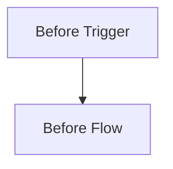
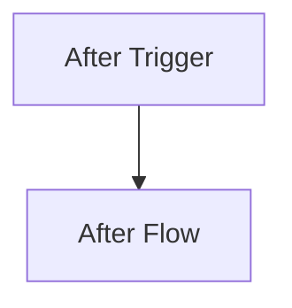

## 연관된 이슈

- closes #
- refs #

## 작업 내용

- 이번 PR에서 변경한 내용을 핵심만 bullet로 정리해주세요.

## 변경 흐름 (Mermaid)

- 구조, 실행 흐름, 데이터 흐름이 바뀌면 `Before` / `After` 두 개의 mermaid 다이어그램으로 요약해주세요.
- 비교 다이어그램을 쓸 때는 아래 `### Before`, `### After` 헤더를 그대로 유지해주세요.
- 흐름 변화가 없으면 단일 `Current` 다이어그램만 적거나, 아주 작은 변경이면 생략하고 이유를 적어주세요.

### Before

### After

## 이번 PR 범위

- 이번 PR에서 다루는 범위를 적어주세요.
- 명시적으로 제외한 범위가 있으면 같이 적어주세요.

## 문서 영향

- 어떤 문서를 업데이트했는지 적어주세요.
- 문서 변경이 없으면 왜 없는지 적어주세요.

## 이슈 완료 조건 / 회귀 테스트 체크

- 관련 이슈의 완료 조건 중 이번 PR에서 실제로 확인한 항목을 적어주세요.
- 관련 이슈의 회귀 테스트 항목 중 이번 PR에서 커버한 항목을 적어주세요.

## 추가된 테스트 명세

- 이번 PR에서 추가하거나 수정한 테스트 시나리오를 적어주세요.
- 어떤 시나리오를 검증하는지 중심으로 적어주세요.

## 체크리스트

- [ ] PR 제목을 컨벤션에 맞게 작성했나요? (`feat: ...`, `fix: ...`)
- [ ] 관련 이슈를 연결했나요?
- [ ] 영향 범위에 맞는 테스트를 실행했나요?
- [ ] 관련 이슈의 완료 조건과 회귀 테스트 항목을 이번 PR 기준으로 다시 확인했나요?
- [ ] PR 본문에 추가/수정된 테스트 명세를 반영했나요?
- [ ] 구조/흐름 변경이 있다면 PR 본문에 `Before` / `After` mermaid 다이어그램을 반영했나요?
- [ ] 문서 영향 분석을 했나요?
- [ ] 필요한 문서를 업데이트했거나, 업데이트가 불필요한 이유를 PR 본문에 적었나요?
- [ ] `AGENTS.md`와 관련 문서를 함께 업데이트했나요?
- [ ] 브랜치 이름이 브랜치 컨벤션을 따르나요?

## 스크린샷 / 로그 / 추가 자료

- 필요 시 첨부해주세요.
