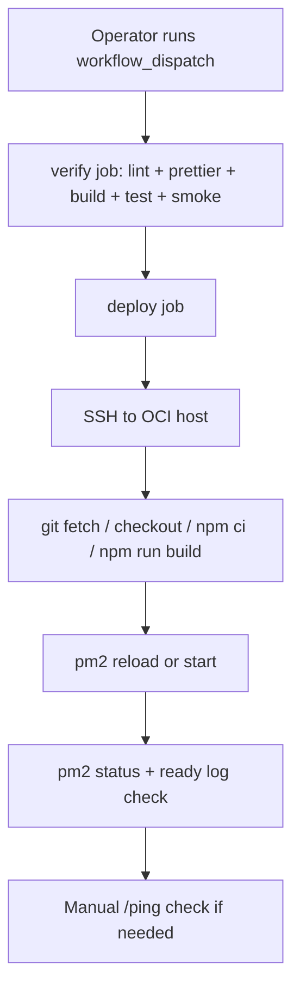

# Production Runbook

## 목적

이 문서는 하루하루 Discord bot의 production 배포, 배포 후 검증, 롤백 절차를 운영자가 같은 순서로 반복할 수 있도록 정리한 runbook이다.

## 배포 구조

- PR 검증: `CI`, `Dependency Review`
- production 배포 시작: GitHub Actions `Deploy Production`
- 배포 시작 방식: `workflow_dispatch`
- 배포 경로: GitHub-hosted runner -> SSH -> OCI Compute -> PM2 single process
- GitHub `production` environment 용도: production secrets/variables 관리

## GitHub 설정

### Environment

- Environment name: `production`

### Secrets

- `PRODUCTION_SSH_HOST`: OCI 서버 호스트명 또는 IP
- `PRODUCTION_SSH_USER`: 배포용 SSH 사용자
- `PRODUCTION_SSH_KEY`: 배포용 private key

### Variables

- `PRODUCTION_APP_DIR`: 서버 내 애플리케이션 디렉터리
- `PRODUCTION_PM2_APP_NAME`: PM2 프로세스 이름, 기본값 `haruharu-bot`
- `PRODUCTION_SSH_PORT`: SSH 포트, 기본값 `22`
- `PRODUCTION_READY_WAIT_SECONDS`: ready 로그 대기 시간, 기본값 `60`

## 배포 전 체크리스트

1. 대상 브랜치 또는 태그가 배포 가능한 상태인지 확인한다.
2. 관련 PR의 `CI`와 `Dependency Review`가 green 인지 확인한다.
3. 이번 배포에 반영할 문서 변경과 운영 영향이 PR 본문에 반영됐는지 확인한다.
4. 필요 시 `/ping`, daily message, messageCreate, cam-study 영향 범위를 미리 확인한다.

## 배포 절차

1. GitHub Actions에서 `Deploy Production` workflow를 연다.
2. `Run workflow`를 눌러 배포할 `ref`를 입력한다. 기본값은 `main`이다.
3. `verify` job이 아래 항목을 통과하는지 확인한다.
   - `npm run lint`
   - `npx prettier --check src`
   - `npm run build`
   - `npm test`
   - `npm run test:smoke`
4. `deploy` job이 시작되면 OCI 서버에 SSH 접속해서 아래를 수행한다.
   - `git fetch origin`
   - 지정한 `ref` checkout
   - `git pull --ff-only origin {ref}`
   - `npm ci`
   - `npm run build`
   - PM2 프로세스 reload 또는 최초 start
5. `Verify production readiness` 단계에서 아래를 자동 확인한다.
   - PM2에 같은 이름의 online 프로세스가 1개인지
   - 최근 로그에 `Ready! Logged in as`가 있는지

## 배포 후 수동 검증

자동 검증이 끝나도 아래 수동 확인을 권장한다.

1. Discord에서 `/ping` 명령으로 운영 응답을 확인한다.
2. 필요 시 등록/체크인/체크아웃 허용 채널에서 명령 라우팅이 정상인지 확인한다.
3. 운영 채널에서 daily message/thread, messageCreate demo, cam-study 이벤트 영향이 없는지 확인한다.
4. OCI 서버에서 `pm2 status`와 최근 로그를 한 번 더 점검한다.

## 롤백 절차

기준: 새 배포 후 `/ping` 실패, ready 로그 부재, 핵심 명령/이벤트 이상, 단일 active 보장 실패 중 하나라도 확인되면 롤백을 검토한다.

1. 마지막 안정 ref를 확인한다.
2. GitHub Actions `Deploy Production` workflow를 다시 실행한다.
3. `ref`에 마지막 안정 브랜치/태그/커밋을 지정한다.
4. `verify -> deploy -> readiness`가 다시 green 인지 확인한다.
5. 배포 후 `/ping`과 핵심 운영 흐름을 다시 점검한다.

## 의존성 변경 정책

- `package.json`, `package-lock.json`, `.github/dependency-review-config.yml` 변경 PR에서는 `Dependency Review` workflow가 자동 실행된다.
- 현재 기본 정책:
  - `moderate` 이상 취약점 추가 시 실패
  - `GPL-2.0`, `GPL-3.0`, `AGPL-3.0` 라이선스 의존성 추가 시 실패
- 더 강한 금지 목록이 필요하면 `.github/dependency-review-config.yml`에서 정책을 확장한다.
