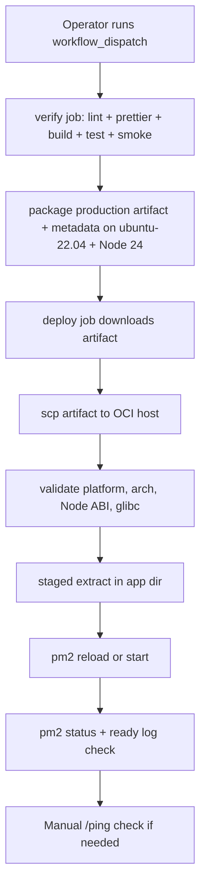

# Production Runbook

## 목적

이 문서는 하루하루 Discord bot의 production 배포, 배포 후 검증, 롤백 절차를 운영자가 같은 순서로 반복할 수 있도록 정리한 runbook이다.

## 배포 구조

- PR 검증: `CI`, `Dependency Review`
- production 배포 시작: GitHub Actions `Deploy Production`
- 배포 시작 방식: `workflow_dispatch`
- 배포 경로: GitHub-hosted `ubuntu-22.04` runner + Node.js 24 -> verify build artifact 생성 -> artifact upload/download -> SSH -> OCI Compute -> PM2 single process
- verify 단계에서 입력한 `ref`를 검증된 commit SHA로 고정한 뒤 deploy가 같은 SHA에서 만든 production artifact를 배포한다
- GitHub `production` environment 용도: production secrets/variables 관리



## GitHub 설정

### Environment

- Environment name: `production`

### Secrets

- `PRODUCTION_SSH_HOST`: OCI 서버 호스트명 또는 IP
- `PRODUCTION_SSH_KNOWN_HOSTS`: 배포 대상 서버의 고정 known_hosts 항목
- `PRODUCTION_SSH_USER`: 배포용 SSH 사용자
- `PRODUCTION_SSH_KEY`: 배포용 private key

### Variables

- `PRODUCTION_APP_DIR`: 서버 내 애플리케이션 디렉터리
- `PRODUCTION_PM2_APP_NAME`: PM2 프로세스 이름, 기본값 `haruharu-bot`
- `PRODUCTION_SSH_PORT`: SSH 포트, 기본값 `22`
- `PRODUCTION_READY_WAIT_SECONDS`: ready 로그 대기 시간, 기본값 `60`

## 배포 전 체크리스트

1. 대상 branch, tag, commit SHA가 배포 가능한 상태인지 확인한다.
2. 관련 PR의 `CI`와 `Dependency Review`가 green 인지 확인한다.
3. 이번 배포에 반영할 문서 변경과 운영 영향이 PR 본문에 반영됐는지 확인한다.
4. 필요 시 `/ping`, daily message, messageCreate, cam-study 영향 범위를 미리 확인한다.

## 배포 절차

1. GitHub Actions에서 `Deploy Production` workflow를 연다.
2. `Run workflow`를 눌러 배포할 `ref`를 입력한다. `branch, tag, commit SHA`를 받을 수 있고 기본값은 `main`이다.
3. `verify` job이 아래 항목을 통과하는지 확인한다.
   - verify job은 `ubuntu-22.04` + Node.js 24에서 실행되어 production 서버와 Node ABI/glibc 계열을 맞춘다.
   - `npm run lint`
   - `npx prettier --check src`
   - `npm run build`
   - `npm test`
   - `npm run test:smoke`
4. `verify`가 끝나면 workflow가 검증된 commit SHA를 고정하고, 같은 SHA에서 production artifact를 만든다.
   - `npm prune --omit=dev`로 production 실행에 필요한 의존성만 남긴다.
   - `dist`, `node_modules`, `package.json`, `package-lock.json`, `artifact-metadata.json`을 tar.gz artifact로 묶어 업로드한다.
   - `artifact-metadata.json`에는 build 시점 Node version, Node ABI, platform, arch, glibc 정보를 기록한다.
5. `deploy` job이 시작되면 OCI 서버에 SSH 접속해서 아래를 수행한다.
   - deploy job은 verify에서 업로드한 artifact만 내려받고, 별도의 server-side build를 하지 않는다.
   - artifact를 OCI 서버로 `scp` 전송한다.
   - 비대화형 SSH 셸에서도 `nvm` 경로를 사용할 수 있도록 원격 스크립트가 `NVM_DIR`과 `nvm.sh`를 직접 로드한다.
   - `node`, `pm2`, `tar`가 현재 원격 셸에서 보이지 않으면 fail-fast로 중단한다.
   - `PRODUCTION_APP_DIR`가 절대 경로인지, `/`가 아닌지 먼저 확인하고 realpath(`cd ... && pwd -P`)로 canonical path를 다시 계산한 뒤에만 배포를 진행한다.
   - 원격 Node/platform/arch/Node ABI가 `artifact-metadata.json`과 다르면 fail-fast로 중단한다.
   - build metadata에 glibc가 있으면 원격 glibc family뿐 아니라 실제 버전이 build보다 낮지 않은지도 함께 검증한다.
   - `Artifact runtime compatibility check failed`가 나오면 서버 Node 업그레이드 또는 workflow 빌드 환경 변경 없이 재시도하지 않는다. 먼저 build/runtime의 Node ABI와 glibc 차이를 맞춘다.
   - artifact는 임시 staging 디렉터리에 먼저 압축 해제하고 `dist`, `node_modules`, `package.json`, `artifact-metadata.json` 존재를 검증한 뒤, 기존 `dist`, `node_modules`, `package.json`, `package-lock.json`과 교체한다.
   - `config.json`, `database.sqlite`, `logs`, `runtime` 같은 서버 로컬 자산은 유지한다.
   - PM2 프로세스 reload 또는 최초 start
6. `Verify production readiness` 단계에서 아래를 자동 확인한다.
   - 비대화형 SSH 셸에서 `nvm` bootstrap 후 `node`, `pm2`를 사용할 수 있는지
   - PM2에 같은 이름의 online 프로세스가 1개인지
   - 이번 배포 이후 info 로그에 새 `Ready! Logged in as`가 기록됐는지
   - 직전 배포와 같은 일별 info 로그 파일을 재사용하면 이전 배포 시점의 바이트 오프셋 뒤만 검사하고, 새 일별 info 로그 파일이 생기면 새 파일 전체에서 ready 로그를 검사한다

### Readiness 로그 판정 메모

- readiness 스크립트는 `runtime/production-deployment-metadata.env`의 `PREVIOUS_INFO_LOG_FILE`, `PREVIOUS_INFO_LOG_SIZE`를 읽어 이번 배포 이후에 추가된 ready 로그만 본다.
- 새 로그 파일이 생성된 배포에서는 이전 오프셋을 이어서 쓰지 않고, 최신 info 로그 파일 전체에서 `Ready! Logged in as`를 찾는다.
- 2026-03-29 이전에는 새 로그 파일 분기 반환값 버그 때문에 ready 로그가 있어도 `Could not find a new ready log entry for haruharu-bot` false negative가 날 수 있었다. 같은 증상이 다시 보이면 스크립트 버전과 최근 배포 시점 로그 파일 교체 여부를 먼저 확인한다.

## 배포 후 수동 검증

자동 검증이 끝나도 아래 수동 확인을 권장한다.

1. Discord에서 `/ping` 명령으로 운영 응답을 확인한다.
2. 필요 시 등록/체크인/체크아웃 허용 채널에서 명령 라우팅이 정상인지 확인한다.
3. 운영 채널에서 daily message/thread, 운영 출석 thread messageCreate 반응/AttendanceLog 기록, cam-study 이벤트 영향이 없는지 확인한다.
4. OCI 서버에서 `pm2 status`와 최근 로그를 한 번 더 점검한다.

## 운영 출석 누락 1회성 보정

- 서버가 source 없이 `dist` artifact만 유지하는 배포 구조라면, 출석 누락 보정 helper도 build 없이 `dist` 엔트리포인트로 직접 실행한다.
- 입력 JSON 예시:

```json
{
  "entries": [
    {
      "threadId": "123456789012345678",
      "messageId": "123456789012345679",
      "userId": "123456789012345670"
    }
  ]
}
```

- 실행 명령:

```bash
node dist/backfill-attendance.js ./attendance-backfill.json
```

- helper는 각 댓글에 대해 아래를 순서대로 수행한다.
  - Discord에서 thread/message fetch
  - 해당 날짜의 `Users` snapshot 조회
  - 댓글 시각 기준 출석 상태 계산
  - `AttendanceLog.findOrCreate(...)`
  - 봇 계정 반응(`✅`, `🟡`, `❌`, 필요 시 `⏰`) 추가
- 이미 같은 `(userid, yearmonthday)`의 다른 공식 `AttendanceLog`가 있으면 중복 보정을 막기 위해 실패시킨다.

## 롤백 절차

기준: 새 배포 후 `/ping` 실패, ready 로그 부재, 핵심 명령/이벤트 이상, 단일 active 보장 실패 중 하나라도 확인되면 롤백을 검토한다.

1. 마지막 안정 ref를 확인한다.
2. GitHub Actions `Deploy Production` workflow를 다시 실행한다.
3. `ref`에 마지막 안정 branch, tag, commit SHA를 지정한다.
4. `verify -> artifact package -> deploy -> readiness`가 다시 green 인지 확인한다.
5. 배포 후 `/ping`과 핵심 운영 흐름을 다시 점검한다.

## 의존성 변경 정책

- `package.json`, `package-lock.json`, `.github/dependency-review-config.yml` 변경 PR에서는 `Dependency Review` workflow가 자동 실행된다.
- 현재 기본 정책:
  - `moderate` 이상 취약점 추가 시 실패
  - `GPL-2.0`, `GPL-3.0`, `AGPL-3.0` 라이선스 의존성 추가 시 실패
- 더 강한 금지 목록이 필요하면 `.github/dependency-review-config.yml`에서 정책을 확장한다.
