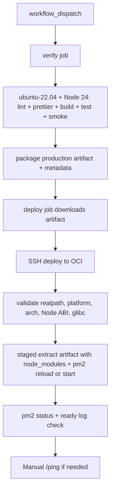

# 하루하루 Discord Bot

## 프로젝트 개요

**하루하루**는 스터디 그룹의 출석 관리와 학습 시간 추적을 위한 Discord 봇입니다.

### 제공 가치

| 가치                 | 설명                                               |
| -------------------- | -------------------------------------------------- |
| **습관 형성**        | 매일 정해진 시간에 기상하는 습관을 만들어 줍니다   |
| **책임감 부여**      | 그룹 내 출석 공개로 자연스러운 동기 부여           |
| **학습 시간 가시화** | 캠스터디를 통해 실제 공부 시간을 객관적으로 측정   |
| **자동화된 관리**    | 수동 집계 없이 매일 자동으로 출석/학습 현황 리포트 |

### 핵심 기능

| 기능                 | 설명                                                                                       |
| -------------------- | ------------------------------------------------------------------------------------------ |
| **기상 챌린지**      | 매일 정해진 시간에 기상하여 인증샷을 올리는 월간 챌린지                                    |
| **캠스터디**         | Discord 음성 채널에서 카메라 또는 화면공유를 켜고 공부하는 시간 추적                       |
| **역할 기반 온보딩** | `#start-here`/`#apply`/`#qna`/`#announcements` 구조와 self-service 역할 활성화로 접근 제어 |

### Discord 운영 채널 구조

| 채널             | 역할                                     | 비고                          |
| ---------------- | ---------------------------------------- | ----------------------------- |
| `#start-here`    | 환영 및 서버 소개                        | 읽기 전용 권장                |
| `#apply`         | 참여 방법 안내 및 self-service 명령 실행 | `/apply-wakeup`, `/apply-cam` |
| `#qna`           | 질문/응답                                | 일반 문의 채널                |
| `#announcements` | 운영 공지                                | 관리자 전용 작성 권장         |
| `#ops`           | 운영 공지 및 관리자 처리                 | 관리자 전용                   |
| `#wake-up`       | 기상인증 전용 채널                       | `@wake-up` 역할 기반 접근     |
| `#cam-study`     | 캠스터디 전용 텍스트 채널                | `@cam-study` 역할 기반 접근   |
| `음성: 캠스터디` | 캠스터디 전용 음성 채널                  | `@cam-study` 역할 기반 접근   |

---

## 프로젝트 구조

```
haruharu-discord-bot/
├── src/
│   ├── index.ts                 # 봇 진입점, runtime 부트스트랩
│   ├── runtime.ts               # Discord client/커맨드/이벤트 로더
│   ├── config.ts                # 런타임 설정 로더
│   ├── deployConfig.ts          # 슬래시 커맨드 배포용 최소 설정 로더
│   ├── logger.ts                # Winston 로깅 설정
│   ├── attendance.ts            # 출석 판정 및 이모지 유틸리티
│   ├── daily-attendance.ts      # 운영 daily message/thread 생성 및 재탐색 유틸리티
│   ├── daily-message.ts         # daily message 질문 풀과 랜덤 선택 유틸리티
│   ├── utils.ts                 # 분리된 유틸 모듈 배럴 export
│   ├── deploy-commands.ts       # 슬래시 커맨드 등록
│   │
│   ├── commands/
│   │   └── haruharu/
│   │       ├── register.ts      # 사용자 기상 챌린지 등록/수정
│   │       ├── apply-vacation.ts # 사용자 휴가 등록
│   │       ├── apply-wakeup.ts  # 사용자 기상인증 참여 신청
│   │       ├── apply-cam.ts     # 사용자 캠스터디 참여 신청
│   │       ├── add-vacances.ts  # 휴가 추가
│   │       ├── approve-application.ts # deprecated: 자동 활성화 안내
│   │       ├── reject-application.ts # deprecated: 자동 활성화 안내
│   │       ├── delete.ts        # 챌린저 삭제
│   │       ├── register-cam.ts  # deprecated: 역할 기반 등록 안내
│   │       ├── delete-cam.ts    # deprecated: 역할 회수 안내
│   │       ├── demo-daily-message.ts # 테스트 채널 daily message 데모
│   │       └── ping.ts          # 헬스체크
│   │
│   ├── events/
│   │   ├── ready.ts             # 봇 시작, DB 동기화, 리포트 스케줄러 등록
│   │   ├── guildMemberUpdate.ts # @cam-study 역할 기반 참가자 동기화
│   │   ├── interactionCreate.ts # 슬래시 커맨드 핸들러
│   │   ├── messageCreate.ts     # 출석 demo thread 댓글 감지
│   │   └── camStudyHandler.ts   # 음성 채널 상태 감지 및 캠스터디 서비스 위임
│   │
│   ├── services/
│   │   ├── attendance.ts        # 레거시 check-in/check-out 처리
│   │   ├── challengeSelfService.ts # 사용자 기상시간/휴가 self-service 정책 처리
│   │   ├── camStudy.ts          # 음성 상태 전이 해석 및 학습 시간 반영
│   │   ├── camStudyRoleSync.ts  # 역할 기반 캠스터디 참가자 동기화
│   │   ├── participationApplication.ts # self-service 활성화/역할 부여 처리
│   │   └── reporting.ts         # 일일/주간 리포트 생성 및 스케줄링
│   │
│   └── repository/
│       ├── config.ts            # Sequelize 설정
│       ├── Users.ts             # 챌린저 모델
│       ├── AttendanceLog.ts     # thread 기반 하루 1회 출석 로그 모델
│       ├── VacationLog.ts       # 사용자 휴가 사용 기록 모델
│       ├── TimeLog.ts           # 출석 로그 모델
│       ├── WaketimeChangeLog.ts # 사용자 기상시간 변경 이력 모델
│       ├── CamStudyUsers.ts     # 캠스터디 참가자 모델
│       ├── CamStudyActiveSession.ts # 진행 중 캠스터디 세션 모델
│       ├── CamStudyTimeLog.ts   # 일간 학습 로그 모델
│       ├── CamStudyWeeklyTimeLog.ts # 주간 학습 로그 모델
│       ├── ParticipationApplication.ts # 역할 기반 신청 상태 모델
│       ├── challengeRepository.ts   # 기상 챌린지 조회/갱신 헬퍼
│       └── camStudyRepository.ts    # 캠스터디 조회/갱신 헬퍼
│
├── docs/
│   ├── PROJECT.md               # 프로젝트 문서 (현재 파일)
│   ├── PRODUCTION_RUNBOOK.md    # production 배포/검증/롤백 runbook
│   ├── USER_STORIES.md          # 사용자 스토리 및 시퀀스 다이어그램
│   ├── plan/                    # 이슈별 구현 계획 문서
│   └── COMMIT_CONVENTION.md     # 커밋 컨벤션
│
├── .github/
│   ├── dependency-review-config.yml # dependency review 정책
│   └── workflows/
│       ├── ci.yml               # GitHub Actions CI + bot smoke test
│       ├── dependency-review.yml # 의존성 변경 PR 검토
│       └── deploy-production.yml # workflow_dispatch production 배포
│
├── scripts/
│   ├── deploy-production.sh     # OCI SSH 배포 스크립트
│   └── verify-production-readiness.sh # PM2 / ready 로그 확인 스크립트
│
├── logs/                        # 일별 로테이션 로그
├── dist/                        # 컴파일된 JavaScript
├── database.sqlite              # SQLite 데이터베이스
├── config.json                  # 봇 설정 (토큰, 채널 ID 등)
├── package.json                 # 의존성 및 스크립트
├── tsconfig.json                # TypeScript 설정
├── eslint.config.js             # ESLint 설정
└── .prettierrc                  # Prettier 설정
```

---

## 모듈 상세

### Commands (슬래시 커맨드)

한국어 locale Discord 클라이언트에서는 아래 `한국어 표시명(ko)`로 보인다. 봇 내부 라우팅과 option 조회에는 기존 영어 key를 그대로 사용한다.

#### 기상 챌린지 커맨드

| 내부 key          | 한국어 표시명(ko)   | 권한   | 설명                                 |
| ----------------- | ------------------- | ------ | ------------------------------------ |
| `/register`       | `/기상등록`         | 사용자 | 자신의 현재 월 기상 챌린지 등록/수정 |
| `/apply-vacation` | `/휴가신청`         | 사용자 | 자신의 특정 날짜 휴가 등록           |
| `/add-vacances`   | `/admin-휴가추가`   | 관리자 | 휴가일수 추가                        |
| `/delete`         | `/admin-챌린저삭제` | 관리자 | 챌린저 삭제                          |

#### 역할 기반 참여 신청 커맨드

| 내부 key               | 한국어 표시명(ko) | 권한   | 설명                     |
| ---------------------- | ----------------- | ------ | ------------------------ |
| `/apply-wakeup`        | `/기상인증신청`   | 사용자 | 기상인증 참여 즉시 활성화 |
| `/apply-cam`           | `/캠스터디신청`   | 사용자 | 캠스터디 참여 즉시 활성화 |
| `/approve-application` | `/admin-신청승인` | 관리자 | deprecated: 자동 활성화 안내 |
| `/reject-application`  | `/admin-신청거절` | 관리자 | deprecated: 자동 활성화 안내 |

#### 캠스터디 커맨드

| 내부 key        | 한국어 표시명(ko)     | 권한   | 설명          |
| --------------- | --------------------- | ------ | ------------- |
| `/register-cam` | `/admin-캠스터디등록` | 관리자 | deprecated: `@cam-study` 역할 부여 안내 |
| `/delete-cam`   | `/admin-캠스터디삭제` | 관리자 | deprecated: `@cam-study` 역할 회수 안내 |

#### 유틸리티 커맨드

| 내부 key              | 한국어 표시명(ko)      | 권한   | 설명                                                                   |
| --------------------- | ---------------------- | ------ | ---------------------------------------------------------------------- |
| `/ping`               | `/admin-상태확인`      | 관리자 | 봇 상태 확인                                                           |
| `/demo-daily-message` | `/admin-demo-출석생성` | 관리자 | 테스트 채널에 랜덤 질문이 포함된 daily message + 출석 demo thread 생성 |

---

### 커맨드 파라미터 상세

#### `/register` (`/기상등록`)

| 내부 파라미터 | 한국어 표시명(ko) | 필수 | 설명                       |
| ------------- | ----------------- | ---- | -------------------------- |
| waketime      | 기상시간          | O    | 기상시간 (HHmm, 0500~0900) |

#### `/apply-vacation` (`/휴가신청`)

| 내부 파라미터 | 한국어 표시명(ko) | 필수 | 설명                      |
| ------------- | ----------------- | ---- | ------------------------- |
| date          | 날짜              | O    | 휴가 대상 날짜 (yyyymmdd) |

#### `/apply-wakeup` (`/기상인증신청`)

- 별도 파라미터 없음
- `#apply` 채널에서만 실행 가능

#### `/apply-cam` (`/캠스터디신청`)

- 별도 파라미터 없음
- `#apply` 채널에서만 실행 가능

#### `/add-vacances` (`/admin-휴가추가`)

| 내부 파라미터 | 한국어 표시명(ko) | 필수 | 설명                 |
| ------------- | ----------------- | ---- | -------------------- |
| userid        | 사용자id          | O    | Discord 사용자 ID    |
| yearmonth     | 년월              | O    | 년월 (yyyymm)        |
| count         | 추가일수          | O    | 추가 지급할 휴가일수 |

#### `/approve-application` (`/admin-신청승인`)

| 내부 파라미터 | 한국어 표시명(ko) | 필수 | 설명              |
| ------------- | ----------------- | ---- | ------------------------------ |
| userid        | 사용자id          | X    | deprecated 레거시 사용자 ID    |
| program       | 프로그램          | X    | deprecated 레거시 대상 프로그램 |

#### `/reject-application` (`/admin-신청거절`)

| 내부 파라미터 | 한국어 표시명(ko) | 필수 | 설명              |
| ------------- | ----------------- | ---- | ------------------------------ |
| userid        | 사용자id          | X    | deprecated 레거시 사용자 ID    |
| program       | 프로그램          | X    | deprecated 레거시 대상 프로그램 |
| reason        | 사유              | X    | deprecated 레거시 사유         |

#### `/delete` (`/admin-챌린저삭제`)

| 내부 파라미터 | 한국어 표시명(ko) | 필수 | 설명              |
| ------------- | ----------------- | ---- | ----------------- |
| userid        | 사용자id          | O    | Discord 사용자 ID |

#### `/delete-cam` (`/admin-캠스터디삭제`)

| 내부 파라미터 | 한국어 표시명(ko) | 필수 | 설명              |
| ------------- | ----------------- | ---- | ------------------------------ |
| userid        | 사용자id          | X    | deprecated 레거시 사용자 ID    |

#### `/register-cam` (`/admin-캠스터디등록`)

| 내부 파라미터 | 한국어 표시명(ko) | 필수 | 설명                     |
| ------------- | ----------------- | ---- | ------------------------ |
| userid        | 사용자id          | X    | deprecated 레거시 사용자 ID |
| username      | 이름              | X    | deprecated 레거시 표시 이름 |

---

### Events (이벤트 핸들러)

#### ready.ts

| 항목   | 내용                                                                                                                                                                                                                 |
| ------ | -------------------------------------------------------------------------------------------------------------------------------------------------------------------------------------------------------------------- |
| 트리거 | 봇 Discord 연결 완료                                                                                                                                                                                                 |
| 기능   | DB 테이블 동기화(`Users`, `TimeLog`, `AttendanceLog`, `VacationLog`, `WaketimeChangeLog`, `ParticipationApplication`, `CamStudy*`), 운영 daily message/thread 생성, 캠스터디 active session 복구, 각종 스케줄러 등록 |

**스케줄러:**

- 운영 daily message/thread 생성: 매일 06:00
- 기상 챌린지 리포트: 매일 13:00
- 캠스터디 리포트: 매일 23:59
- 캠스터디 active session heartbeat: 1분 간격

**구현 메모:**

- 운영 daily message/thread 중복 방지와 재탐색은 `src/daily-attendance.ts`가 담당한다.
- 실제 출석표 생성과 캠스터디 집계는 `src/services/reporting.ts`로 위임한다.
- `ClientReady` 직후에는 저장된 `CamStudyActiveSession`과 현재 voice state를 비교해 세션을 복구/종료 정산한다.
- heartbeat는 `lastobservedat`를 주기적으로 갱신해 재배포 중 종료 이벤트를 놓쳤을 때 손실 범위를 제한한다.
- 스케줄러는 중복 실행 방지 플래그와 예외 로깅을 포함한다.

#### guildMemberUpdate.ts

| 항목   | 내용                                                                    |
| ------ | ----------------------------------------------------------------------- |
| 트리거 | 서버 멤버 역할 변경                                                     |
| 기능   | `@cam-study` 역할 부여/회수를 감지하고 `CamStudyUsers`를 자동 등록/해제 |

**구현 메모:**

- `CamStudyUsers`는 역할 상태를 반영하는 캐시 인덱스이며, 역할 부여 시 upsert 한다.
- 역할 회수 시에는 보통 즉시 삭제하되, 이미 캠스터디를 진행 중이면 종료 이벤트가 들어올 때까지 삭제를 미룬다.
- `@cam-study` 역할 변화가 없으면 아무 작업도 하지 않는다.
- `GuildMembers` intent가 활성화되어야 실제 운영 환경에서 역할 변경 이벤트를 수신할 수 있다.
- `oldMember`가 partial인 경우에도 `newMember` 현재 역할 상태를 기준으로 self-heal 동기화를 수행한다.

### Runtime / Delivery

| 파일                     | 역할                                                                                                                       |
| ------------------------ | -------------------------------------------------------------------------------------------------------------------------- |
| `src/index.ts`           | 프로세스 진입점. `bootstrapClient()` 호출과 Discord 로그인 시작만 담당                                                     |
| `src/runtime.ts`         | Discord client 생성, `GuildMembers` 포함 intent 선언, 커맨드/이벤트 동적 로딩, slash command payload 수집, smoke boot 지원 |
| `src/deploy-commands.ts` | `src/runtime.ts` 로더를 재사용해 slash command JSON을 생성하고 Discord에 등록                                              |

### GitHub Actions

| Workflow            | 트리거                                      | 역할                                                                                    |
| ------------------- | ------------------------------------------- | --------------------------------------------------------------------------------------- |
| `CI`                | `push`, `pull_request`, `workflow_dispatch` | `ubuntu-22.04` + Node.js 24에서 lint, prettier, unit test, bot boot smoke test, main 수동/직접 실행 시 integration test |
| `Dependency Review` | `pull_request` + package manifest 변경      | 취약점/라이선스 정책 검토                                                               |
| `Deploy Production` | `workflow_dispatch`                         | `ubuntu-22.04` + Node.js 24 verify 후 production artifact와 runtime metadata를 만들고 OCI 서버에서 realpath, platform, arch, Node ABI, glibc 호환성 및 staged bundle 검증 뒤 반영한 뒤 PM2/ready 로그를 확인 |

### Production 배포 흐름



#### interactionCreate.ts

| 항목   | 내용                                                                   |
| ------ | ---------------------------------------------------------------------- |
| 트리거 | 슬래시 커맨드 실행                                                     |
| 기능   | 공통 허용 채널 검증, 커맨드별 허용 채널 검증, 쿨다운 관리, 커맨드 실행 |

**쿨다운:**

- 기본: 3초
- 기타 커맨드: 5초

**채널 라우팅 메모:**

- 기존 운영 커맨드는 `commandChannelIds` 기준으로 채널을 검증한다.
- `/apply-wakeup`, `/apply-cam`은 `#apply` 전용 채널에서만 실행된다.
- `/approve-application`, `/reject-application`은 deprecated 상태로 `#ops`에서만 남아 있고 실제 참여 상태는 바꾸지 않는다.
- `/register-cam`, `/delete-cam`은 deprecated 상태로 남아 있으며 역할 기반 운영 흐름만 안내한다.

#### camStudyHandler.ts

| 항목   | 내용                                                                                                                         |
| ------ | ---------------------------------------------------------------------------------------------------------------------------- |
| 트리거 | 음성 채널 상태 변경                                                                                                          |
| 기능   | 카메라(`selfVideo`) 또는 화면공유(`streaming`) ON/OFF 감지, 상태 전이를 `src/services/camStudy.ts`에 위임하여 학습 시간 기록 |

**구현 메모:**

- 학습 세션이 이미 시작된 뒤 `@cam-study` 역할이 제거되어도, 기존 `CamStudyTimeLog`를 기준으로 종료 시점 분 계산은 마무리한다.

#### messageCreate.ts

| 항목   | 내용                                                                        |
| ------ | --------------------------------------------------------------------------- |
| 트리거 | 일반 메시지 생성                                                            |
| 기능   | 테스트 채널의 출석 demo thread에서 첫 댓글을 감지하고 출석 상태 이모지 반응 |

#### daily-attendance.ts

| 항목   | 내용                                                                                        |
| ------ | ------------------------------------------------------------------------------------------- |
| 역할   | 운영 채널용 daily message 본문, thread 이름 규칙, today thread 재탐색/중복 방지 로직을 제공 |
| 사용처 | `ready.ts` 운영 daily message/thread 자동 생성 스케줄                                       |

#### daily-message.ts

| 항목   | 내용                                                            |
| ------ | --------------------------------------------------------------- |
| 역할   | daily message에 넣을 질문 100개를 보관하고 랜덤으로 하나를 선택 |
| 사용처 | `/demo-daily-message` 커맨드, 운영 daily message 본문 생성      |

---

### Services (도메인 서비스)

#### attendance.ts

| 항목   | 내용                                                                                     |
| ------ | ---------------------------------------------------------------------------------------- |
| 역할   | 레거시 `TimeLog` 기반 check-in/check-out 기록 로직 보관                                  |
| 담당   | 채널 검증, 사용자 조회, 중복 출석 확인, 허용 시간 판정, 이미지 첨부 검증, `TimeLog` 생성 |
| 호출처 | 현재 공식 slash command 호출처 없음. 과거 레거시 데이터 호환과 참고 구현으로만 남아 있다 |

#### camStudy.ts

| 항목   | 내용                                                                                                                                                                                   |
| ------ | -------------------------------------------------------------------------------------------------------------------------------------------------------------------------------------- |
| 역할   | 음성 채널 상태 변경을 캠스터디 시작/종료 이벤트로 해석                                                                                                                                 |
| 담당   | 입장/퇴장/카메라/화면공유 활성 전이 계산, 최소 인정 시간 검증, 일간 로그 생성/갱신, 진행 중 active session 저장, 재기동 시 voice state 기반 복구/종료 정산, 상태 전이 구조화 로그 기록 |
| 호출처 | `src/events/camStudyHandler.ts`, `src/events/ready.ts`                                                                                                                                 |

비고:

- 진행 중 세션은 `CamStudyActiveSession`에 `(userid, channelid, startedat, lastobservedat)` 형태로 저장한다.
- 재배포 후 `ready.ts`는 저장된 active session과 현재 음성 채널 상태를 비교해 세션을 유지하거나 마지막 관측 시각 기준으로 종료 정산한다.
- 종료 이벤트를 놓친 뒤 다음 시작 이벤트가 오면, 남아 있던 active session을 먼저 정리한 뒤 새 세션을 시작한다.

#### camStudyRoleSync.ts

| 항목   | 내용                                                                                                                                             |
| ------ | ------------------------------------------------------------------------------------------------------------------------------------------------ |
| 역할   | `@cam-study` 역할 상태를 `CamStudyUsers` 캐시에 반영                                                                                             |
| 담당   | 역할 추가/제거 감지, partial member fallback 처리, 표시 이름 추출, `CamStudyUsers` upsert/remove, 활성 세션 중 제거 defer, 역할 동기화 로그 기록 |
| 호출처 | `src/events/guildMemberUpdate.ts`                                                                                                                |

#### challengeSelfService.ts

| 항목   | 내용                                                                                                             |
| ------ | ---------------------------------------------------------------------------------------------------------------- |
| 역할   | 사용자 직접 `/register` upsert 와 휴가 등록 정책 처리                                                            |
| 담당   | 사용자 기준 등록/수정, 기상시간 범위 검증, register 하루 1회 변경 제한, 휴가 날짜 중복 방지, 잔여 휴가 한도 검증 |
| 호출처 | `src/commands/haruharu/register.ts`, `src/commands/haruharu/apply-vacation.ts`                                   |

#### participationApplication.ts

| 항목   | 내용                                                                                                                                                                         |
| ------ | ---------------------------------------------------------------------------------------------------------------------------------------------------------------------------- |
| 역할   | self-service 참여 활성화, 역할 부여, deprecated 운영 명령 안내                                                                                                               |
| 담당   | `ParticipationApplication` 조회/갱신, `@wake-up`/`@cam-study` 역할 매핑, 신청 즉시 `approved` 반영, 캠스터디 자동 활성화 시 `CamStudyUsers` upsert, 실패 시 role/db rollback |
| 호출처 | `src/commands/haruharu/apply-wakeup.ts`, `src/commands/haruharu/apply-cam.ts`, `src/commands/haruharu/approve-application.ts`, `src/commands/haruharu/reject-application.ts` |
#### reporting.ts

| 항목   | 내용                                                                                                                                                                                                                                                                                                                                                                                                                                       |
| ------ | ------------------------------------------------------------------------------------------------------------------------------------------------------------------------------------------------------------------------------------------------------------------------------------------------------------------------------------------------------------------------------------------------------------------------------------------ |
| 역할   | 일일/주간 리포트 생성과 스케줄링                                                                                                                                                                                                                                                                                                                                                                                                           |
| 담당   | `Users`/`TimeLog`/`AttendanceLog`/`ParticipationApplication` 등 모델 sync, `AttendanceLog` 단일 원본 기반 기상 챌린지 출석표 생성, 휴가일 결석 제외 처리, 무댓글 사용자 결석 확정, 오늘 상태와 월 누적 `latecount` / `absencecount` / 잔여휴가를 함께 표시하는 결과표 생성, Discord 2000자 제한 초과 시 결과표 분할 전송, 월말 생존 명단 생성, 캠스터디 일일 리포트 생성, 해당 주차 일간 로그 재계산 기반 주간 집계, 스케줄 중복 실행 방지 |
| 호출처 | `src/events/ready.ts`                                                                                                                                                                                                                                                                                                                                                                                                                      |

비고:

- 캠스터디 리포트는 종료 정산된 `CamStudyTimeLog.totalminutes`만 합산한다.
- `CamStudyActiveSession`에 남아 있는 진행 중 세션은 리포트 합계에 포함하지 않고, 제외된 사용자 ID를 로그로 남긴다.

---

### Repository (데이터 모델)

#### Repository helper 모듈

| 파일                     | 역할                                                                                                         |
| ------------------------ | ------------------------------------------------------------------------------------------------------------ |
| `challengeRepository.ts` | `Users`, `TimeLog`, `AttendanceLog`, `VacationLog`, `WaketimeChangeLog` 기반 기상 챌린지 조회/생성/집계 헬퍼 |
| `camStudyRepository.ts`  | `CamStudyUsers`, `CamStudyActiveSession`, `CamStudyTimeLog`, `CamStudyWeeklyTimeLog` 기반 조회/갱신 헬퍼     |

#### Users (기상 챌린지 참가자)

| 컬럼         | 타입    | 설명                       |
| ------------ | ------- | -------------------------- |
| id           | INTEGER | PK, Auto Increment         |
| userid       | STRING  | Discord 사용자 ID          |
| username     | STRING  | 표시 이름                  |
| yearmonth    | STRING  | 년월 (yyyymm)              |
| waketime     | STRING  | 기상시간 (HHmm)            |
| vacances     | INTEGER | 총 지급 휴가일수 (기본: 5) |
| latecount    | INTEGER | 지각 횟수                  |
| absencecount | INTEGER | 결석 횟수                  |

#### TimeLog (출석 로그)

| 컬럼         | 타입    | 설명                 |
| ------------ | ------- | -------------------- |
| id           | INTEGER | PK, Auto Increment   |
| userid       | STRING  | Discord 사용자 ID    |
| username     | STRING  | 표시 이름            |
| yearmonthday | STRING  | 날짜 (yyyymmdd)      |
| checkintime  | STRING  | 체크인 시간 (HHmm)   |
| checkouttime | STRING  | 체크아웃 시간 (HHmm) |
| isintime     | BOOLEAN | 정시 출석 여부       |

비고:

- 과거 레거시 `/check-in`, `/check-out` 2건 구조 데이터 호환용 테이블이다.
- thread 기반 하루 1회 출석 전환과 별도로 유지되며, 현재 등록된 slash command 중 이 테이블을 직접 갱신하는 경로는 없다.
- 13:00 집계 원본에는 더 이상 참여하지 않으며, 과거 기록 조회와 레거시 구현 보관 용도로만 유지한다.

#### VacationLog (휴가 사용 기록)

| 컬럼         | 타입    | 설명                      |
| ------------ | ------- | ------------------------- |
| id           | INTEGER | PK, Auto Increment        |
| userid       | STRING  | Discord 사용자 ID         |
| username     | STRING  | 표시 이름                 |
| yearmonthday | STRING  | 휴가 사용 날짜 (yyyymmdd) |
| createdAt    | DATE    | 생성 시각                 |
| updatedAt    | DATE    | 수정 시각                 |

비고:

- `(userid, yearmonthday)` 조합은 UNIQUE이며 같은 날짜 중복 등록을 막는다.
- `Users.vacances` 총량과 별도로, 실제 사용한 휴가 날짜를 기록한다.
- 잔여 휴가 수는 `vacances - VacationLog 월별 사용 건수`로 해석한다.

#### WaketimeChangeLog (기상시간 변경 이력)

| 컬럼         | 타입    | 설명                      |
| ------------ | ------- | ------------------------- |
| id           | INTEGER | PK, Auto Increment        |
| userid       | STRING  | Discord 사용자 ID         |
| yearmonthday | STRING  | 변경 발생 날짜 (yyyymmdd) |
| waketime     | STRING  | 변경한 기상시간 (HHmm)    |
| createdAt    | DATE    | 생성 시각                 |
| updatedAt    | DATE    | 수정 시각                 |

비고:

- `(userid, yearmonthday)` 조합은 UNIQUE이며 하루 1회 변경 제한을 강제한다.

#### AttendanceLog (thread 출석 로그)

| 컬럼         | 타입    | 설명                                |
| ------------ | ------- | ----------------------------------- |
| id           | INTEGER | PK, Auto Increment                  |
| userid       | STRING  | Discord 사용자 ID                   |
| username     | STRING  | 표시 이름                           |
| yearmonthday | STRING  | 날짜 (yyyymmdd)                     |
| threadid     | STRING  | daily message thread ID             |
| messageid    | STRING  | 공식 출석으로 인정된 댓글 메시지 ID |
| commentedat  | STRING  | 댓글 시각 ISO 문자열                |
| status       | STRING  | `attended` / `late` / `absent`      |
| createdAt    | DATE    | 생성 시각                           |
| updatedAt    | DATE    | 수정 시각                           |

비고:

- `(userid, yearmonthday)` 조합은 UNIQUE이며 하루 1건만 저장한다.
- `too-early`는 공식 출석 로그에 저장하지 않는다.
- 13:00 출석 집계의 단일 원본이며, `attended` / `late` / `absent` 상태에 따라 결과표와 `latecount` / `absencecount`가 반영된다.
- `AttendanceLog`가 없는 등록 사용자는 `TimeLog` 여부와 무관하게 결석으로 확정된다.
- 결과표는 사용자별 오늘 상태와 월 누적 `latecount`, `absencecount`, 잔여휴가를 함께 출력한다.
- 결과표 길이가 Discord 2000자 제한을 넘기면 줄 경계를 기준으로 여러 메시지로 분할 전송한다.

#### CamStudyUsers (캠스터디 참가자)

| 컬럼     | 타입    | 설명               |
| -------- | ------- | ------------------ |
| id       | INTEGER | PK, Auto Increment |
| userid   | STRING  | Discord 사용자 ID  |
| username | STRING  | 표시 이름          |

비고:

- `@cam-study` 역할 상태를 반영하는 캐시/인덱스 성격의 테이블이다.
- 역할 부여 시 upsert 한다.
- 역할 회수 시에는 보통 삭제하되, 활성 세션이면 종료 이벤트가 들어온 뒤 삭제한다.
- 같은 `userid` 중복 row가 발견되면 upsert 과정에서 최신 이름 기준으로 1건으로 정리한다.
- 과거 학습 로그(`CamStudyTimeLog`, `CamStudyWeeklyTimeLog`)는 역할 회수 후에도 유지된다.

#### CamStudyActiveSession (진행 중 캠스터디 세션)

| 컬럼           | 타입    | 설명                                       |
| -------------- | ------- | ------------------------------------------ |
| id             | INTEGER | PK, Auto Increment                         |
| userid         | STRING  | Discord 사용자 ID (UNIQUE)                 |
| username       | STRING  | 표시 이름                                  |
| channelid      | STRING  | 추적 대상 음성 채널 ID                     |
| startedat      | STRING  | 세션 시작 시각 타임스탬프                  |
| lastobservedat | STRING  | 마지막 heartbeat/복구 확인 시각 타임스탬프 |

비고:

- 한 사용자당 최대 1건만 열린 세션을 유지한다.
- 재배포 중 종료 이벤트를 놓치면 `lastobservedat` 기준으로 종료 정산해 손실 범위를 제한한다.
- `ready.ts`와 1분 heartbeat가 이 테이블을 복구/정리한다.

#### CamStudyTimeLog (일간 학습 로그)

| 컬럼         | 타입    | 설명                   |
| ------------ | ------- | ---------------------- |
| id           | INTEGER | PK, Auto Increment     |
| userid       | STRING  | Discord 사용자 ID      |
| username     | STRING  | 표시 이름              |
| yearmonthday | STRING  | 날짜 (yyyymmdd)        |
| timestamp    | STRING  | 마지막 갱신 타임스탬프 |
| totalminutes | INTEGER | 총 학습 분 (기본: 0)   |

#### CamStudyWeeklyTimeLog (주간 학습 로그)

| 컬럼         | 타입    | 설명                      |
| ------------ | ------- | ------------------------- |
| id           | INTEGER | PK, Auto Increment        |
| userid       | STRING  | Discord 사용자 ID         |
| username     | STRING  | 표시 이름                 |
| weektimes    | INTEGER | 주차 (2024-04-06 기준)    |
| totalminutes | INTEGER | 주간 총 학습 분 (기본: 0) |

비고:

- 같은 날짜 리포트를 여러 번 실행해도 같은 `CamStudyTimeLog`가 중복 합산되지 않도록, 해당 주차 범위의 일간 로그를 기준으로 재계산한다.

#### ParticipationApplication (역할 기반 신청 상태)

| 컬럼     | 타입    | 설명                                |
| -------- | ------- | ----------------------------------- |
| id       | INTEGER | PK, Auto Increment                  |
| userid   | STRING  | Discord 사용자 ID                   |
| username | STRING  | 표시 이름                           |
| program  | STRING  | `wake-up` / `cam-study`             |
| status   | STRING  | `pending` / `approved` / `rejected` |
| reason   | TEXT    | 거절 사유 또는 마지막 운영 메모     |

비고:

- `(userid, program)` 조합은 UNIQUE이며 사용자별 프로그램 신청 상태를 1건으로 유지한다.
- 현재 self-service 흐름에서는 `/apply-wakeup`, `/apply-cam` 실행 시 해당 row를 즉시 `approved`로 맞춘다.
- 이 테이블은 역할 기반 접근 제어용 상태 테이블이며, 실제 기능 사용 등록 정보(`Users`, `CamStudyUsers`)와는 분리된다.

---

### Utils (유틸리티)

비고:

- `src/utils.ts`는 배럴 파일이며 실제 구현은 `src/utils/constants.ts`, `src/utils/date.ts`, `src/utils/format.ts`로 분리되어 있다.

#### 날짜/시간 함수

| 함수                                | 반환    | 설명                                                    |
| ----------------------------------- | ------- | ------------------------------------------------------- |
| `getYearMonthDate()`                | Object  | 현재 시간 정보 (year, month, date, day, hours, minutes) |
| `isLastDayOfMonth()`                | boolean | 월말 여부 확인                                          |
| `getFormattedYesterday()`           | string  | 어제 날짜 (yyyymmdd)                                    |
| `getTimeDiffFromNowInMinutes()`     | number  | 타임스탬프와 현재 시간 차이 (분)                        |
| `calculateWeekTimes()`              | number  | 주차 계산 (2024-04-06 기준)                             |
| `formatFromMinutesToHours()`        | string  | 분 → "X시간 Y분" 포맷                                   |
| `calculateRemainingTimeChallenge()` | number  | 다음 13:00까지 남은 밀리초                              |
| `calculateRemainingTimeCamStudy()`  | number  | 다음 23:59까지 남은 밀리초                              |

#### 상수

| 상수                               | 값                                  | 설명                                    |
| ---------------------------------- | ----------------------------------- | --------------------------------------- |
| `PERMISSION_NUM_ADMIN`             | `PermissionFlagsBits.Administrator` | Discord 관리자 권한 비트                |
| `LATE_RANGE_TIME`                  | 10                                  | 정시 인정 범위 (분)                     |
| `ABSENCE_RANGE_TIME`               | 30                                  | 출석 유효 범위 (분)                     |
| `DEFAULT_VACANCES_COUNT`           | 5                                   | 기본 휴가일수                           |
| `LEAST_TIME_LIMIT`                 | 5                                   | 최소 학습 인정 시간 (분)                |
| `CAM_STUDY_HEARTBEAT_MILLISECONDS` | 60000                               | 진행 중 캠스터디 session heartbeat 간격 |
| `PRINT_HOURS_CHALLENGE`            | 13                                  | 기상 챌린지 리포트 시간                 |
| `PRINT_HOURS_CAM_STUDY`            | 23                                  | 캠스터디 리포트 시간                    |
| `PRINT_MINUTES_CAM_STUDY`          | 59                                  | 캠스터디 리포트 분                      |
| `ONE_DAY_MILLISECONDS`             | 86400000                            | 일일 스케줄 반복 간격                   |
| `PUBLIC_HOLIDAYS_2026`             | [...]                               | 2026년 한국 공휴일 목록                 |

---

## 설정 파일

### config.json

```json
{
  "token": "Discord 봇 토큰",
  "clientId": "봇 애플리케이션 ID",
  "guildId": "대상 Discord 서버 ID",
  "checkChannelId": "기상 출석 운영 채널 ID",
  "logChannelId": "학습 시간 로그 채널 ID",
  "resultChannelId": "결과/리더보드 채널 ID",
  "voiceChannelId": "캠스터디 음성 채널 ID",
  "noticeChannelId": "운영 공지 채널 ID",
  "vacancesRegisterChannelId": "기상 self-service 채널 ID",
  "testChannelId": "테스트 채널 ID",
  "applyChannelId": "#apply 채널 ID",
  "opsChannelId": "#ops 채널 ID",
  "wakeUpRoleId": "@wake-up 역할 ID",
  "camStudyRoleId": "@cam-study 역할 ID"
}
```

비고:

- `src/config.ts`는 런타임 진입점에서 사용하는 설정 로더이며 `token`, `clientId`, `guildId`, 각 채널 ID와 역할 ID를 fail-fast로 검증한다.
- `databaseUser`, `password`는 SQLite 사용 기준 optional 값이며 비어 있어도 동작한다.
- `src/deployConfig.ts`는 slash command 등록 전용 최소 설정 로더이며 `token`, `clientId`, `guildId`만 요구한다.

---

## 운영 메모

- 사용자 직접 변경 명령은 `interaction.user.id`를 기준으로 자신의 데이터만 수정한다.
- `/register`는 사용자가 자신의 월별 기상시간을 신규 등록하거나 수정하는 단일 명령이다.
- `/register`는 Discord 한국어 locale에서 `/기상등록`으로 표시된다.
- `/register`는 같은 날 두 번째 변경을 거부한다.
- `/register`는 현재 시각 기준 `yearmonth`를 내부에서 계산한다.
- `/apply-vacation`은 Discord 한국어 locale에서 `/휴가신청`으로 표시되며 날짜 단위(`yyyymmdd`)로 동작한다.
- 관리자 전용 커맨드는 Discord 한국어 locale에서 `admin-...` 접두어로 표시된다.
- 데모 전용 커맨드는 Discord 한국어 locale에서 `admin-demo-...` 접두어로 표시된다.
- `/apply-wakeup`, `/apply-cam`은 `#apply`에서만 실행되고, 실행 즉시 역할 부여와 `approved` 상태 반영을 시도하며 결과는 `ephemeral`로 응답한다.
- `/apply-wakeup` 성공 뒤에도 실제 기상 챌린지 참가 데이터는 사용자가 `/register`로 기상시간을 넣어야 완성된다.
- `/apply-cam` 성공 시 `@cam-study` 역할과 `CamStudyUsers`가 함께 맞춰지고, 이후 역할 변경은 `guildMemberUpdate`가 계속 동기화한다.
- `/approve-application`, `/reject-application`은 `#ops`에서 deprecated 안내만 반환한다.
- 휴가가 등록된 날짜는 일일 출석 리포트에서 `휴가`로 표시되고, 결석 카운트는 증가하지 않는다.

### package.json 스크립트

| 스크립트                  | 설명                                                                                     |
| ------------------------- | ---------------------------------------------------------------------------------------- |
| `npm run build`           | `dist`를 정리한 뒤 TypeScript를 컴파일                                                   |
| `npm start`               | TypeScript 컴파일 후 봇 실행                                                             |
| `npm run pm2`             | 빌드 후 PM2로 프로덕션 프로세스 시작                                                     |
| `npm run deploy`          | 최신 코드를 pull한 뒤 다시 빌드하고 PM2 프로세스를 reload                                |
| `npm run deploy:commands` | slash command를 다시 등록                                                                |
| `npm run local:ci`        | GitHub Actions CI와 같은 로컬 검증 실행 (`lint` + `prettier --check` + `build` + `test`) |
| `npm run lint`            | ESLint 검사                                                                              |
| `npm run lint:fix`        | ESLint 자동 수정                                                                         |
| `npm run test:smoke`      | Discord 로그인 없이 bot boot smoke test 실행                                             |
| `npm run format`          | Prettier 포맷팅                                                                          |

---

## 기술 스택

| 구분         | 기술                                                            |
| ------------ | --------------------------------------------------------------- |
| 언어         | TypeScript                                                      |
| 런타임       | Node.js 24.x                                                    |
| Discord API  | discord.js 14                                                   |
| 데이터베이스 | SQLite3 + Sequelize                                             |
| 로깅         | Winston + Daily Rotate                                          |
| 코드 품질    | ESLint + Prettier                                               |
| 배포         | GitHub-hosted `ubuntu-22.04` runner + SSH + PM2                 |
| CI/CD        | GitHub Actions (`CI`, `Dependency Review`, `Deploy Production`) |

---

## 관련 문서

- [Production Runbook](./PRODUCTION_RUNBOOK.md)
- [사용자 스토리 및 시퀀스 다이어그램](./USER_STORIES.md)
- [커밋 컨벤션](./COMMIT_CONVENTION.md)
