# 사용자 스토리 및 시퀀스 다이어그램

## 기상 챌린지 (Morning Challenge)

### US-1: 챌린저 등록

```
AS A 관리자
I WANT TO 사용자를 기상 챌린지에 등록
SO THAT 해당 사용자가 출석 체크를 할 수 있다
```

**인수 조건:**
- 사용자 ID, 년월, 기상시간, 이름을 입력받는다
- 기상시간은 05:00~09:00 범위만 허용
- 기본 휴가일수는 5일
- 이미 등록된 사용자는 정보가 업데이트된다

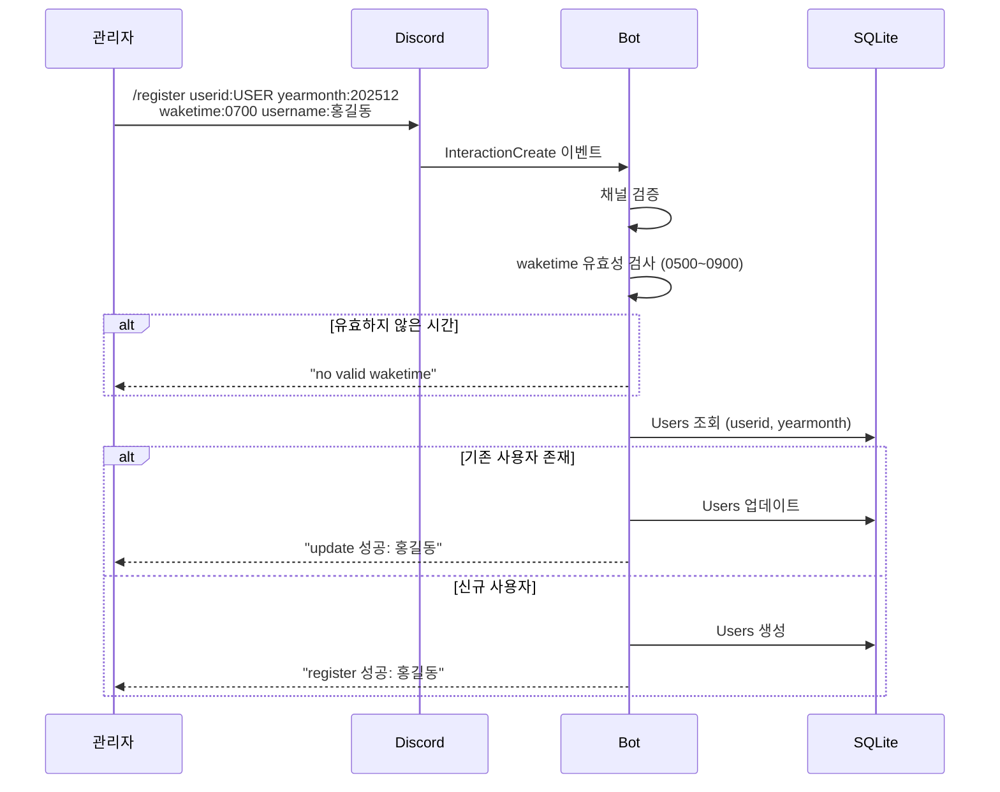

---

### US-2: 체크인

```
AS A 챌린저
I WANT TO 기상 후 인증샷과 함께 체크인
SO THAT 오늘의 출석이 기록된다
```

**인수 조건:**
- 등록된 기상시간 ±30분 내에만 체크인 가능
- ±10분 내: 정시 출석
- 10~30분 후: 지각 처리
- 이미지 파일 첨부 필수
- 하루에 한 번만 체크인 가능

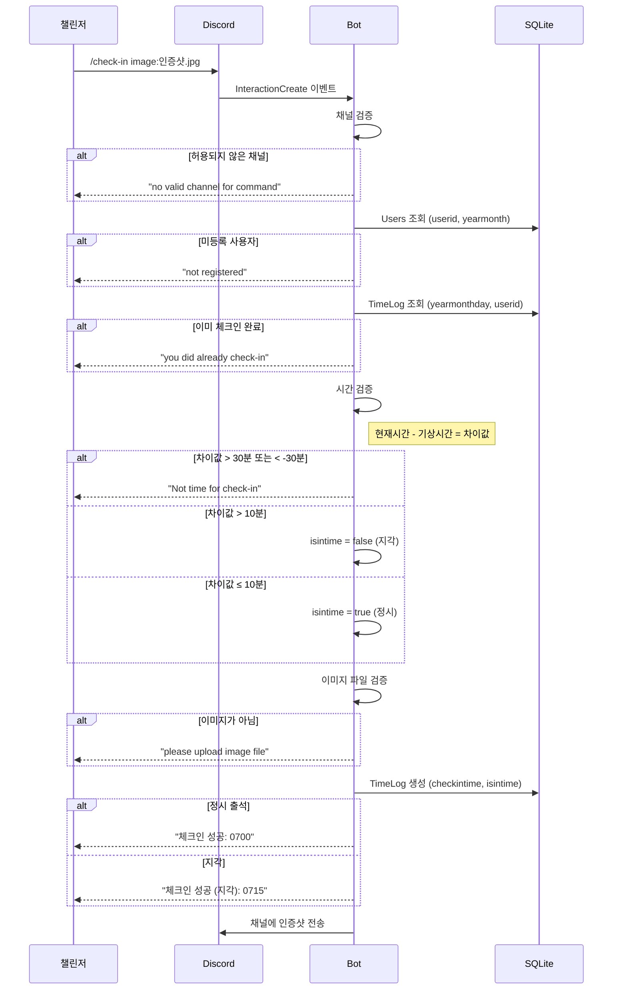

---

### US-3: 체크아웃

```
AS A 챌린저
I WANT TO 기상 후 1시간 뒤 체크아웃
SO THAT 출석이 완료된다
```

**인수 조건:**
- 체크인 완료 후에만 체크아웃 가능
- 기상시간 + 1시간 ±10분 내에만 가능
- 이미지 파일 첨부 필수
- 하루에 한 번만 체크아웃 가능

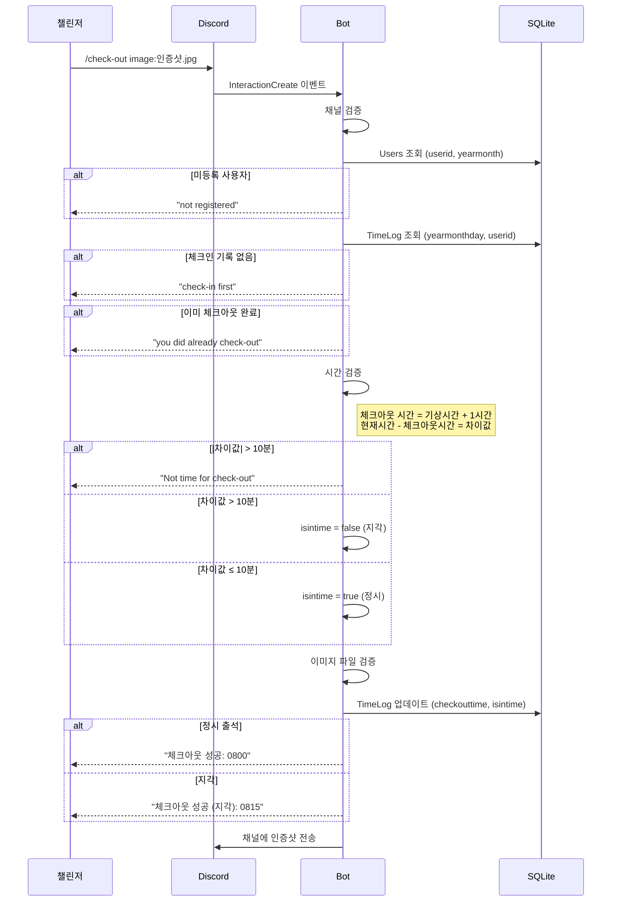

---

### US-4: 휴가 추가

```
AS A 관리자
I WANT TO 챌린저에게 휴가일수를 추가
SO THAT 해당 챌린저가 추가 휴식일을 가질 수 있다
```

**인수 조건:**
- 기존 휴가일수에 지정한 수만큼 추가
- 등록된 사용자만 대상

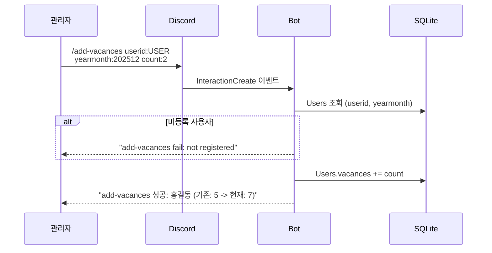

---

### US-5: 일일 출석 리포트

```
AS A 챌린저
I WANT TO 매일 오후 1시에 출석 현황을 확인
SO THAT 나와 다른 챌린저들의 출석 상태를 알 수 있다
```

**인수 조건:**
- 출석/지각/결석 인원 집계
- 주말 및 공휴일 제외
- 결석자는 결석 횟수 증가
- 지각자는 지각 횟수 증가

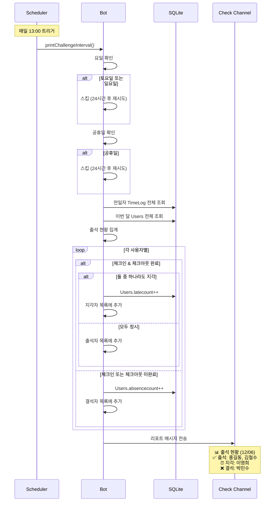

---

### US-6: 명예의 전당

```
AS A 챌린저
I WANT TO 월말에 완주자 명단을 확인
SO THAT 한 달간의 성과를 축하받을 수 있다
```

**인수 조건:**
- 매월 마지막 날 출력
- 결석 3회 미만인 사용자만 포함 (삼진아웃 제도)

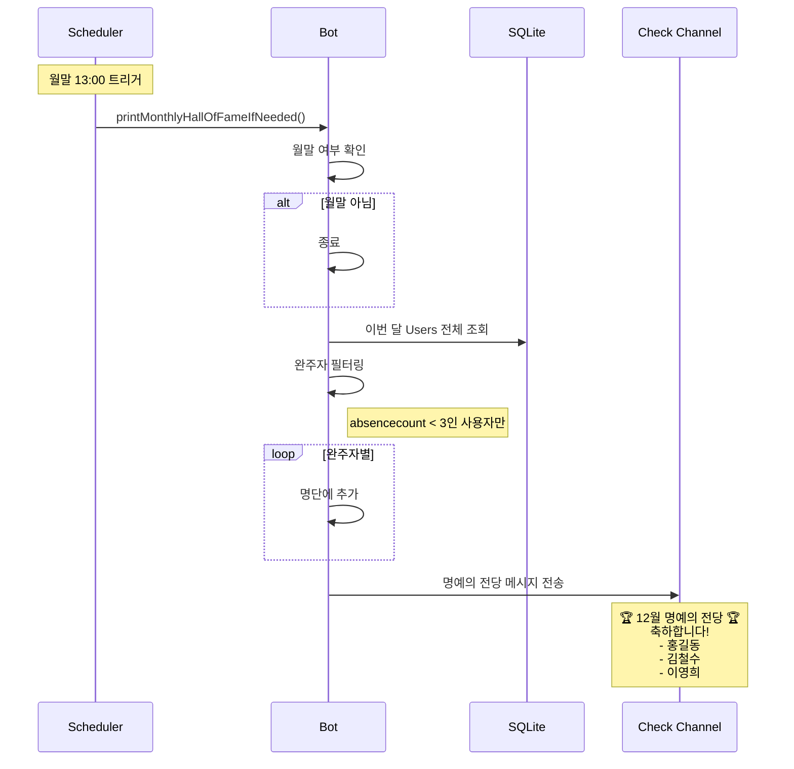

---

## 캠스터디 (Cam Study)

### US-7: 캠스터디 등록

```
AS A 관리자
I WANT TO 사용자를 캠스터디에 등록
SO THAT 해당 사용자의 학습 시간이 추적된다
```

**인수 조건:**
- 사용자 ID와 이름을 입력받는다
- 중복 등록 불가

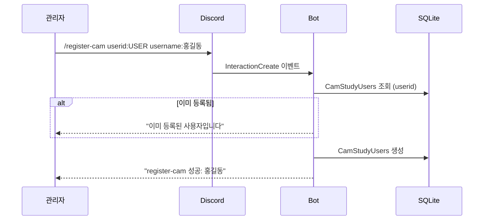

---

### US-8: 학습 시간 자동 추적

```
AS A 캠스터디 참가자
I WANT TO 음성 채널에서 카메라를 켜면 자동으로 시간이 기록
SO THAT 별도 조작 없이 공부 시간이 측정된다
```

**인수 조건:**
- 카메라 ON: 학습 시작
- 카메라 OFF 또는 채널 퇴장: 학습 종료
- 5분 미만 세션은 무시
- 자정을 넘기면 새 날짜로 분리 기록

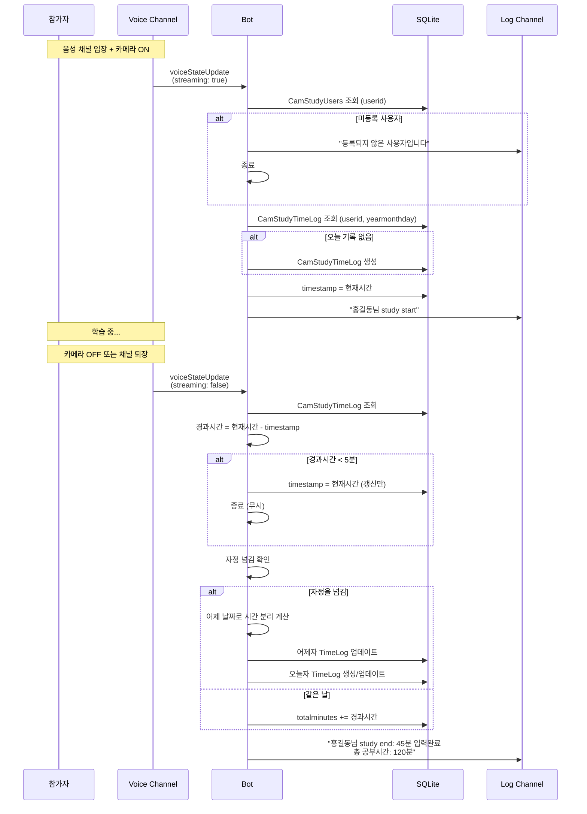

---

### US-9: 일간 학습 시간 리포트

```
AS A 캠스터디 참가자
I WANT TO 매일 23:59에 학습 시간 랭킹을 확인
SO THAT 나의 학습량을 다른 참가자와 비교할 수 있다
```

**인수 조건:**
- 학습 시간 기준 내림차순 정렬
- 시간 형식: "X시간 Y분"

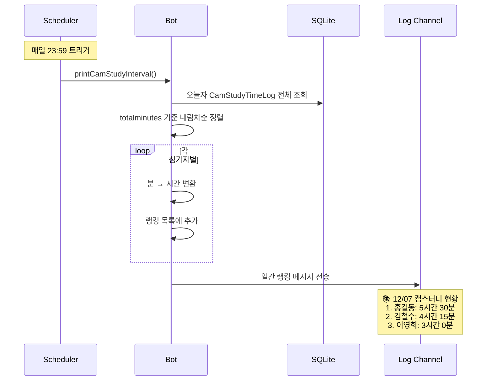

---

### US-10: 주간 학습 시간 리포트

```
AS A 캠스터디 참가자
I WANT TO 매주 금요일에 주간 학습 시간 랭킹을 확인
SO THAT 한 주간의 학습량을 확인할 수 있다
```

**인수 조건:**
- 매주 금요일 23:59에 출력
- 월~금 학습 시간 누적
- 주차 번호: 2024-04-06 기준으로 계산

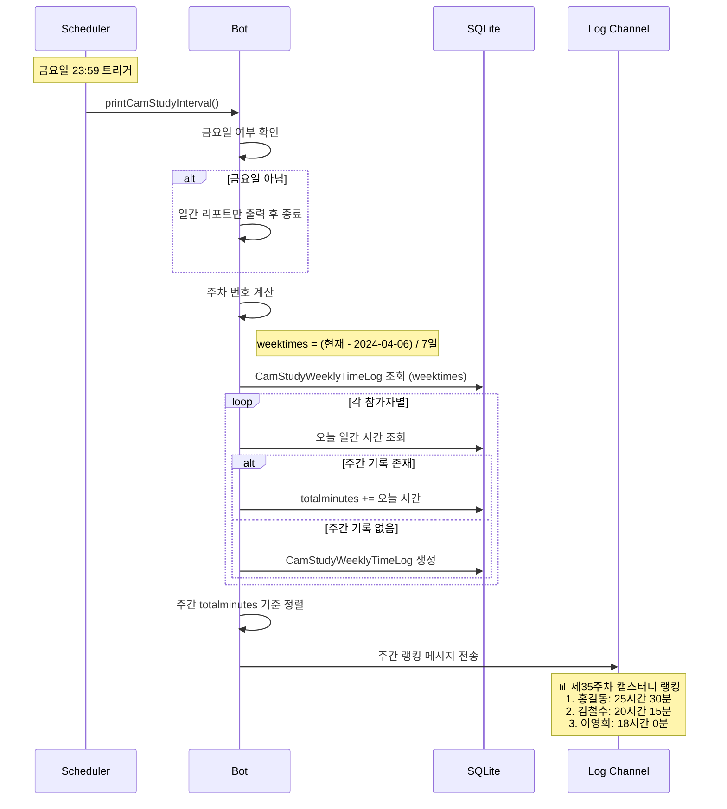

---

### US-11: 캠스터디 탈퇴

```
AS A 관리자
I WANT TO 사용자를 캠스터디에서 삭제
SO THAT 해당 사용자의 학습 시간 추적이 중단된다
```

**인수 조건:**
- 등록된 사용자만 삭제 가능
- 기존 학습 기록은 유지됨

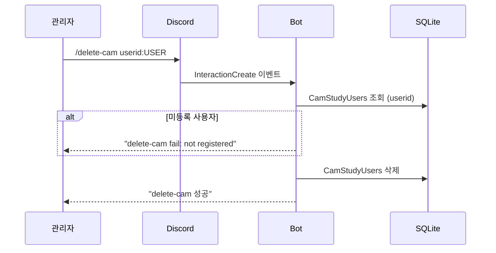
