# 사용자 스토리 및 시퀀스 다이어그램

## 공통 온보딩 (Onboarding)

### US-14: 역할 기반 온보딩 안내

```
AS A 신규 사용자
I WANT TO #start-here 와 #apply 만 보고 서버 구조와 참여 절차를 이해하고 싶다
SO THAT 어디서 읽고, 어디서 신청하고, 어디서 질문해야 하는지 헷갈리지 않는다
```

**인수 조건:**

- `#start-here`에는 서버 소개와 프로그램 요약이 고정 안내로 제공된다
- `#apply`에는 참여 방법과 신청 명령어가 고정 안내로 제공된다
- `#qna`는 질문/응답 채널로 분리된다
- `#announcements`는 운영 공지 전용 채널로 분리된다

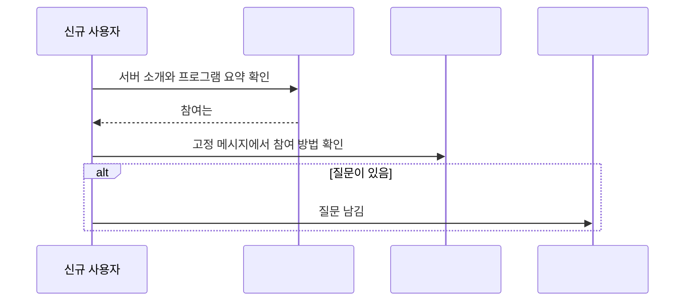
```mermaid
sequenceDiagram
    participant U as 신규 사용자
    participant S as #start-here
    participant A as #apply
    participant Q as #qna

    U->>S: 서버 소개와 프로그램 요약 확인
    S-->>U: 참여는 #apply / 질문은 #qna 안내
    U->>A: 고정 메시지에서 참여 방법 확인
    alt 질문이 있음
        U->>Q: 질문 남김
    end
```

---

### US-15: 역할 기반 참여 신청과 승인

```
AS A 서버 사용자
I WANT TO /apply-wakeup 또는 /apply-cam 으로 직접 신청하고 운영자 승인을 받고 싶다
SO THAT 승인된 프로그램의 전용 채널만 자동으로 열리길 원한다
```

**인수 조건:**

- `/apply-wakeup`, `/apply-cam`은 `#apply`에서만 실행된다
- 신청 응답은 신청자 본인에게만 보이는 `ephemeral` 응답으로 처리된다
- 신청 시 운영 채널에 승인/거절용 안내가 전송된다
- 운영자가 승인하면 해당 역할이 자동 부여된다
- 운영자가 거절하면 거절 사유와 재신청 안내가 사용자에게 전달된다

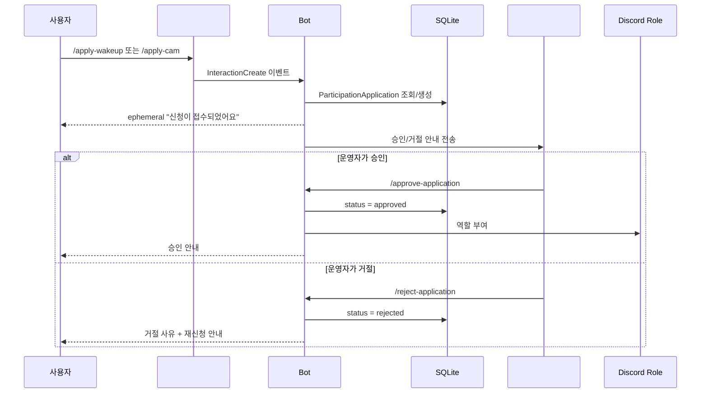
```mermaid
sequenceDiagram
    participant U as 사용자
    participant A as #apply
    participant B as Bot
    participant DB as SQLite
    participant O as #ops
    participant D as Discord Role

    U->>A: /apply-wakeup 또는 /apply-cam
    A->>B: InteractionCreate 이벤트
    B->>DB: ParticipationApplication 조회/생성
    B-->>U: ephemeral "신청이 접수되었어요"
    B->>O: 승인/거절 안내 전송

    alt 운영자가 승인
        O->>B: /approve-application
        B->>DB: status = approved
        B->>D: 역할 부여
        B-->>U: 승인 안내
    else 운영자가 거절
        O->>B: /reject-application
        B->>DB: status = rejected
        B-->>U: 거절 사유 + 재신청 안내
    end
```

---

## 기상 챌린지 (Morning Challenge)

### US-13: 운영 daily message 자동 생성

```
AS A 챌린저
I WANT TO 매일 아침 운영 채널에 오늘의 daily message와 출석 thread가 열리길 원한다
SO THAT 그날의 출석 진입점이 하나로 유지된다
```

**인수 조건:**

- 운영 채널에 매일 오전 06:00 daily message와 출석 thread를 생성한다
- 같은 날짜에는 daily message/thread를 한 번만 생성한다
- 봇 재시작 후에도 오늘 thread를 다시 찾아 재사용할 수 있다
- 테스트 채널 demo thread와 운영 thread는 다른 채널/이름 규칙을 사용한다

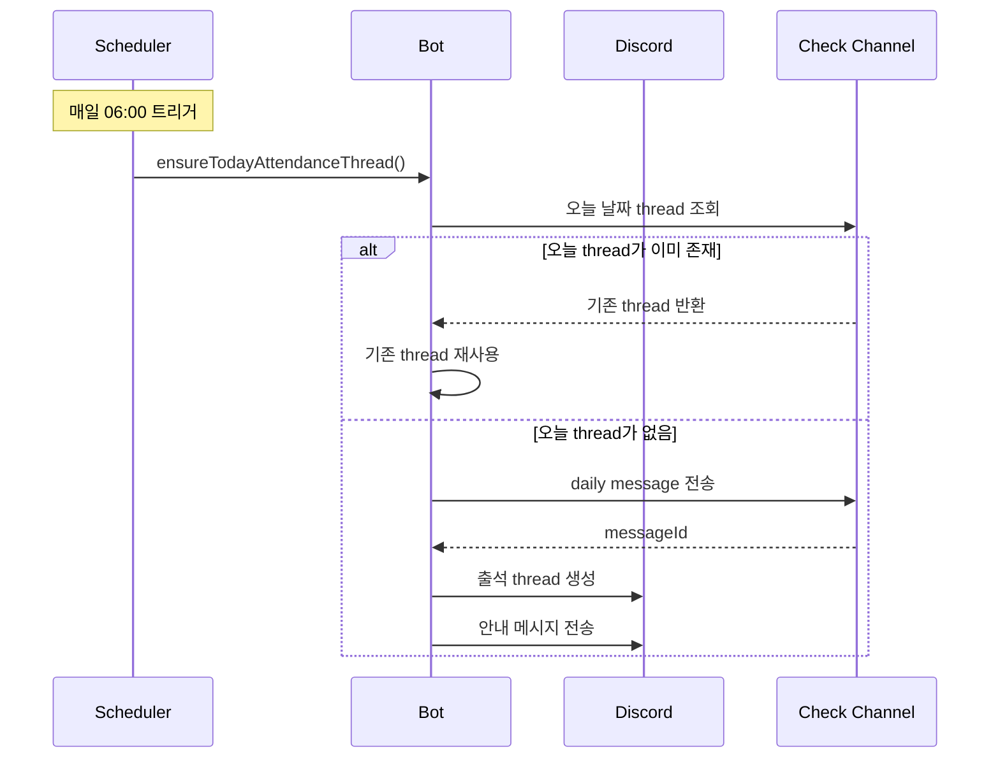
```mermaid
sequenceDiagram
    participant S as Scheduler
    participant B as Bot
    participant D as Discord
    participant C as Check Channel

    Note over S: 매일 06:00 트리거
    S->>B: ensureTodayAttendanceThread()
    B->>C: 오늘 날짜 thread 조회

    alt 오늘 thread가 이미 존재
        C-->>B: 기존 thread 반환
        B->>B: 기존 thread 재사용
    else 오늘 thread가 없음
        B->>C: daily message 전송
        C-->>B: messageId
        B->>D: 출석 thread 생성
        B->>D: 안내 메시지 전송
    end
```

---

### US-14: CI bot boot smoke test

```
AS A 운영자
I WANT TO Discord 로그인 없이도 봇 부팅 경로를 CI에서 확인하고 싶다
SO THAT 설정 누락이나 command/event 로더 오류를 production 배포 전에 막을 수 있다
```

**인수 조건:**
- `config` 로딩이 CI에서 실패 없이 검증된다
- Discord client 생성이 실제 로그인 없이 가능하다
- command/event 동적 로딩이 CI에서 실패 없이 끝난다
- smoke test는 production 토큰 없이 실행 가능하다

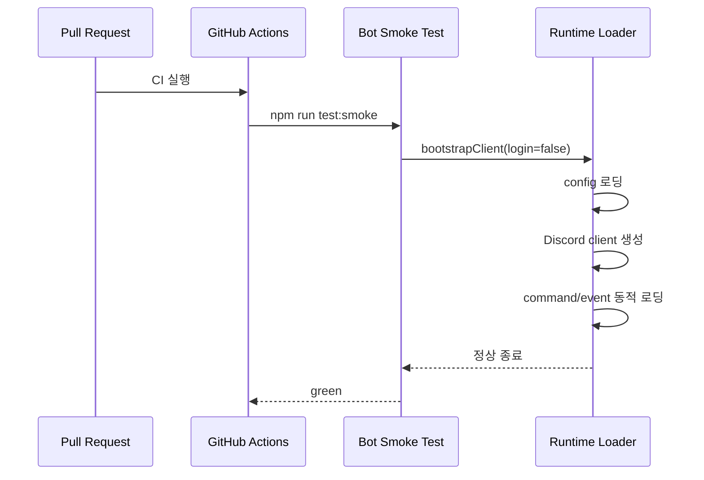
```mermaid
sequenceDiagram
    participant PR as Pull Request
    participant GH as GitHub Actions
    participant T as Bot Smoke Test
    participant B as Runtime Loader

    PR->>GH: CI 실행
    GH->>T: npm run test:smoke
    T->>B: bootstrapClient(login=false)
    B->>B: config 로딩
    B->>B: Discord client 생성
    B->>B: command/event 동적 로딩
    B-->>T: 정상 종료
    T-->>GH: green
```

---

### US-15: 운영자 production 수동 배포와 롤백

```
AS A 운영자
I WANT TO workflow_dispatch로 production 배포를 시작하고 verify 통과 후 자동 배포되길 원한다
SO THAT 배포 전 검증과 배포 후 확인을 같은 절차로 반복할 수 있다
```

**인수 조건:**
- production 배포는 `workflow_dispatch`로만 시작된다
- verify job이 `lint`, `prettier`, `build`, `test`, `smoke test`를 통과해야 deploy가 실행된다
- deploy는 GitHub-hosted runner에서 OCI 서버로 SSH 배포한다
- deploy 뒤에는 `pm2 status`와 `Ready! Logged in as` 로그를 확인한다
- 실패 시 이전 안정 ref로 같은 workflow를 다시 실행해 롤백할 수 있다

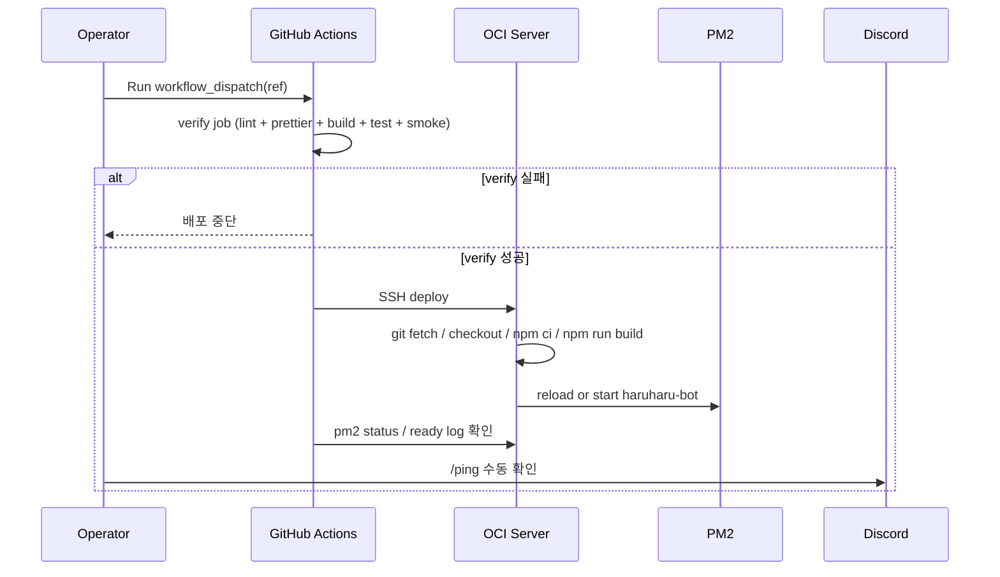
```mermaid
sequenceDiagram
    participant O as Operator
    participant GH as GitHub Actions
    participant OCI as OCI Server
    participant PM2 as PM2
    participant D as Discord

    O->>GH: Run workflow_dispatch(ref)
    GH->>GH: verify job (lint + prettier + build + test + smoke)

    alt verify 실패
        GH-->>O: 배포 중단
    else verify 성공
        GH->>OCI: SSH deploy
        OCI->>OCI: git fetch / checkout / npm ci / npm run build
        OCI->>PM2: reload or start haruharu-bot
        GH->>OCI: pm2 status / ready log 확인
        O->>D: /ping 수동 확인
    end
```

---

### US-1: 챌린저 등록/수정

```
AS A 챌린저
I WANT TO /register 명령으로 내 기상시간을 등록하거나 수정
SO THAT 운영자 개입 없이 출석 체크 기준 시간을 스스로 설정할 수 있다
```

**인수 조건:**

- 기상시간을 입력받는다
- 기상시간은 05:00~09:00 범위만 허용
- Discord 사용자 ID와 이름은 interaction 사용자 정보에서 사용한다
- 현재 시각 기준 `yearmonth`를 내부에서 계산한다
- 기본 휴가일수는 5일
- 이미 등록된 사용자는 정보가 업데이트된다
- 같은 날에는 한 번만 변경할 수 있다

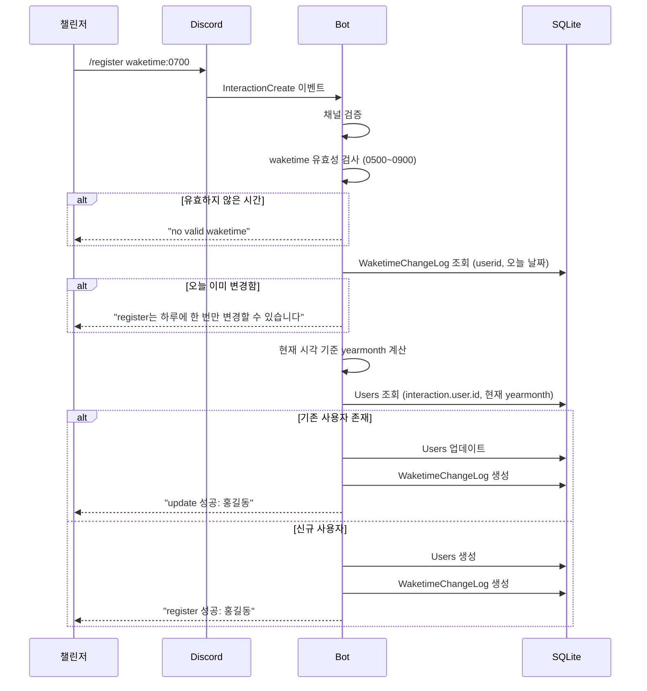
```mermaid
sequenceDiagram
    participant U as 챌린저
    participant D as Discord
    participant B as Bot
    participant DB as SQLite

    U->>D: /register waketime:0700

    D->>B: InteractionCreate 이벤트
    B->>B: 채널 검증

    B->>B: waketime 유효성 검사 (0500~0900)
    alt 유효하지 않은 시간
        B-->>U: "no valid waketime"
    end

    B->>DB: WaketimeChangeLog 조회 (userid, 오늘 날짜)
    alt 오늘 이미 변경함
        B-->>U: "register는 하루에 한 번만 변경할 수 있습니다"
    end

    B->>B: 현재 시각 기준 yearmonth 계산
    B->>DB: Users 조회 (interaction.user.id, 현재 yearmonth)

    alt 기존 사용자 존재
        B->>DB: Users 업데이트
        B->>DB: WaketimeChangeLog 생성
        B-->>U: "update 성공: 홍길동"
    else 신규 사용자
        B->>DB: Users 생성
        B->>DB: WaketimeChangeLog 생성
        B-->>U: "register 성공: 홍길동"
    end
```

---

### US-2, US-3: 레거시 check-in/check-out 제거

- `/check-in`, `/check-out`는 더 이상 등록되지 않는다.
- 공식 기상 출석 입력은 daily message에 연결된 오늘의 출석 thread 첫 댓글만 사용한다.
- 과거 `TimeLog` 데이터는 집계 원본이 아닌 레거시 기록 호환용으로만 유지한다.

---

### US-4: 휴가 추가

```
AS A 관리자
I WANT TO 챌린저에게 휴가일수를 추가
SO THAT 해당 챌린저가 추가 휴식일을 가질 수 있다
```

**인수 조건:**

- 사용자에게 지급된 총 휴가일수에 지정한 수만큼 추가
- 등록된 사용자만 대상

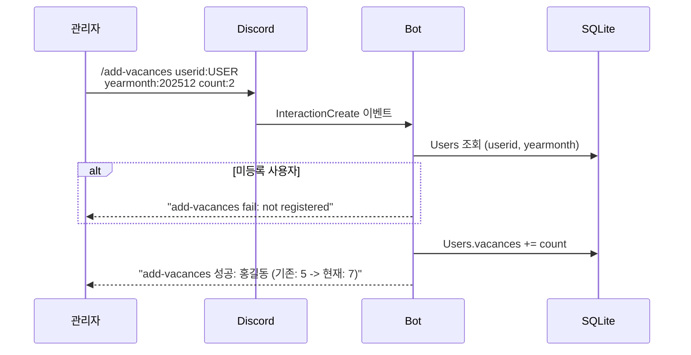
```mermaid
sequenceDiagram
    participant A as 관리자
    participant D as Discord
    participant B as Bot
    participant DB as SQLite

    A->>D: /add-vacances userid:USER<br/>yearmonth:202512 count:2

    D->>B: InteractionCreate 이벤트

    B->>DB: Users 조회 (userid, yearmonth)
    alt 미등록 사용자
        B-->>A: "add-vacances fail: not registered"
    end

    B->>DB: Users.vacances += count
    B-->>A: "add-vacances 성공: 홍길동 (기존: 5 -> 현재: 7)"
```

---

### US-5: 일일 출석 리포트

```
AS A 챌린저
I WANT TO 매일 오후 1시에 출석 현황을 확인
SO THAT 나와 다른 챌린저들의 출석 상태를 알 수 있다
```

**인수 조건:**

- `AttendanceLog` 기준 출석/지각/결석 인원 집계
- 휴가 등록된 날짜는 `휴가`로 표시하고 결석으로 처리하지 않음
- 댓글이 없는 사용자도 결석으로 확정
- `AttendanceLog`가 없는 등록 사용자는 `TimeLog` 여부와 무관하게 결석으로 확정
- 주말 및 공휴일 제외
- `late` 상태는 `latecount` 증가
- `absent` 상태 또는 무댓글 사용자는 `absencecount` 증가
- 결과표에 사용자별 오늘 상태와 월 누적 `latecount`, `absencecount`, 잔여휴가를 함께 표시
- 결과표가 Discord 2000자 제한을 넘기면 줄 경계를 기준으로 여러 메시지로 나눠 순서대로 전송

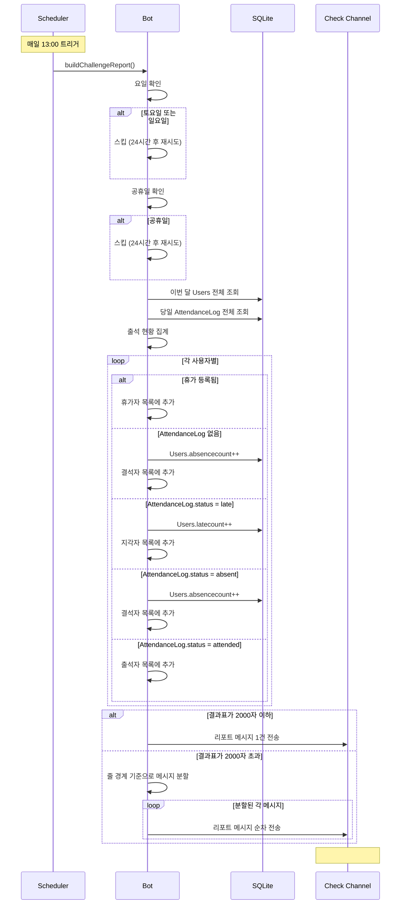
```mermaid
sequenceDiagram
    participant S as Scheduler
    participant B as Bot
    participant DB as SQLite
    participant C as Check Channel

    Note over S: 매일 13:00 트리거
    S->>B: buildChallengeReport()

    B->>B: 요일 확인
    alt 토요일 또는 일요일
        B->>B: 스킵 (24시간 후 재시도)
    end

    B->>B: 공휴일 확인
    alt 공휴일
        B->>B: 스킵 (24시간 후 재시도)
    end

    B->>DB: 이번 달 Users 전체 조회
    B->>DB: 당일 AttendanceLog 전체 조회

    B->>B: 출석 현황 집계

    loop 각 사용자별
        alt 휴가 등록됨
            B->>B: 휴가자 목록에 추가
        else AttendanceLog 없음
            B->>DB: Users.absencecount++
            B->>B: 결석자 목록에 추가
        else AttendanceLog.status = late
            B->>DB: Users.latecount++
            B->>B: 지각자 목록에 추가
        else AttendanceLog.status = absent
            B->>DB: Users.absencecount++
            B->>B: 결석자 목록에 추가
        else AttendanceLog.status = attended
            B->>B: 출석자 목록에 추가
        end
    end

    alt 결과표가 2000자 이하
        B->>C: 리포트 메시지 1건 전송
    else 결과표가 2000자 초과
        B->>B: 줄 경계 기준으로 메시지 분할
        loop 분할된 각 메시지
            B->>C: 리포트 메시지 순차 전송
        end
    end
    Note over C: ### 20251208 출석표<br/>- 홍길동: 출석 (월 누적 지각 0회, 결석 0회, 잔여휴가 5일)<br/>- 이영희: 지각 (월 누적 지각 3회, 결석 1회, 잔여휴가 5일)<br/>- 박민수: 휴가 (월 누적 지각 0회, 결석 0회, 잔여휴가 4일)<br/>- 최민지: 결석 (월 누적 지각 0회, 결석 2회, 잔여휴가 5일)
```

---

### US-6: 명예의 전당

```
AS A 챌린저
I WANT TO 월말에 완주자 명단을 확인
SO THAT 한 달간의 성과를 축하받을 수 있다
```

**인수 조건:**

- 매월 마지막 날 출력
- 결석 횟수가 해당 월 총 지급 휴가일수 이내인 사용자만 포함


```mermaid
sequenceDiagram
    participant S as Scheduler
    participant B as Bot
    participant DB as SQLite
    participant C as Check Channel

    Note over S: 월말 13:00 트리거
    S->>B: printMonthlyHallOfFameIfNeeded()

    B->>B: 월말 여부 확인
    alt 월말 아님
        B->>B: 종료
    end

    B->>DB: 이번 달 Users 전체 조회

    B->>B: 완주자 필터링
    Note right of B: absencecount <= vacances인 사용자만

    loop 완주자별
        B->>B: 명단에 추가
    end

    B->>C: 명예의 전당 메시지 전송
    Note over C: 🏆 12월 명예의 전당 🏆<br/>축하합니다!<br/>- 홍길동<br/>- 김철수<br/>- 이영희
```

---

## 캠스터디 (Cam Study)

### US-7: 캠스터디 등록

```
AS A 관리자
I WANT TO 사용자를 캠스터디에 등록
SO THAT 해당 사용자의 학습 시간이 추적된다
```

**인수 조건:**

- 사용자 ID와 이름을 입력받는다
- 중복 등록 불가

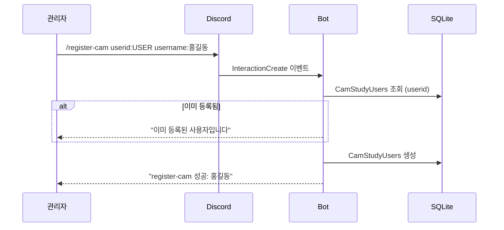
```mermaid
sequenceDiagram
    participant A as 관리자
    participant D as Discord
    participant B as Bot
    participant DB as SQLite

    A->>D: /register-cam userid:USER username:홍길동

    D->>B: InteractionCreate 이벤트

    B->>DB: CamStudyUsers 조회 (userid)
    alt 이미 등록됨
        B-->>A: "이미 등록된 사용자입니다"
    end

    B->>DB: CamStudyUsers 생성
    B-->>A: "register-cam 성공: 홍길동"
```

---

### US-8: 학습 시간 자동 추적

```
AS A 캠스터디 참가자
I WANT TO 음성 채널에서 카메라 또는 화면공유를 켜면 자동으로 시간이 기록
SO THAT 별도 조작 없이 공부 시간이 측정된다
```

**인수 조건:**

- 카메라 ON 또는 화면공유 ON: 학습 시작
- 카메라와 화면공유가 모두 OFF 이거나 채널 퇴장: 학습 종료
- 5분 미만 세션은 무시
- 자정을 넘기면 새 날짜로 분리 기록

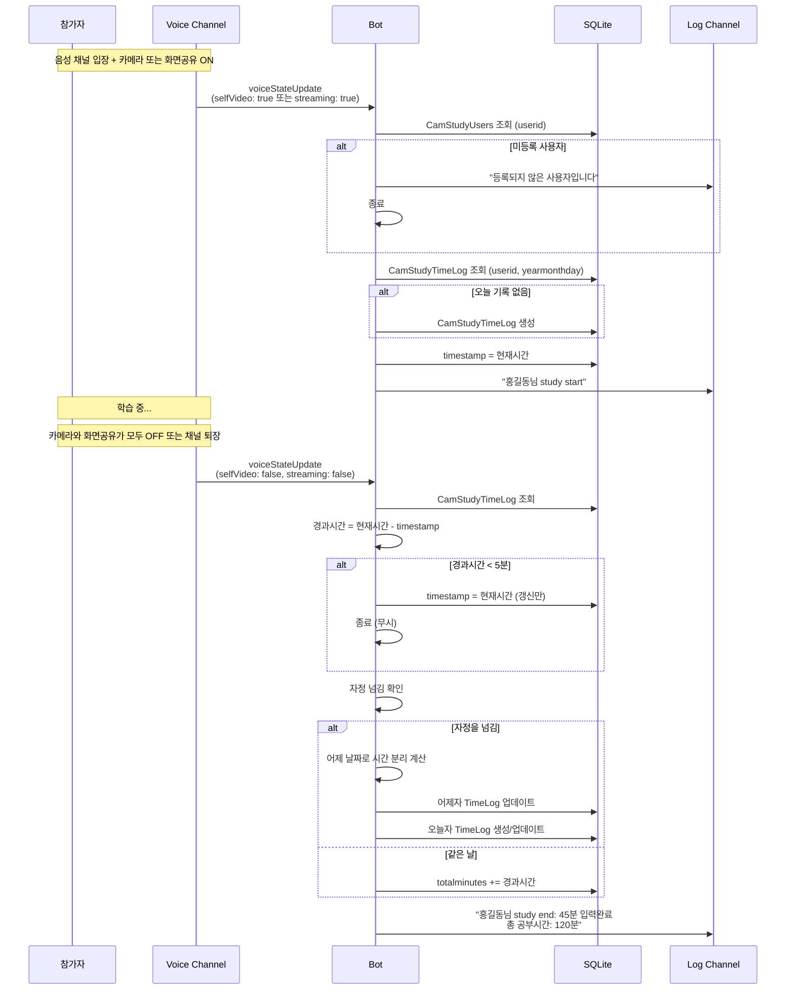
```mermaid
sequenceDiagram
    participant U as 참가자
    participant VC as Voice Channel
    participant B as Bot
    participant DB as SQLite
    participant L as Log Channel

    Note over U,VC: 음성 채널 입장 + 카메라 또는 화면공유 ON
    VC->>B: voiceStateUpdate<br/>(selfVideo: true 또는 streaming: true)

    B->>DB: CamStudyUsers 조회 (userid)
    alt 미등록 사용자
        B->>L: "등록되지 않은 사용자입니다"
        B->>B: 종료
    end

    B->>DB: CamStudyTimeLog 조회 (userid, yearmonthday)
    alt 오늘 기록 없음
        B->>DB: CamStudyTimeLog 생성
    end

    B->>DB: timestamp = 현재시간
    B->>L: "홍길동님 study start"

    Note over U,VC: 학습 중...

    Note over U,VC: 카메라와 화면공유가 모두 OFF 또는 채널 퇴장
    VC->>B: voiceStateUpdate<br/>(selfVideo: false, streaming: false)

    B->>DB: CamStudyTimeLog 조회
    B->>B: 경과시간 = 현재시간 - timestamp

    alt 경과시간 < 5분
        B->>DB: timestamp = 현재시간 (갱신만)
        B->>B: 종료 (무시)
    end

    B->>B: 자정 넘김 확인
    alt 자정을 넘김
        B->>B: 어제 날짜로 시간 분리 계산
        B->>DB: 어제자 TimeLog 업데이트
        B->>DB: 오늘자 TimeLog 생성/업데이트
    else 같은 날
        B->>DB: totalminutes += 경과시간
    end

    B->>L: "홍길동님 study end: 45분 입력완료<br/>총 공부시간: 120분"
```

---

### US-9: 일간 학습 시간 리포트

```
AS A 캠스터디 참가자
I WANT TO 매일 23:59에 학습 시간 랭킹을 확인
SO THAT 나의 학습량을 다른 참가자와 비교할 수 있다
```

**인수 조건:**

- 학습 시간 기준 내림차순 정렬
- 시간 형식: "X시간 Y분"

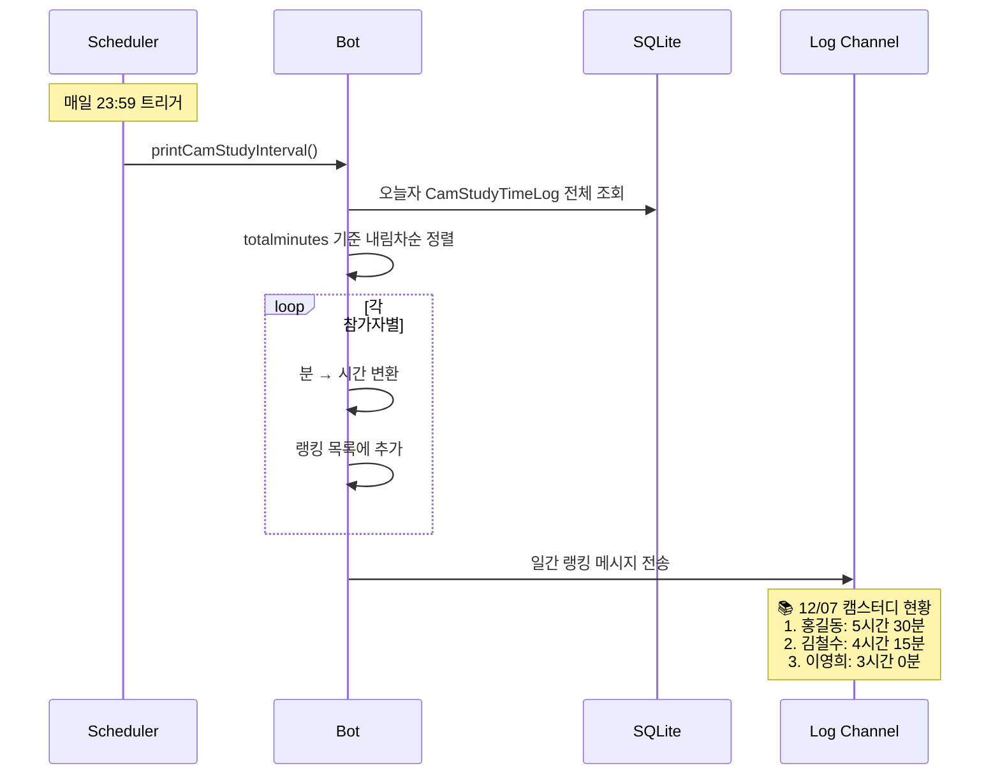
```mermaid
sequenceDiagram
    participant S as Scheduler
    participant B as Bot
    participant DB as SQLite
    participant L as Log Channel

    Note over S: 매일 23:59 트리거
    S->>B: printCamStudyInterval()

    B->>DB: 오늘자 CamStudyTimeLog 전체 조회

    B->>B: totalminutes 기준 내림차순 정렬

    loop 각 참가자별
        B->>B: 분 → 시간 변환
        B->>B: 랭킹 목록에 추가
    end

    B->>L: 일간 랭킹 메시지 전송
    Note over L: 📚 12/07 캠스터디 현황<br/>1. 홍길동: 5시간 30분<br/>2. 김철수: 4시간 15분<br/>3. 이영희: 3시간 0분
```

---

### US-10: 주간 학습 시간 리포트

```
AS A 캠스터디 참가자
I WANT TO 매주 금요일에 주간 학습 시간 랭킹을 확인
SO THAT 한 주간의 학습량을 확인할 수 있다
```

**인수 조건:**

- 매주 금요일 23:59에 출력
- 월~금 학습 시간 누적
- 주차 번호: 2024-04-06 기준으로 계산
- 같은 날짜 기준 재실행해도 주간 누적 시간이 중복 반영되지 않는다

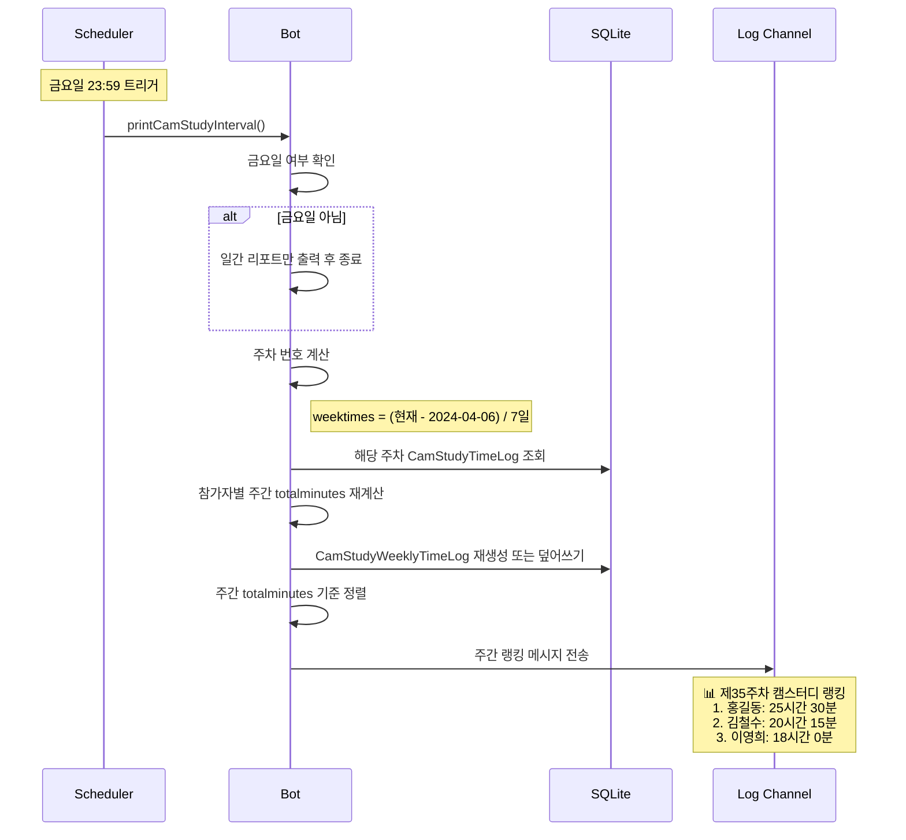
```mermaid
sequenceDiagram
    participant S as Scheduler
    participant B as Bot
    participant DB as SQLite
    participant L as Log Channel

    Note over S: 금요일 23:59 트리거
    S->>B: printCamStudyInterval()

    B->>B: 금요일 여부 확인
    alt 금요일 아님
        B->>B: 일간 리포트만 출력 후 종료
    end

    B->>B: 주차 번호 계산
    Note right of B: weektimes = (현재 - 2024-04-06) / 7일

    B->>DB: 해당 주차 CamStudyTimeLog 조회
    B->>B: 참가자별 주간 totalminutes 재계산
    B->>DB: CamStudyWeeklyTimeLog 재생성 또는 덮어쓰기

    B->>B: 주간 totalminutes 기준 정렬

    B->>L: 주간 랭킹 메시지 전송
    Note over L: 📊 제35주차 캠스터디 랭킹<br/>1. 홍길동: 25시간 30분<br/>2. 김철수: 20시간 15분<br/>3. 이영희: 18시간 0분
```

---

### US-11: 캠스터디 탈퇴

```
AS A 관리자
I WANT TO 사용자를 캠스터디에서 삭제
SO THAT 해당 사용자의 학습 시간 추적이 중단된다
```

**인수 조건:**

- 등록된 사용자만 삭제 가능
- 기존 학습 기록은 유지됨

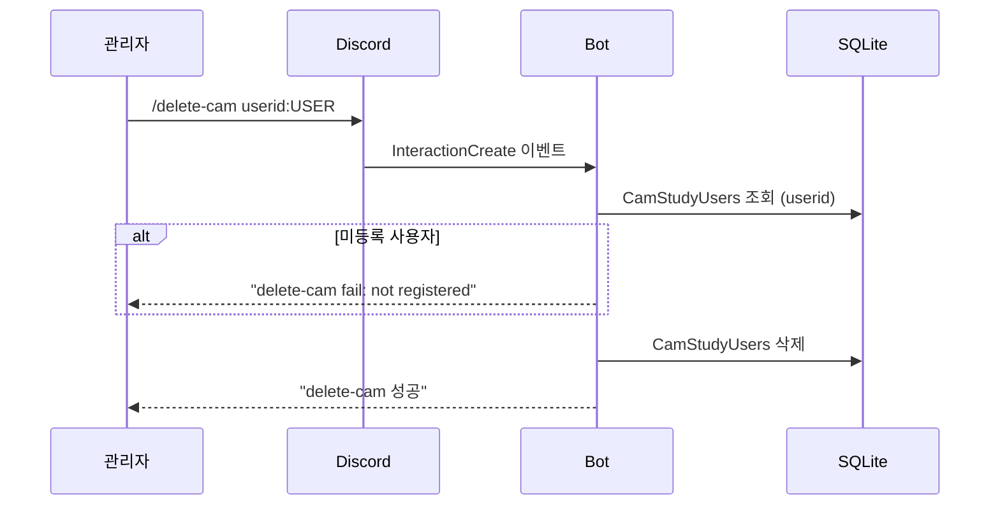
```mermaid
sequenceDiagram
    participant A as 관리자
    participant D as Discord
    participant B as Bot
    participant DB as SQLite

    A->>D: /delete-cam userid:USER

    D->>B: InteractionCreate 이벤트

    B->>DB: CamStudyUsers 조회 (userid)
    alt 미등록 사용자
        B-->>A: "delete-cam fail: not registered"
    end

    B->>DB: CamStudyUsers 삭제
    B-->>A: "delete-cam 성공"
```

---

### US-13: 사용자 직접 기상시간 재등록

```
AS A 챌린저
I WANT TO `/register`를 다시 실행해서 자신의 기상시간을 수정
SO THAT 같은 명령으로 등록과 수정을 모두 처리할 수 있다
```

**인수 조건:**

- 이미 등록된 사용자도 같은 `/register` 명령을 사용한다
- 본인 데이터만 수정 가능
- 기상시간은 05:00~09:00 범위만 허용
- 같은 날에는 한 번만 변경 가능

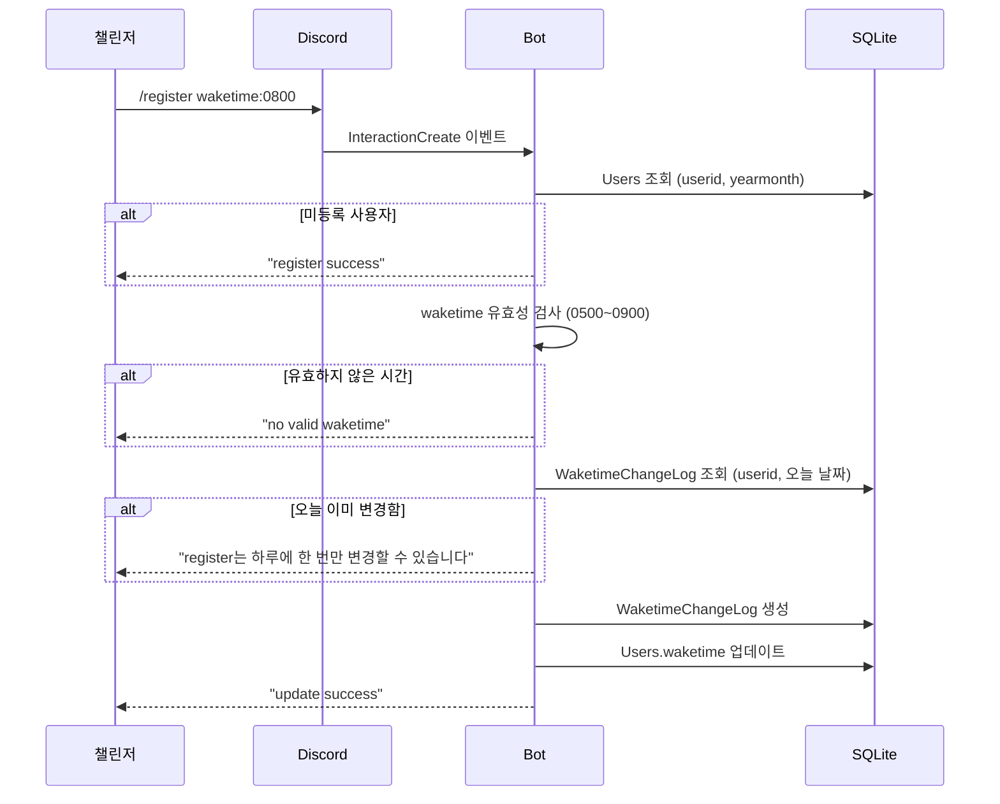
```mermaid
sequenceDiagram
    participant U as 챌린저
    participant D as Discord
    participant B as Bot
    participant DB as SQLite

    U->>D: /register waketime:0800
    D->>B: InteractionCreate 이벤트

    B->>DB: Users 조회 (userid, yearmonth)
    alt 미등록 사용자
        B-->>U: "register success"
    end

    B->>B: waketime 유효성 검사 (0500~0900)
    alt 유효하지 않은 시간
        B-->>U: "no valid waketime"
    end

    B->>DB: WaketimeChangeLog 조회 (userid, 오늘 날짜)
    alt 오늘 이미 변경함
        B-->>U: "register는 하루에 한 번만 변경할 수 있습니다"
    end

    B->>DB: WaketimeChangeLog 생성
    B->>DB: Users.waketime 업데이트
    B-->>U: "update success"
```

---

### US-14: 사용자 직접 휴가 등록

```
AS A 챌린저
I WANT TO 자신의 휴가를 날짜 단위로 직접 등록
SO THAT 운영자 개입 없이 휴가 사용을 관리할 수 있다
```

**인수 조건:**

- 등록된 사용자만 가능
- 본인 데이터만 변경 가능
- 날짜는 `yyyymmdd` 형식이어야 함
- 같은 날짜 중복 등록 불가
- 잔여 휴가가 있을 때만 등록 가능

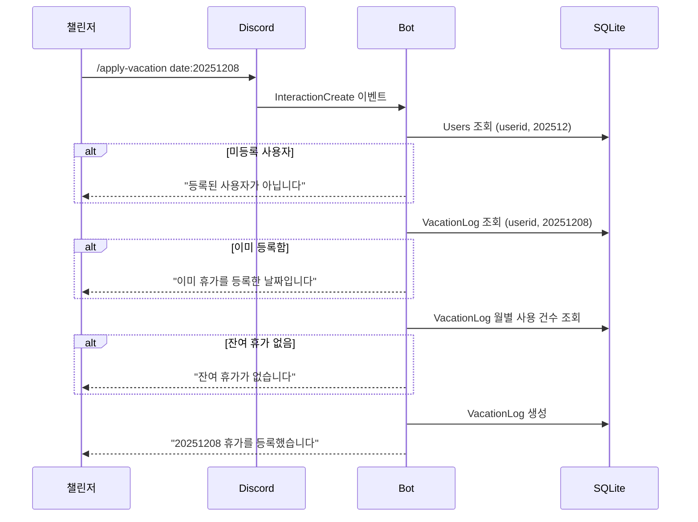
```mermaid
sequenceDiagram
    participant U as 챌린저
    participant D as Discord
    participant B as Bot
    participant DB as SQLite

    U->>D: /apply-vacation date:20251208
    D->>B: InteractionCreate 이벤트

    B->>DB: Users 조회 (userid, 202512)
    alt 미등록 사용자
        B-->>U: "등록된 사용자가 아닙니다"
    end

    B->>DB: VacationLog 조회 (userid, 20251208)
    alt 이미 등록함
        B-->>U: "이미 휴가를 등록한 날짜입니다"
    end

    B->>DB: VacationLog 월별 사용 건수 조회
    alt 잔여 휴가 없음
        B-->>U: "잔여 휴가가 없습니다"
    end

    B->>DB: VacationLog 생성
    B-->>U: "20251208 휴가를 등록했습니다"
```
