# 사용자 스토리 및 시퀀스 다이어그램

## 공통 온보딩 (Onboarding)

### US-14: 역할 기반 온보딩 안내

```
AS A 신규 사용자
I WANT TO #start-here 만 보고 서버 구조와 참여 절차를 이해하고 싶다
SO THAT 어디서 읽고, 어디서 신청하고, 어디서 질문해야 하는지 헷갈리지 않는다
```

**인수 조건:**

- `#start-here`에는 서버 소개와 프로그램 요약이 고정 안내로 제공된다
- `#start-here`에는 참여 방법과 공통 self-service 명령어가 함께 안내된다
- 기상 self-service 안내 채널에는 `/기상등록`, `/기상중단`, `/휴가신청` 사용 방법이 고정 안내로 제공된다
- `#qna`는 질문/응답 채널로 분리된다
- `#announcements`는 운영 공지 전용 채널로 분리된다
- `#start-here`, `#qna`, `#announcements`는 누구나 볼 수 있고 이후 전용 채널은 역할 기반으로만 노출된다

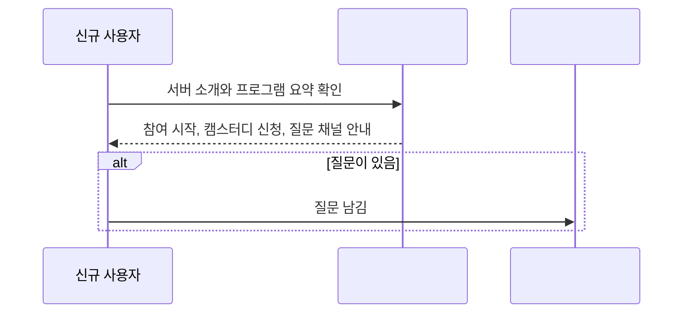
```mermaid
sequenceDiagram
    participant U as 신규 사용자
    participant S as #start-here
    participant Q as #qna

    U->>S: 서버 소개와 프로그램 요약 확인
    S-->>U: 참여 시작, 캠스터디 신청, 질문 채널 안내
    alt 질문이 있음
        U->>Q: 질문 남김
    end
```

---

### US-15: 역할 기반 self-service 참여 활성화

```
AS A 서버 사용자
I WANT TO #start-here 에서 /apply-cam 으로 바로 캠스터디 참여를 활성화하고 싶다
SO THAT 운영자 개입 없이 필요한 전용 채널 접근이 즉시 열리길 원한다
```

**인수 조건:**

- `/캠스터디신청` (`/apply-cam`)은 `#start-here`에서만 실행된다
- 다른 채널에서 `/캠스터디신청`을 실행하면 `#start-here` 사용과 `#qna` 질문 채널을 함께 안내한다
- 활성화 결과는 신청자 본인에게만 보이는 `ephemeral` 응답으로 처리된다
- `/apply-cam` 성공/실패 결과는 운영 확인용으로 `testChannelId`에도 기록된다
- `/apply-cam` 성공 시 `@cam-study` 역할, `ParticipationApplication.status=approved`, `CamStudyUsers`가 즉시 반영된다
- 이미 `@cam-study` 역할이 활성화된 사용자가 `/apply-cam`을 다시 실행하면 전용 채널 확인을 다시 안내한다
- 캠스터디는 이후 수동 역할 부여/회수도 `guildMemberUpdate`로 감지해서 `CamStudyUsers`를 계속 동기화한다

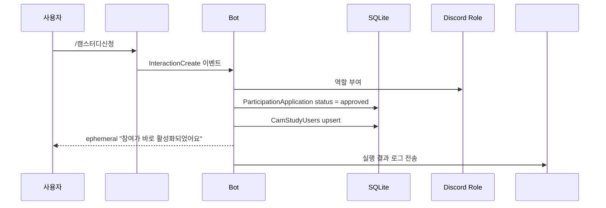
```mermaid
sequenceDiagram
    participant U as 사용자
    participant A as #start-here
    participant B as Bot
    participant DB as SQLite
    participant D as Discord Role
    participant T as #test

    U->>A: /캠스터디신청
    A->>B: InteractionCreate 이벤트
    B->>D: 역할 부여
    B->>DB: ParticipationApplication status = approved
    B->>DB: CamStudyUsers upsert
    B-->>U: ephemeral "참여가 바로 활성화되었어요"
    B->>T: 실행 결과 로그 전송
```

---

## 기상 챌린지 (Morning Challenge)

### US-13: 운영 daily message 자동 생성

```
AS A 챌린저
I WANT TO 매일 아침 운영 채널에 오늘의 daily message와 출석 thread가 열리길 원한다
SO THAT 그날의 출석 진입점이 하나로 유지된다
```

**인수 조건:**

- 운영 채널에 매일 오전 04:00 daily message와 출석 thread를 생성한다
- 같은 날짜에는 daily message/thread를 한 번만 생성한다
- 봇 재시작 후에도 오늘 thread를 다시 찾아 재사용할 수 있다
- 테스트 채널 demo thread와 운영 thread는 다른 채널/이름 규칙을 사용한다
- 운영 thread 안내 메시지에는 주말/공휴일 보너스 규칙이 포함된다


```mermaid
sequenceDiagram
    participant S as Scheduler
    participant B as Bot
    participant D as Discord
    participant C as Check Channel

    Note over S: 매일 04:00 트리거
    S->>B: ensureTodayAttendanceThread()
    B->>C: 오늘 날짜 thread 조회

    alt 오늘 thread가 이미 존재
        C-->>B: 기존 thread 반환
        B->>B: 기존 thread 재사용
    else 오늘 thread가 없음
        B->>C: daily message 전송
        C-->>B: messageId
        B->>D: 출석 thread 생성
        B->>D: 안내 메시지 전송
    end
```

---

### US-14: CI bot boot smoke test

```
AS A 운영자
I WANT TO Discord 로그인 없이도 봇 부팅 경로를 CI에서 확인하고 싶다
SO THAT 설정 누락이나 command/event 로더 오류를 production 배포 전에 막을 수 있다
```

**인수 조건:**

- `config` 로딩이 CI에서 실패 없이 검증된다
- Discord client 생성이 실제 로그인 없이 가능하다
- command/event 동적 로딩이 CI에서 실패 없이 끝난다
- smoke test는 production 토큰 없이 실행 가능하다

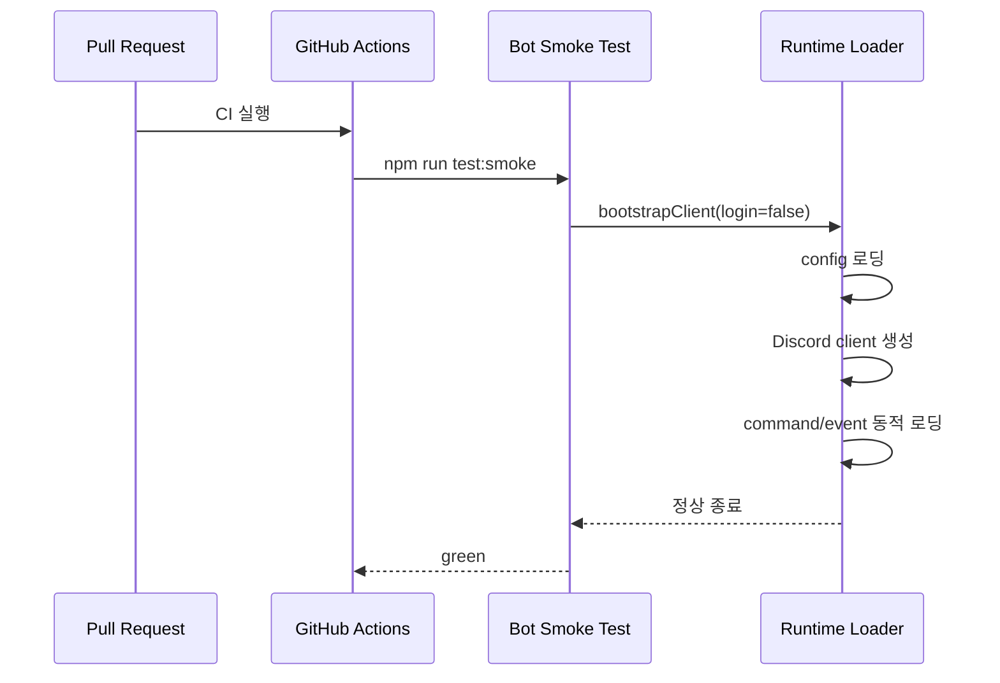
```mermaid
sequenceDiagram
    participant PR as Pull Request
    participant GH as GitHub Actions
    participant T as Bot Smoke Test
    participant B as Runtime Loader

    PR->>GH: CI 실행
    GH->>T: npm run test:smoke
    T->>B: bootstrapClient(login=false)
    B->>B: config 로딩
    B->>B: Discord client 생성
    B->>B: command/event 동적 로딩
    B-->>T: 정상 종료
    T-->>GH: green
```

---

### US-15: 운영자 production 수동 배포와 롤백

```
AS A 운영자
I WANT TO workflow_dispatch로 production 배포를 시작하고 verify 통과 후 자동 배포되길 원한다
SO THAT 배포 전 검증과 배포 후 확인을 같은 절차로 반복할 수 있다
```

**인수 조건:**

- production 배포는 `workflow_dispatch`로만 시작된다
- verify job이 `ubuntu-22.04` + Node.js 24에서 `lint`, `prettier`, `build`, `test`, `smoke test`를 통과해야 deploy가 실행된다
- deploy는 GitHub-hosted `ubuntu-22.04` runner에서 검증된 artifact를 OCI 서버로 SSH 배포한다
- deploy 뒤에는 `pm2 status`와 `Ready! Logged in as` 로그를 확인한다
- 실패 시 이전 안정 ref로 같은 workflow를 다시 실행해 롤백할 수 있다

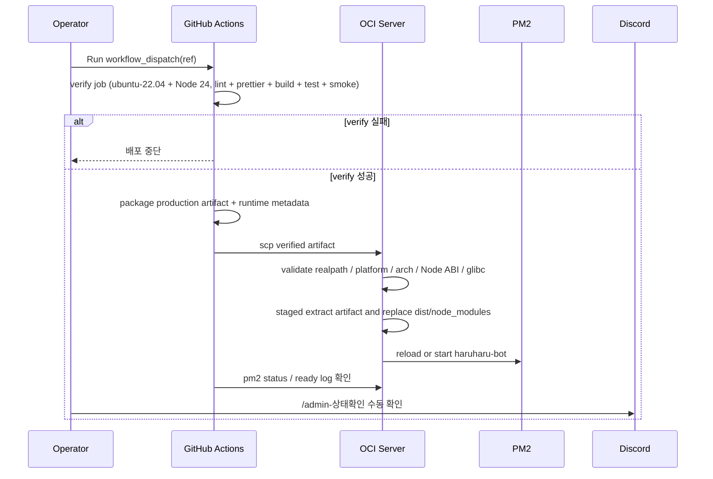
```mermaid
sequenceDiagram
    participant O as Operator
    participant GH as GitHub Actions
    participant OCI as OCI Server
    participant PM2 as PM2
    participant D as Discord

    O->>GH: Run workflow_dispatch(ref)
    GH->>GH: verify job (ubuntu-22.04 + Node 24, lint + prettier + build + test + smoke)

    alt verify 실패
        GH-->>O: 배포 중단
    else verify 성공
        GH->>GH: package production artifact + runtime metadata
        GH->>OCI: scp verified artifact
        OCI->>OCI: validate realpath / platform / arch / Node ABI / glibc
        OCI->>OCI: staged extract artifact and replace dist/node_modules
        OCI->>PM2: reload or start haruharu-bot
        GH->>OCI: pm2 status / ready log 확인
        O->>D: /admin-상태확인 수동 확인
    end
```

---

### US-1: 챌린저 등록/수정

```
AS A 챌린저
I WANT TO /기상등록 명령으로 내 기상시간을 등록하거나 수정
SO THAT 운영자 개입 없이 출석 체크 기준 시간을 스스로 설정할 수 있다
```

**인수 조건:**

- 기상시간을 입력받는다
- 기상시간은 05:00~09:00 범위만 허용
- `/기상등록`은 `#start-here`, 기상 self-service 안내 채널에서만 실행된다
- 응답은 실행한 사용자에게만 보이는 `ephemeral`로 반환된다
- 성공/실패 결과는 운영 확인용으로 `testChannelId`에도 기록된다
- Discord 사용자 ID와 이름은 interaction 사용자 정보에서 사용한다
- 현재 시각 기준 `yearmonth`를 내부에서 계산한다
- `WakeUpMembership`이 없으면 생성하고, `stopped` 상태면 다시 `active` 로 전환한다
- 기본 휴가일수는 5일
- 현재 월 `Users` 스냅샷이 없으면 자동 생성한다
- 이미 등록된 사용자는 정보가 업데이트된다
- 같은 날에는 한 번만 변경할 수 있다

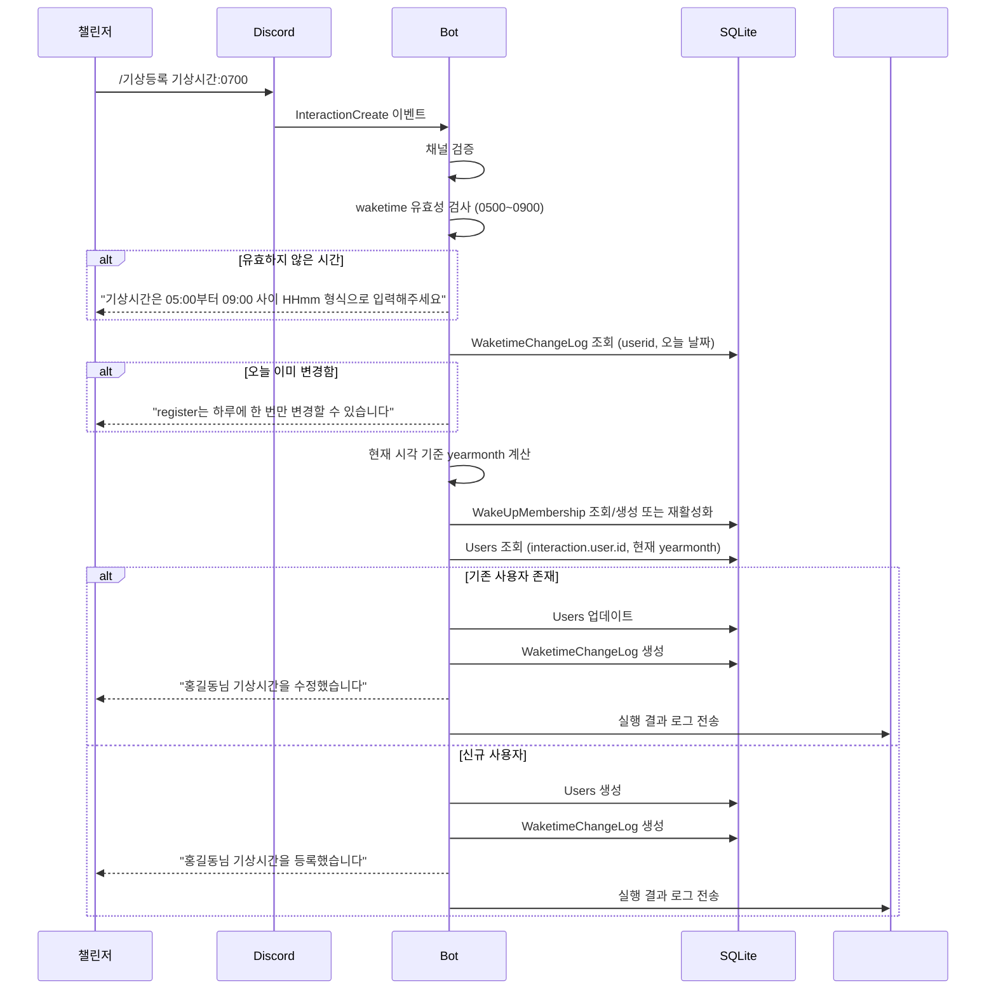
```mermaid
sequenceDiagram
    participant U as 챌린저
    participant D as Discord
    participant B as Bot
    participant DB as SQLite
    participant T as #test

    U->>D: /기상등록 기상시간:0700

    D->>B: InteractionCreate 이벤트
    B->>B: 채널 검증

    B->>B: waketime 유효성 검사 (0500~0900)
    alt 유효하지 않은 시간
        B-->>U: "기상시간은 05:00부터 09:00 사이 HHmm 형식으로 입력해주세요"
    end

    B->>DB: WaketimeChangeLog 조회 (userid, 오늘 날짜)
    alt 오늘 이미 변경함
        B-->>U: "register는 하루에 한 번만 변경할 수 있습니다"
    end

    B->>B: 현재 시각 기준 yearmonth 계산
    B->>DB: WakeUpMembership 조회/생성 또는 재활성화
    B->>DB: Users 조회 (interaction.user.id, 현재 yearmonth)

    alt 기존 사용자 존재
        B->>DB: Users 업데이트
        B->>DB: WaketimeChangeLog 생성
        B-->>U: "홍길동님 기상시간을 수정했습니다"
        B->>T: 실행 결과 로그 전송
    else 신규 사용자
        B->>DB: Users 생성
        B->>DB: WaketimeChangeLog 생성
        B-->>U: "홍길동님 기상시간을 등록했습니다"
        B->>T: 실행 결과 로그 전송
    end
```

---

### US-1A: 기상 챌린지 self-service 중단

```
AS A 챌린저
I WANT TO /기상중단 명령으로 기상 챌린지 상시 참여를 직접 중단
SO THAT 이번 달 참여를 바로 멈추고 다음 달부터만 다시 시작 여부를 결정하고 싶다
```

**인수 조건:**

- 현재 active 상태인 사용자만 중단할 수 있다
- `/기상중단`은 `#start-here`, 기상 self-service 안내 채널에서만 실행된다
- 응답은 실행한 사용자에게만 보이는 `ephemeral`로 반환된다
- 성공/실패 결과는 운영 확인용으로 `testChannelId`에도 기록된다
- `WakeUpMembership` 이 아직 없는 legacy 참가자라도 latest `Users` 스냅샷에 있으면 중단할 수 있다
- 현재 월 `Users` 스냅샷은 즉시 제거되고 같은 달 exclusion 이 기록된다
- 같은 달 리포트/휴가/출석 경로는 이 exclusion 을 존중해 사용자를 자동 복구하지 않는다
- `WakeUpMembership.status` 는 `stopped` 로 바뀐다
- 같은 달에는 `/기상등록`으로 다시 참여할 수 없고, 다음 달부터 다시 등록할 수 있다

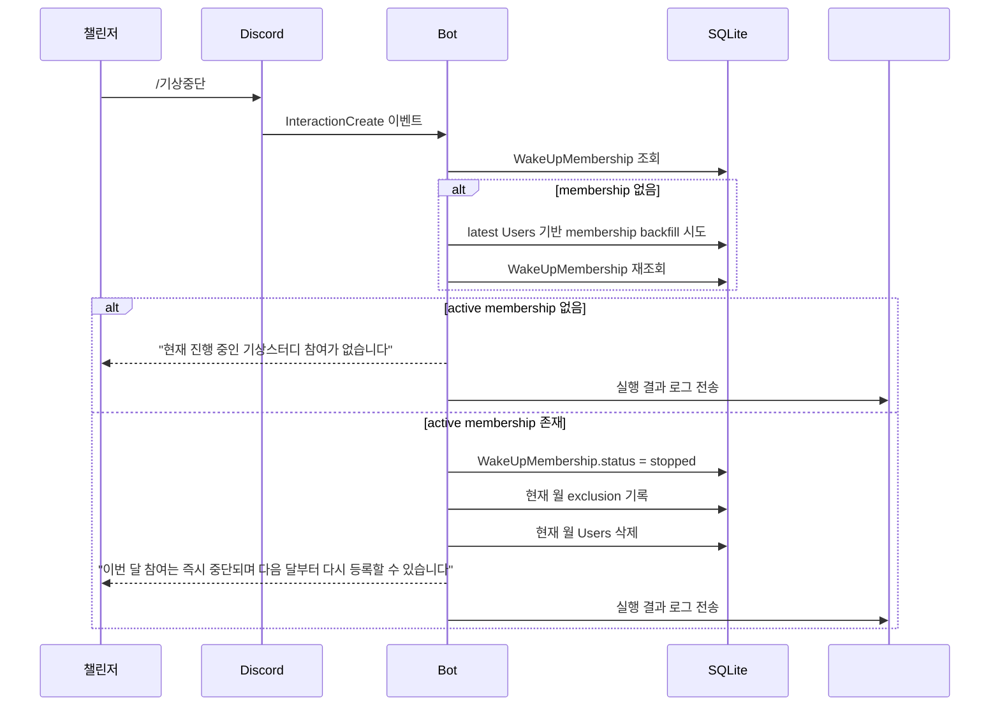
```mermaid
sequenceDiagram
    participant U as 챌린저
    participant D as Discord
    participant B as Bot
    participant DB as SQLite
    participant T as #test

    U->>D: /기상중단
    D->>B: InteractionCreate 이벤트
    B->>DB: WakeUpMembership 조회
    alt membership 없음
        B->>DB: latest Users 기반 membership backfill 시도
        B->>DB: WakeUpMembership 재조회
    end

    alt active membership 없음
        B-->>U: "현재 진행 중인 기상스터디 참여가 없습니다"
        B->>T: 실행 결과 로그 전송
    else active membership 존재
        B->>DB: WakeUpMembership.status = stopped
        B->>DB: 현재 월 exclusion 기록
        B->>DB: 현재 월 Users 삭제
        B-->>U: "이번 달 참여는 즉시 중단되며 다음 달부터 다시 등록할 수 있습니다"
        B->>T: 실행 결과 로그 전송
    end
```

---

### US-1C: stale `/apply-wakeup` 전환 안내

```
AS A 기존 사용자
I WANT TO 배포 전환 중 예전 /apply-wakeup 명령을 눌러도 실패 대신 새 진입점 안내를 받고 싶다
SO THAT slash command 재배포 전에도 무엇을 해야 하는지 알 수 있다
```

**인수 조건:**

- 새 코드에는 `/apply-wakeup` 실행 핸들러가 없다
- 하지만 stale Discord 슬래시 등록으로 `apply-wakeup` interaction 이 들어오면 무응답으로 끝나지 않는다
- 봇은 ephemeral 로 `/register`에서 기상시간을 입력해 참여하라는 안내를 반환한다

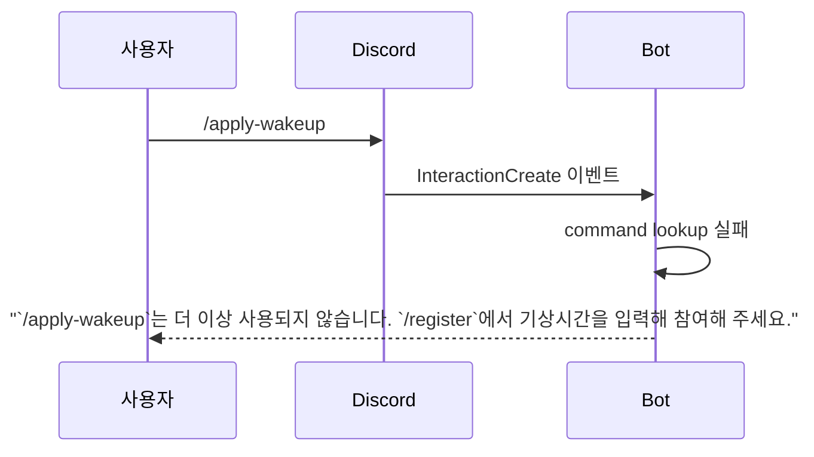
```mermaid
sequenceDiagram
    participant U as 사용자
    participant D as Discord
    participant B as Bot

    U->>D: /apply-wakeup
    D->>B: InteractionCreate 이벤트
    B->>B: command lookup 실패
    B-->>U: "`/apply-wakeup`는 더 이상 사용되지 않습니다. `/register`에서 기상시간을 입력해 참여해 주세요."
```

---

### US-1B: 관리자 월별 챌린저 삭제

```
AS A 관리자
I WANT TO 특정 월 챌린저를 삭제했을 때 자동 스냅샷 생성이 그 사용자를 다시 만들지 않길 원한다
SO THAT 월별 운영 판단이 리포트 자동화에 의해 되돌아가지 않는다
```

**인수 조건:**

- `/admin-챌린저삭제`는 해당 `(userid, yearmonth)`의 `Users` 스냅샷을 제거한다
- 삭제된 `(userid, yearmonth)`는 exclusion 으로 기록된다
- 같은 달 리포트/휴가/출석 경로의 자동 스냅샷 생성은 exclusion 을 존중한다
- 사용자의 상시 `WakeUpMembership` 자체는 유지된다

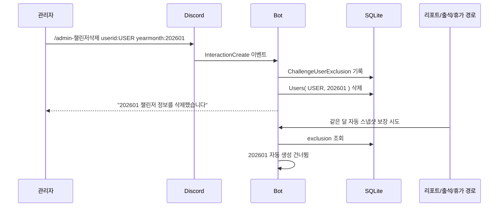
```mermaid
sequenceDiagram
    participant A as 관리자
    participant D as Discord
    participant B as Bot
    participant DB as SQLite
    participant R as 리포트/출석/휴가 경로

    A->>D: /admin-챌린저삭제 userid:USER yearmonth:202601
    D->>B: InteractionCreate 이벤트
    B->>DB: ChallengeUserExclusion 기록
    B->>DB: Users( USER, 202601 ) 삭제
    B-->>A: "202601 챌린저 정보를 삭제했습니다"

    R->>B: 같은 달 자동 스냅샷 보장 시도
    B->>DB: exclusion 조회
    B->>B: 202601 자동 생성 건너뜀
```

---

### US-2, US-3: 레거시 check-in/check-out 제거

- `/check-in`, `/check-out`는 더 이상 등록되지 않는다.
- 공식 기상 출석 입력은 daily message에 연결된 오늘의 출석 thread 첫 댓글만 사용한다.
- 과거 `TimeLog` 데이터는 집계 원본이 아닌 레거시 기록 호환용으로만 유지한다.

---

### US-4: 휴가 추가

```
AS A 관리자
I WANT TO 챌린저에게 휴가일수를 추가
SO THAT 해당 챌린저가 추가 휴식일을 가질 수 있다
```

**인수 조건:**

- 사용자에게 지급된 총 휴가일수에 지정한 수만큼 추가
- 등록된 사용자만 대상

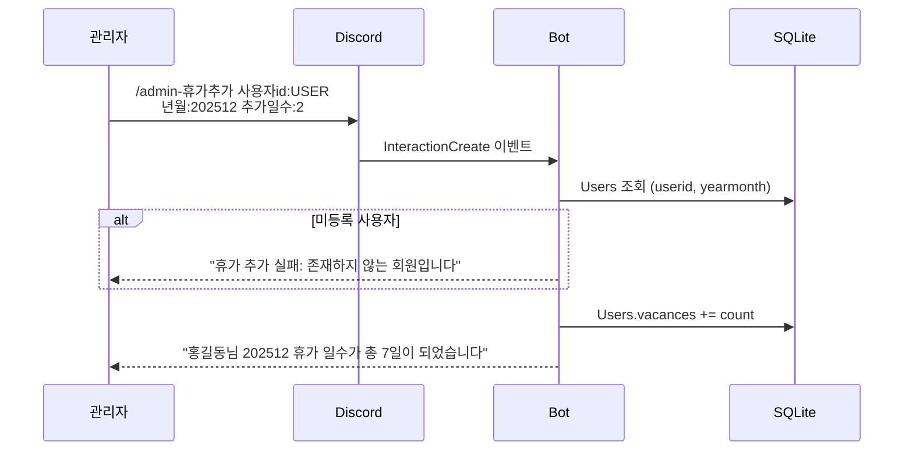
```mermaid
sequenceDiagram
    participant A as 관리자
    participant D as Discord
    participant B as Bot
    participant DB as SQLite

    A->>D: /admin-휴가추가 사용자id:USER<br/>년월:202512 추가일수:2

    D->>B: InteractionCreate 이벤트

    B->>DB: Users 조회 (userid, yearmonth)
    alt 미등록 사용자
        B-->>A: "휴가 추가 실패: 존재하지 않는 회원입니다"
    end

    B->>DB: Users.vacances += count
    B-->>A: "홍길동님 202512 휴가 일수가 총 7일이 되었습니다"
```

---

### US-5: 일일 출석 리포트

```
AS A 챌린저
I WANT TO 매일 오후 1시에 출석 현황을 확인
SO THAT 나와 다른 챌린저들의 출석 상태를 알 수 있다
```

**인수 조건:**

- `AttendanceLog` 기준 출석/지각/결석 인원 집계
- 휴가 등록된 날짜는 `휴가`로 표시하고 결석으로 처리하지 않음
- 댓글이 없는 사용자도 결석으로 확정
- `AttendanceLog`가 없는 등록 사용자는 `TimeLog` 여부와 무관하게 결석으로 확정
- `late` 상태는 `latecount` 증가
- `absent` 상태 또는 무댓글 사용자는 `absencecount` 증가
- 결과표에 사용자별 오늘 상태와 월 누적 `latecount`, `absencecount`, 잔여휴가를 함께 표시
- 평일 결과표는 당일 출석 thread 댓글로 전송한다
- 결과표가 Discord 2000자 제한을 넘기면 줄 경계를 기준으로 여러 메시지로 나눠 같은 thread에 순서대로 전송
- 주말/공휴일에는 결과 메시지를 공지하지 않는다
- 주말/공휴일에는 무댓글, `late`, `absent`로 새 패널티를 추가하지 않는다
- 주말/공휴일 `attended`는 `absencecount`를 우선 1 감소시키고, 차감할 결석이 없으면 `latecount`를 1 감소시킨다

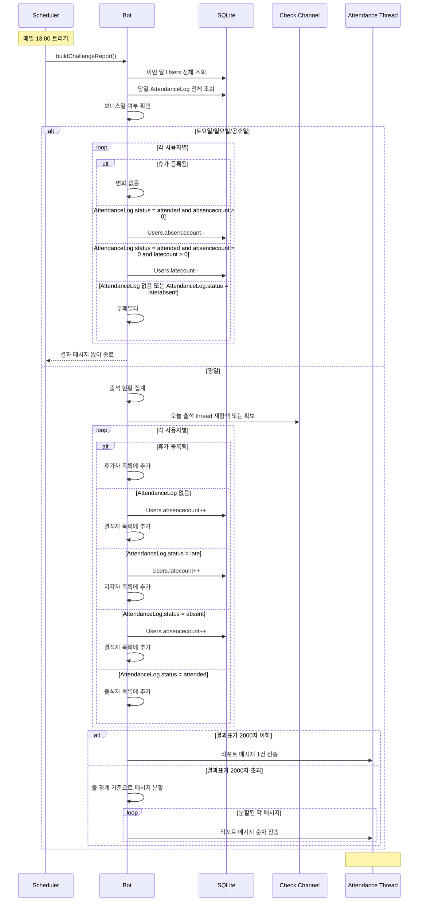
```mermaid
sequenceDiagram
    participant S as Scheduler
    participant B as Bot
    participant DB as SQLite
    participant C as Check Channel
    participant T as Attendance Thread

    Note over S: 매일 13:00 트리거
    S->>B: buildChallengeReport()

    B->>DB: 이번 달 Users 전체 조회
    B->>DB: 당일 AttendanceLog 전체 조회

    B->>B: 보너스일 여부 확인
    alt 토요일/일요일/공휴일
        loop 각 사용자별
            alt 휴가 등록됨
                B->>B: 변화 없음
            else AttendanceLog.status = attended and absencecount > 0
                B->>DB: Users.absencecount--
            else AttendanceLog.status = attended and absencecount = 0 and latecount > 0
                B->>DB: Users.latecount--
            else AttendanceLog 없음 또는 AttendanceLog.status = late/absent
                B->>B: 무패널티
            end
        end
        B-->>S: 결과 메시지 없이 종료
    else 평일
        B->>B: 출석 현황 집계
        B->>C: 오늘 출석 thread 재탐색 또는 확보

        loop 각 사용자별
            alt 휴가 등록됨
                B->>B: 휴가자 목록에 추가
            else AttendanceLog 없음
                B->>DB: Users.absencecount++
                B->>B: 결석자 목록에 추가
            else AttendanceLog.status = late
                B->>DB: Users.latecount++
                B->>B: 지각자 목록에 추가
            else AttendanceLog.status = absent
                B->>DB: Users.absencecount++
                B->>B: 결석자 목록에 추가
            else AttendanceLog.status = attended
                B->>B: 출석자 목록에 추가
            end
        end

        alt 결과표가 2000자 이하
            B->>T: 리포트 메시지 1건 전송
        else 결과표가 2000자 초과
            B->>B: 줄 경계 기준으로 메시지 분할
            loop 분할된 각 메시지
                B->>T: 리포트 메시지 순차 전송
            end
        end
    end
    Note over T: ### 20251208 출석표<br/>- 홍길동: 출석 (월 누적 지각 0회, 결석 0회, 잔여휴가 5일)<br/>- 이영희: 지각 (월 누적 지각 3회, 결석 1회, 잔여휴가 5일)<br/>- 박민수: 휴가 (월 누적 지각 0회, 결석 0회, 잔여휴가 4일)<br/>- 최민지: 결석 (월 누적 지각 0회, 결석 2회, 잔여휴가 5일)
```

---

### US-6: 명예의 전당

```
AS A 챌린저
I WANT TO 월말에 완주자 명단을 확인
SO THAT 한 달간의 성과를 축하받을 수 있다
```

**인수 조건:**

- 매월 마지막 날 출력
- 결석 횟수가 해당 월 총 지급 휴가일수 이내인 사용자만 포함


```mermaid
sequenceDiagram
    participant S as Scheduler
    participant B as Bot
    participant DB as SQLite
    participant C as Check Channel

    Note over S: 월말 13:00 트리거
    S->>B: printMonthlyHallOfFameIfNeeded()

    B->>B: 월말 여부 확인
    alt 월말 아님
        B->>B: 종료
    end

    B->>DB: 이번 달 Users 전체 조회

    B->>B: 완주자 필터링
    Note right of B: absencecount <= vacances인 사용자만

    loop 완주자별
        B->>B: 명단에 추가
    end

    B->>C: 명예의 전당 메시지 전송
    Note over C: 🏆 12월 명예의 전당 🏆<br/>축하합니다!<br/>- 홍길동<br/>- 김철수<br/>- 이영희
```

---

## 캠스터디 (Cam Study)

### US-7: 캠스터디 역할 기반 등록

```
AS A 캠스터디 참여 사용자
I WANT TO `@cam-study` 역할을 받으면 별도 관리자 명령 없이 자동으로 등록되고 싶다
SO THAT 실제 채널 접근 권한과 학습 추적 대상이 항상 일치한다
```

**인수 조건:**

- `@cam-study` 역할 부여 시 `CamStudyUsers`에 자동 등록된다
- 이미 등록된 사용자면 중복 생성 대신 표시 이름을 갱신한다

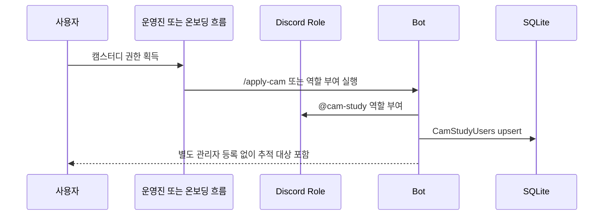
```mermaid
sequenceDiagram
    participant U as 사용자
    participant O as 운영진 또는 온보딩 흐름
    participant D as Discord Role
    participant B as Bot
    participant DB as SQLite

    U->>O: 캠스터디 권한 획득
    O->>B: /apply-cam 또는 역할 부여 실행
    B->>D: @cam-study 역할 부여
    B->>DB: CamStudyUsers upsert
    B-->>U: 별도 관리자 등록 없이 추적 대상 포함
```

---

### US-8: 학습 시간 자동 추적

```
AS A 캠스터디 참가자
I WANT TO 음성 채널에서 카메라 또는 화면공유를 켜면 자동으로 시간이 기록
SO THAT 별도 조작 없이 공부 시간이 측정된다
```

**인수 조건:**

- 카메라 ON 또는 화면공유 ON: 학습 시작
- 카메라와 화면공유가 모두 OFF 이거나 채널 퇴장: 학습 종료
- 5분 미만 세션은 무시
- 자정을 넘기면 새 날짜로 분리 기록
- 진행 중 세션은 `CamStudyActiveSession`에 저장한다
- 재배포 후 봇이 다시 올라오면 저장된 active session 과 현재 voice state 를 비교해 세션을 복구하거나 종료 정산한다
- 재배포 중 종료 이벤트를 놓치면 마지막 heartbeat(`lastobservedat`) 기준으로 손실 범위를 제한한다

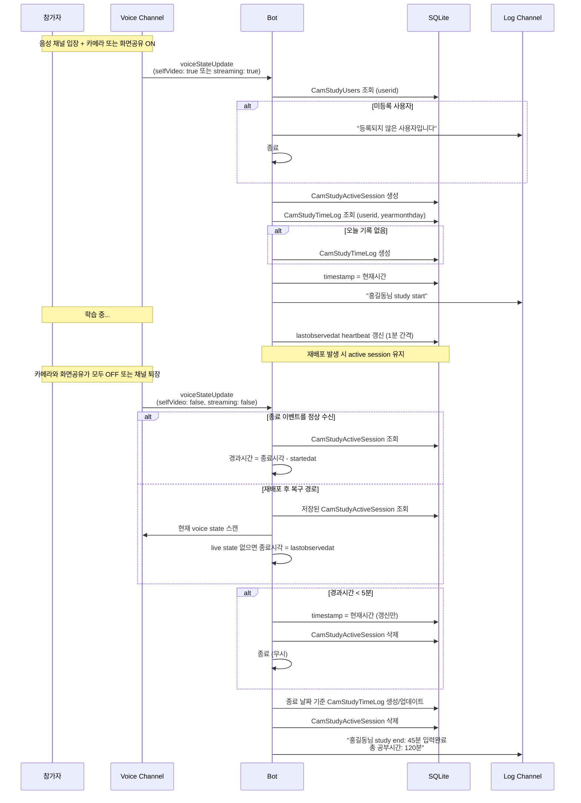
```mermaid
sequenceDiagram
    participant U as 참가자
    participant VC as Voice Channel
    participant B as Bot
    participant DB as SQLite
    participant L as Log Channel

    Note over U,VC: 음성 채널 입장 + 카메라 또는 화면공유 ON
    VC->>B: voiceStateUpdate<br/>(selfVideo: true 또는 streaming: true)

    B->>DB: CamStudyUsers 조회 (userid)
    alt 미등록 사용자
        B->>L: "등록되지 않은 사용자입니다"
        B->>B: 종료
    end

    B->>DB: CamStudyActiveSession 생성
    B->>DB: CamStudyTimeLog 조회 (userid, yearmonthday)
    alt 오늘 기록 없음
        B->>DB: CamStudyTimeLog 생성
    end

    B->>DB: timestamp = 현재시간
    B->>L: "홍길동님 study start"

    Note over U,VC: 학습 중...
    B->>DB: lastobservedat heartbeat 갱신 (1분 간격)

    Note over B,DB: 재배포 발생 시 active session 유지

    Note over U,VC: 카메라와 화면공유가 모두 OFF 또는 채널 퇴장
    VC->>B: voiceStateUpdate<br/>(selfVideo: false, streaming: false)

    alt 종료 이벤트를 정상 수신
        B->>DB: CamStudyActiveSession 조회
        B->>B: 경과시간 = 종료시각 - startedat
    else 재배포 후 복구 경로
        B->>DB: 저장된 CamStudyActiveSession 조회
        B->>VC: 현재 voice state 스캔
        B->>B: live state 없으면 종료시각 = lastobservedat
    end

    alt 경과시간 < 5분
        B->>DB: timestamp = 현재시간 (갱신만)
        B->>DB: CamStudyActiveSession 삭제
        B->>B: 종료 (무시)
    end

    B->>DB: 종료 날짜 기준 CamStudyTimeLog 생성/업데이트
    B->>DB: CamStudyActiveSession 삭제
    B->>L: "홍길동님 study end: 45분 입력완료<br/>총 공부시간: 120분"
```

---

### US-9: 일간 학습 시간 리포트

```
AS A 캠스터디 참가자
I WANT TO 매일 23:59에 학습 시간 랭킹을 확인
SO THAT 나의 학습량을 다른 참가자와 비교할 수 있다
```

**인수 조건:**

- 학습 시간 기준 내림차순 정렬
- 시간 형식: "X시간 Y분"
- 진행 중 `CamStudyActiveSession`은 합계에 포함하지 않고 종료 정산된 `CamStudyTimeLog.totalminutes`만 사용한다

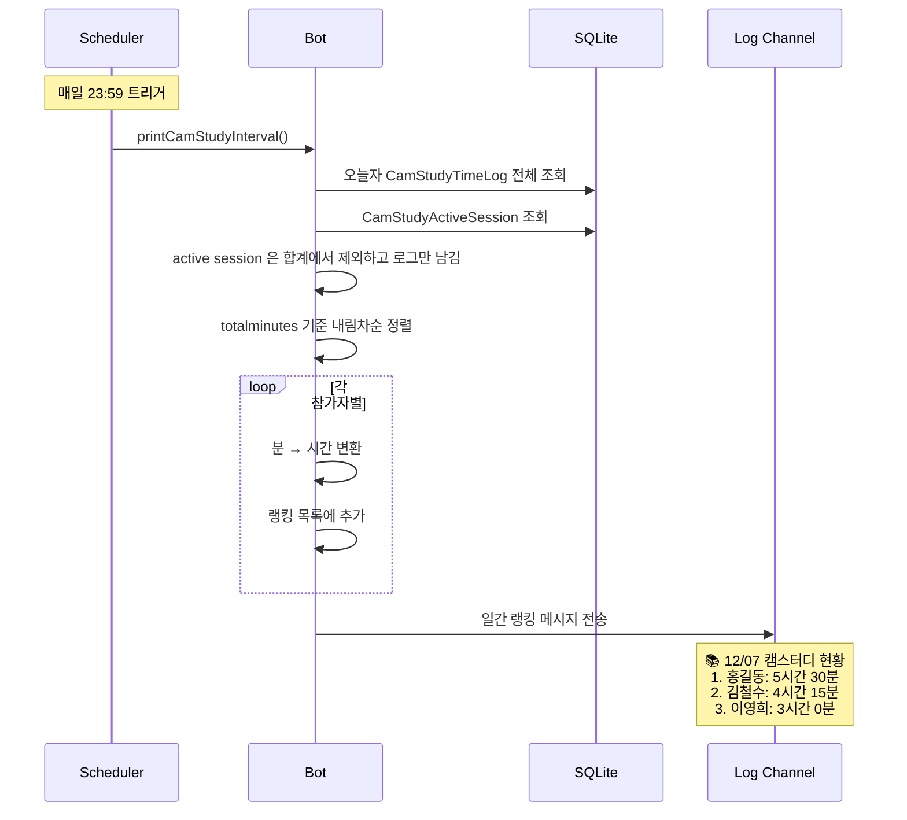
```mermaid
sequenceDiagram
    participant S as Scheduler
    participant B as Bot
    participant DB as SQLite
    participant L as Log Channel

    Note over S: 매일 23:59 트리거
    S->>B: printCamStudyInterval()

    B->>DB: 오늘자 CamStudyTimeLog 전체 조회
    B->>DB: CamStudyActiveSession 조회
    B->>B: active session 은 합계에서 제외하고 로그만 남김

    B->>B: totalminutes 기준 내림차순 정렬

    loop 각 참가자별
        B->>B: 분 → 시간 변환
        B->>B: 랭킹 목록에 추가
    end

    B->>L: 일간 랭킹 메시지 전송
    Note over L: 📚 12/07 캠스터디 현황<br/>1. 홍길동: 5시간 30분<br/>2. 김철수: 4시간 15분<br/>3. 이영희: 3시간 0분
```

---

### US-10: 주간 학습 시간 리포트

```
AS A 캠스터디 참가자
I WANT TO 매주 금요일에 주간 학습 시간 랭킹을 확인
SO THAT 한 주간의 학습량을 확인할 수 있다
```

**인수 조건:**

- 매주 금요일 23:59에 출력
- 월~금 학습 시간 누적
- 주차 번호: 2024-04-06 기준으로 계산
- 진행 중 `CamStudyActiveSession`은 합계에 포함하지 않고 종료 정산된 일간/주간 누적만 사용한다
- 같은 날짜 기준 재실행해도 주간 누적 시간이 중복 반영되지 않는다

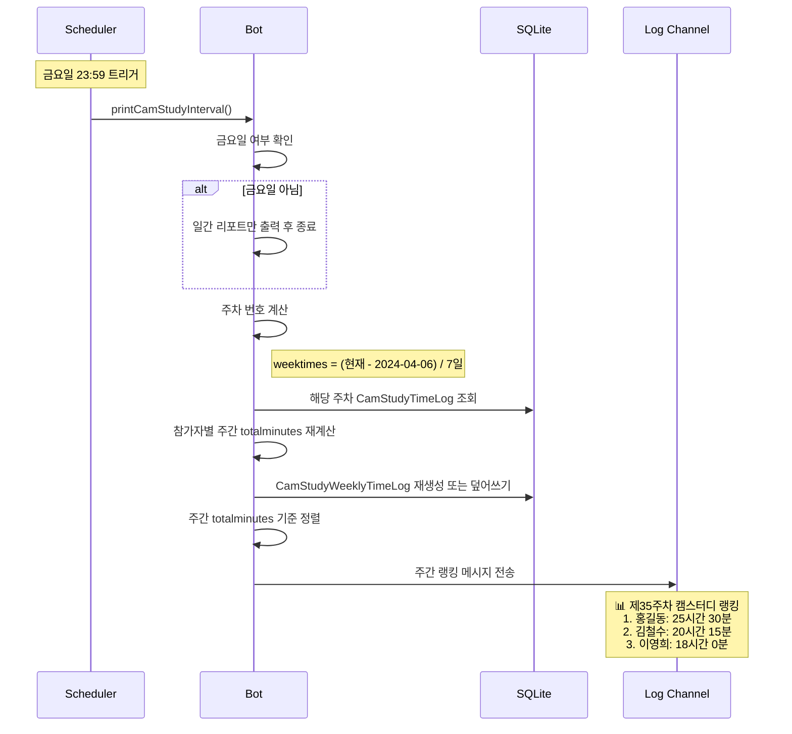
```mermaid
sequenceDiagram
    participant S as Scheduler
    participant B as Bot
    participant DB as SQLite
    participant L as Log Channel

    Note over S: 금요일 23:59 트리거
    S->>B: printCamStudyInterval()

    B->>B: 금요일 여부 확인
    alt 금요일 아님
        B->>B: 일간 리포트만 출력 후 종료
    end

    B->>B: 주차 번호 계산
    Note right of B: weektimes = (현재 - 2024-04-06) / 7일

    B->>DB: 해당 주차 CamStudyTimeLog 조회
    B->>B: 참가자별 주간 totalminutes 재계산
    B->>DB: CamStudyWeeklyTimeLog 재생성 또는 덮어쓰기

    B->>B: 주간 totalminutes 기준 정렬

    B->>L: 주간 랭킹 메시지 전송
    Note over L: 📊 제35주차 캠스터디 랭킹<br/>1. 홍길동: 25시간 30분<br/>2. 김철수: 20시간 15분<br/>3. 이영희: 18시간 0분
```

---

### US-11: 캠스터디 역할 회수 기반 탈퇴

```
AS A 캠스터디 참가자
I WANT TO `@cam-study` 역할이 회수되면 자동으로 추적 대상에서 빠지고 싶다
SO THAT 권한이 없는 사용자의 학습 시간이 계속 기록되지 않는다
```

**인수 조건:**

- `@cam-study` 역할이 제거되면 `CamStudyUsers`에서 자동 해제된다
- 단, 이미 진행 중인 캠스터디 세션이 있으면 종료 이벤트까지는 임시로 유지되고 종료 직후 해제된다
- 기존 학습 기록은 유지된다

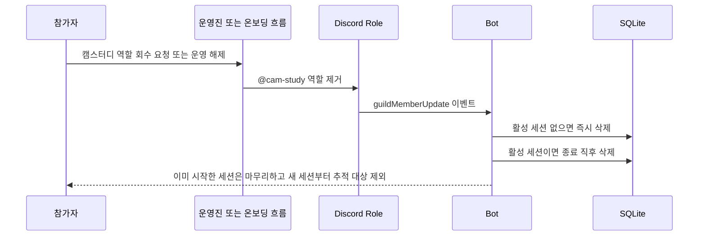
```mermaid
sequenceDiagram
    participant U as 참가자
    participant O as 운영진 또는 온보딩 흐름
    participant D as Discord Role
    participant B as Bot
    participant DB as SQLite

    U->>O: 캠스터디 역할 회수 요청 또는 운영 해제
    O->>D: @cam-study 역할 제거
    D->>B: guildMemberUpdate 이벤트
    B->>DB: 활성 세션 없으면 즉시 삭제
    B->>DB: 활성 세션이면 종료 직후 삭제
    B-->>U: 이미 시작한 세션은 마무리하고 새 세션부터 추적 대상 제외
```

---

### US-13: 사용자 직접 기상시간 재등록

```
AS A 챌린저
I WANT TO `/기상등록`을 다시 실행해서 자신의 기상시간을 수정
SO THAT 같은 명령으로 등록과 수정을 모두 처리할 수 있다
```

**인수 조건:**

- 이미 등록된 사용자도 같은 `/기상등록` 명령을 사용한다
- 본인 데이터만 수정 가능
- 기상시간은 05:00~09:00 범위만 허용
- 같은 날에는 한 번만 변경 가능
- 이전 달에 중단한 사용자는 같은 `/기상등록`으로 다시 참여할 수 있다
- 같은 달에 `/기상중단`한 사용자는 다음 달이 되기 전까지 `/기상등록`으로 다시 참여할 수 없다

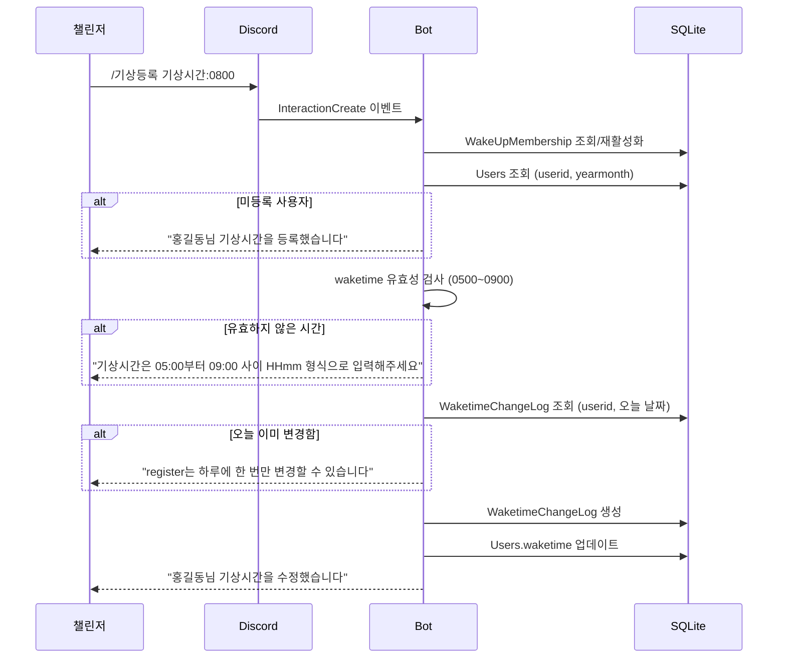
```mermaid
sequenceDiagram
    participant U as 챌린저
    participant D as Discord
    participant B as Bot
    participant DB as SQLite

    U->>D: /기상등록 기상시간:0800
    D->>B: InteractionCreate 이벤트

    B->>DB: WakeUpMembership 조회/재활성화
    B->>DB: Users 조회 (userid, yearmonth)
    alt 미등록 사용자
        B-->>U: "홍길동님 기상시간을 등록했습니다"
    end

    B->>B: waketime 유효성 검사 (0500~0900)
    alt 유효하지 않은 시간
        B-->>U: "기상시간은 05:00부터 09:00 사이 HHmm 형식으로 입력해주세요"
    end

    B->>DB: WaketimeChangeLog 조회 (userid, 오늘 날짜)
    alt 오늘 이미 변경함
        B-->>U: "register는 하루에 한 번만 변경할 수 있습니다"
    end

    B->>DB: WaketimeChangeLog 생성
    B->>DB: Users.waketime 업데이트
    B-->>U: "홍길동님 기상시간을 수정했습니다"
```

---

### US-14: 사용자 직접 휴가 등록

```
AS A 챌린저
I WANT TO 자신의 휴가를 날짜 단위로 직접 등록
SO THAT 운영자 개입 없이 휴가 사용을 관리할 수 있다
```

**인수 조건:**

- 등록된 사용자만 가능
- 본인 데이터만 변경 가능
- `/휴가신청`은 `#start-here`, 기상 self-service 안내 채널에서만 실행된다
- 응답은 실행한 사용자에게만 보이는 `ephemeral`로 반환된다
- 성공/실패 결과는 운영 확인용으로 `testChannelId`에도 기록된다
- 날짜는 `yyyymmdd` 형식이어야 함
- 현재 월 날짜만 신청 가능
- 같은 날짜 중복 등록 불가
- 잔여 휴가가 있을 때만 등록 가능
- 활성 membership 이 있으면 현재 월 `Users` 스냅샷이 없어도 자동 생성 후 처리된다

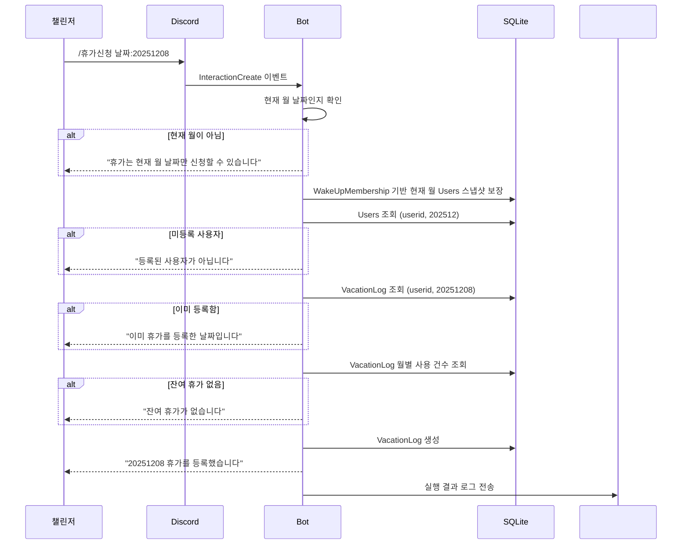
```mermaid
sequenceDiagram
    participant U as 챌린저
    participant D as Discord
    participant B as Bot
    participant DB as SQLite
    participant T as #test

    U->>D: /휴가신청 날짜:20251208
    D->>B: InteractionCreate 이벤트

    B->>B: 현재 월 날짜인지 확인
    alt 현재 월이 아님
        B-->>U: "휴가는 현재 월 날짜만 신청할 수 있습니다"
    end

    B->>DB: WakeUpMembership 기반 현재 월 Users 스냅샷 보장
    B->>DB: Users 조회 (userid, 202512)
    alt 미등록 사용자
        B-->>U: "등록된 사용자가 아닙니다"
    end

    B->>DB: VacationLog 조회 (userid, 20251208)
    alt 이미 등록함
        B-->>U: "이미 휴가를 등록한 날짜입니다"
    end

    B->>DB: VacationLog 월별 사용 건수 조회
    alt 잔여 휴가 없음
        B-->>U: "잔여 휴가가 없습니다"
    end

    B->>DB: VacationLog 생성
    B-->>U: "20251208 휴가를 등록했습니다"
    B->>T: 실행 결과 로그 전송
```

---

### US-16A: 레거시 Users 기반 membership backfill

```
AS A 운영자
I WANT TO 배포 시 기존 `Users` 참가자가 membership 부재 때문에 다음 달 자동 이월에서 빠지지 않길 원한다
SO THAT 기능 롤아웃이 기존 참여자 데이터를 끊지 않는다
```

**인수 조건:**

- 최신 `Users.yearmonth` 스냅샷의 참가자 중 membership 이 없는 사용자는 자동으로 `WakeUpMembership`이 생성된다
- backfill 된 membership 은 최신 `Users.waketime`을 사용한다
- 이후 월 자동 스냅샷 생성은 backfill 된 membership 을 기준으로 이어진다

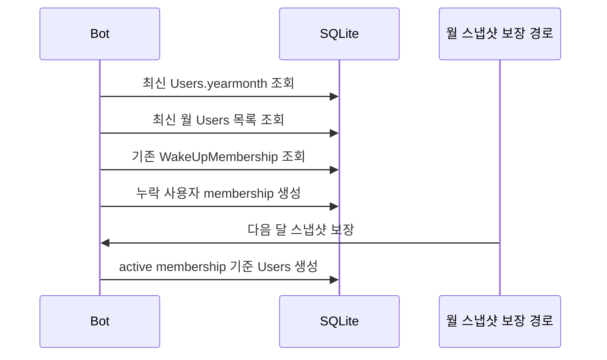
```mermaid
sequenceDiagram
    participant B as Bot
    participant DB as SQLite
    participant R as 월 스냅샷 보장 경로

    B->>DB: 최신 Users.yearmonth 조회
    B->>DB: 최신 월 Users 목록 조회
    B->>DB: 기존 WakeUpMembership 조회
    B->>DB: 누락 사용자 membership 생성

    R->>B: 다음 달 스냅샷 보장
    B->>DB: active membership 기준 Users 생성
```
