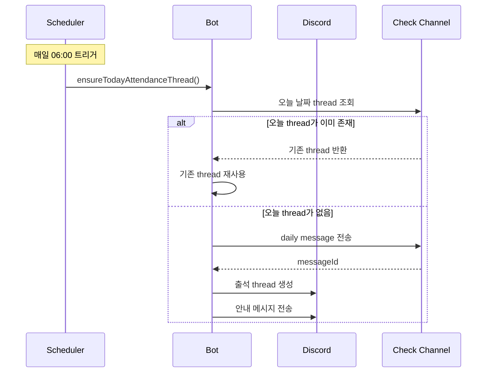
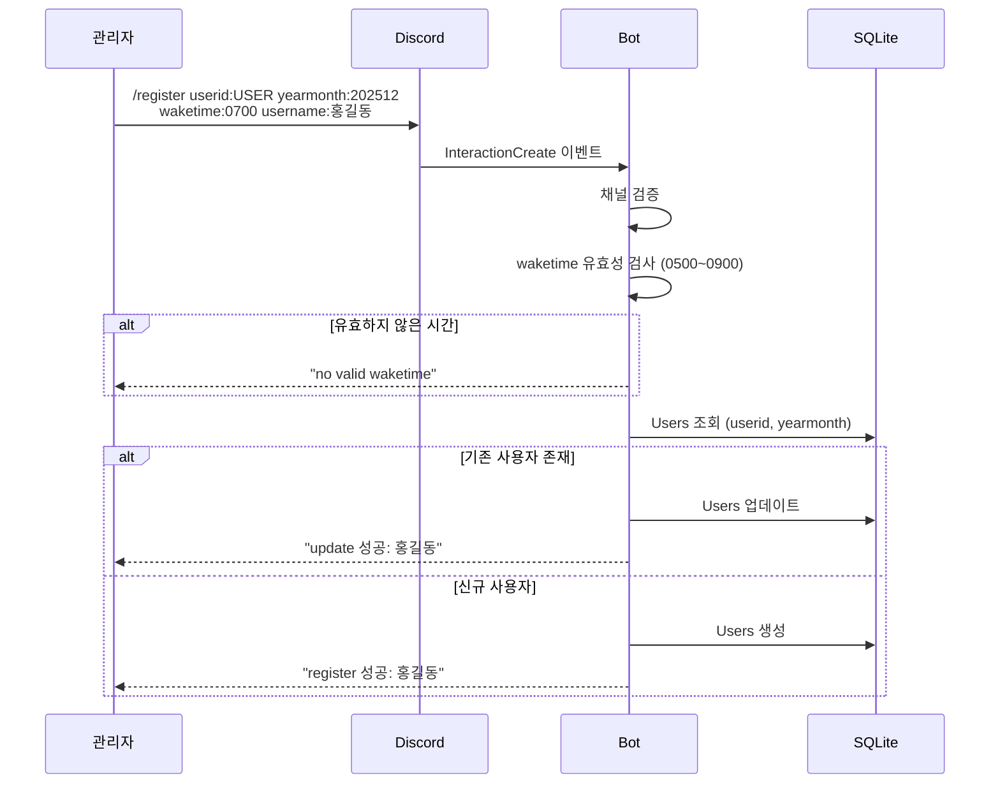
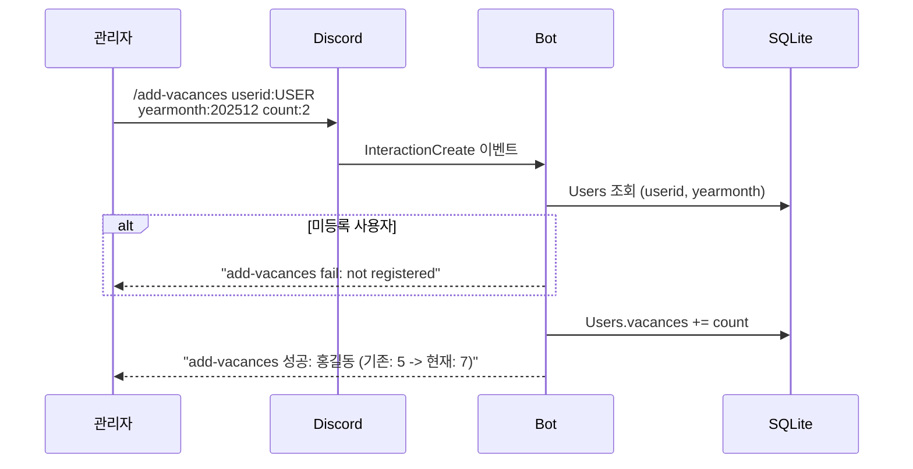
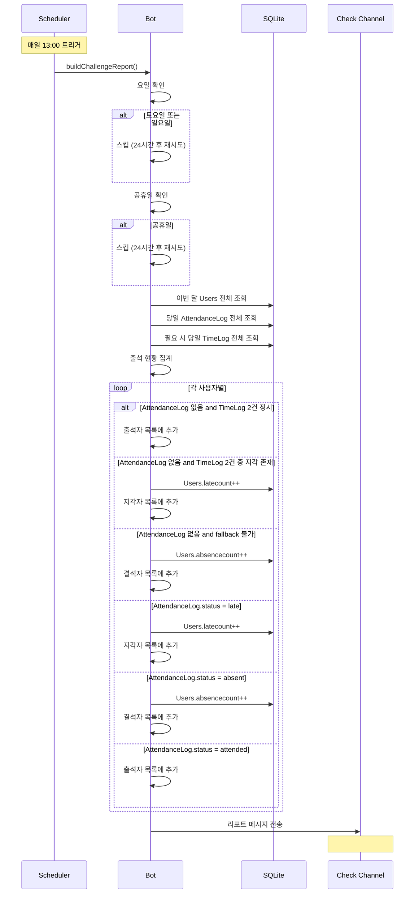
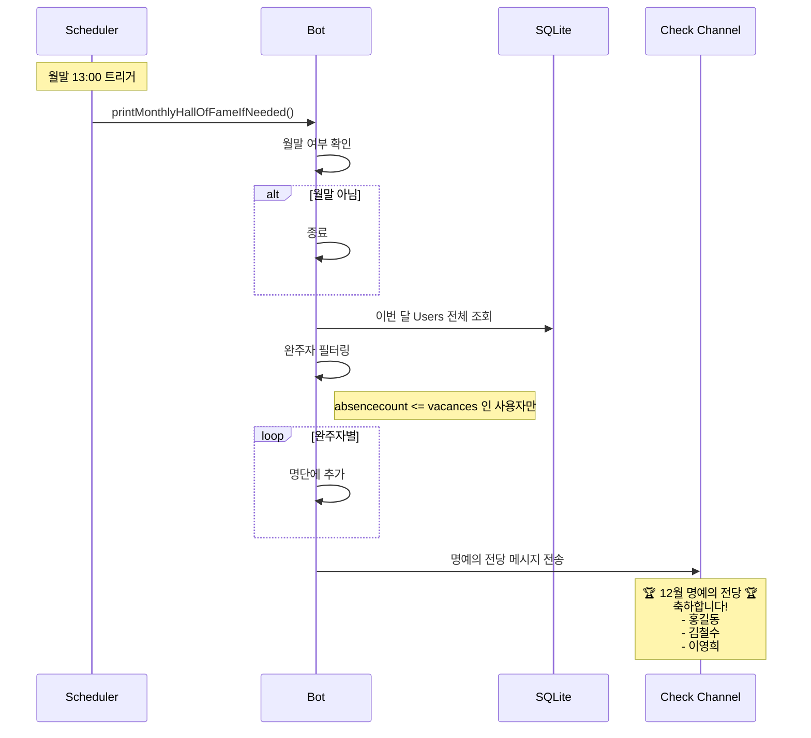
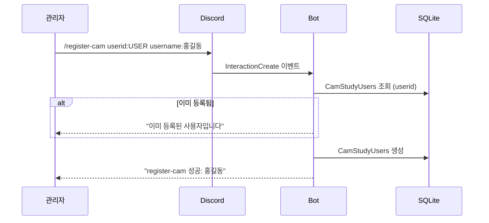
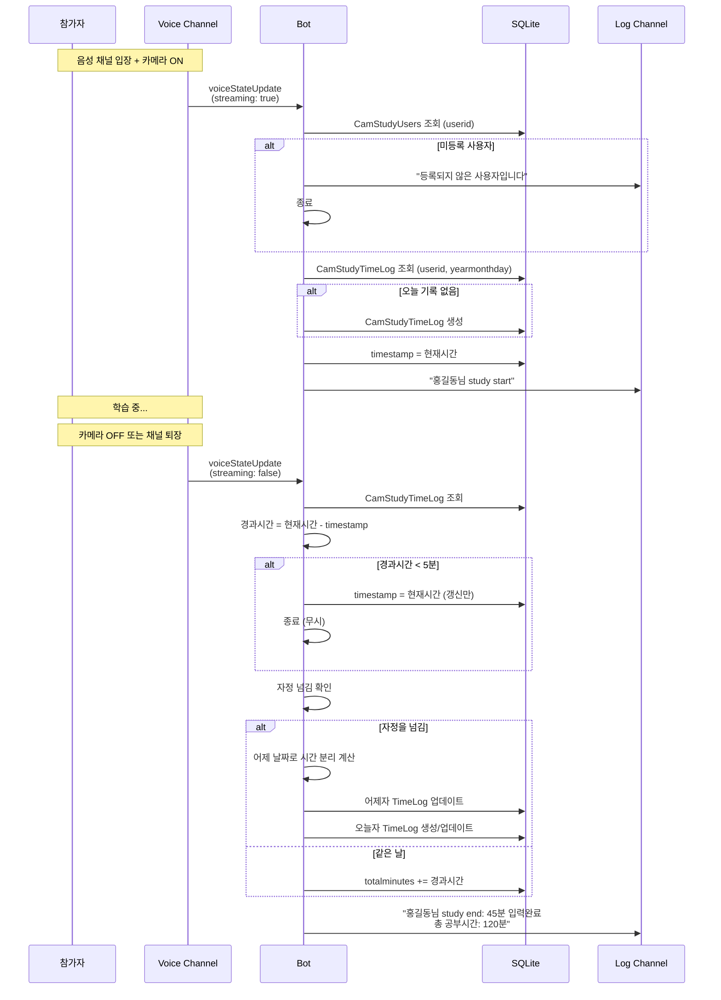
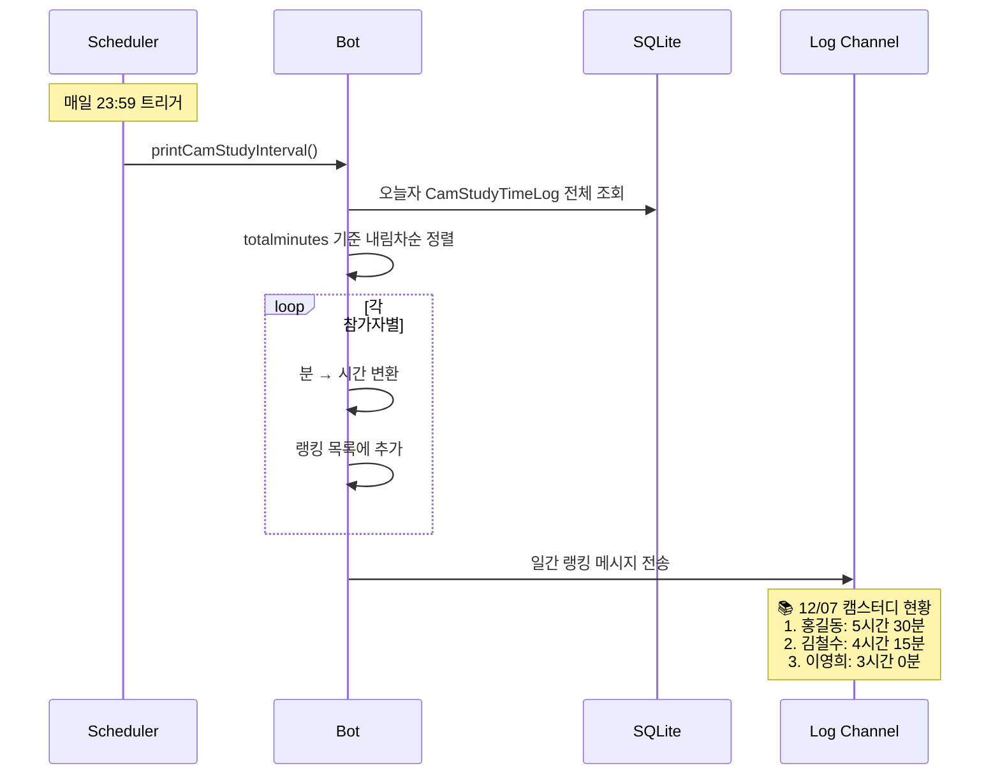
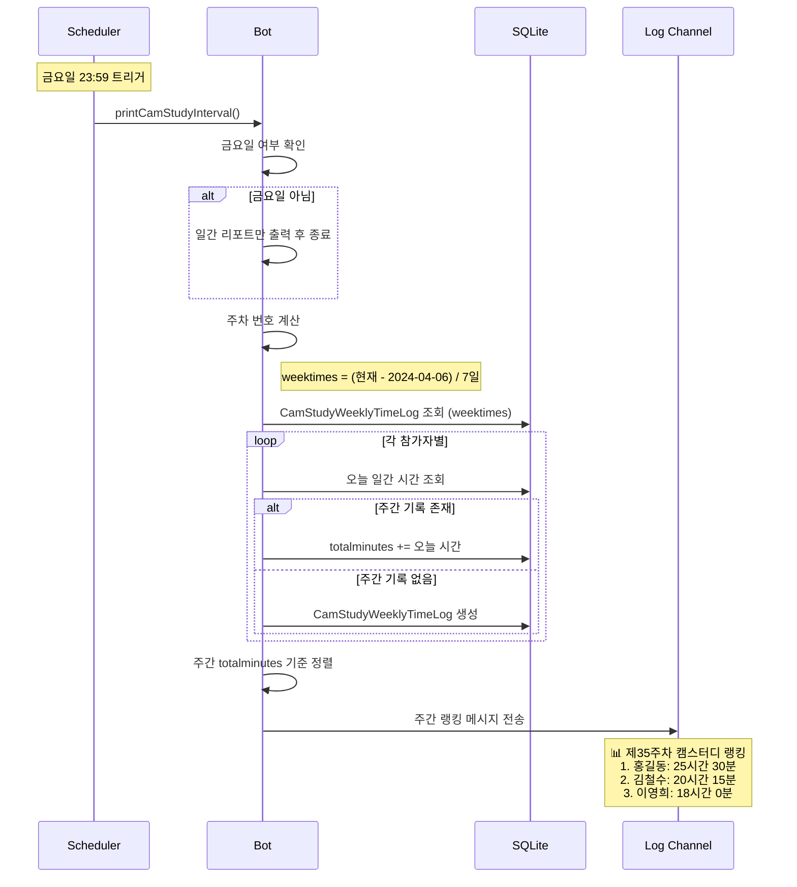
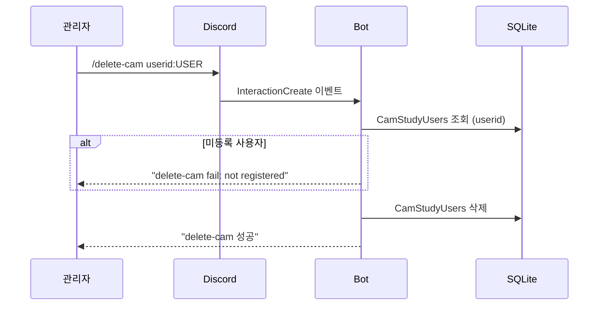

# 사용자 스토리 및 시퀀스 다이어그램

## 기상 챌린지 (Morning Challenge)

### US-13: 운영 daily message 자동 생성

```
AS A 챌린저
I WANT TO 매일 아침 운영 채널에 오늘의 daily message와 출석 thread가 열리길 원한다
SO THAT 그날의 출석 진입점이 하나로 유지된다
```

**인수 조건:**
- 운영 채널에 매일 오전 06:00 daily message와 출석 thread를 생성한다
- 같은 날짜에는 daily message/thread를 한 번만 생성한다
- 봇 재시작 후에도 오늘 thread를 다시 찾아 재사용할 수 있다
- 테스트 채널 demo thread와 운영 thread는 다른 채널/이름 규칙을 사용한다


```mermaid
sequenceDiagram
    participant S as Scheduler
    participant B as Bot
    participant D as Discord
    participant C as Check Channel

    Note over S: 매일 06:00 트리거
    S->>B: ensureTodayAttendanceThread()
    B->>C: 오늘 날짜 thread 조회

    alt 오늘 thread가 이미 존재
        C-->>B: 기존 thread 반환
        B->>B: 기존 thread 재사용
    else 오늘 thread가 없음
        B->>C: daily message 전송
        C-->>B: messageId
        B->>D: 출석 thread 생성
        B->>D: 안내 메시지 전송
    end
```

---

### US-1: 챌린저 등록

```
AS A 관리자
I WANT TO 사용자를 기상 챌린지에 등록
SO THAT 해당 사용자가 출석 체크를 할 수 있다
```

**인수 조건:**
- 사용자 ID, 년월, 기상시간, 이름을 입력받는다
- 기상시간은 05:00~09:00 범위만 허용
- 기본 휴가일수는 5일
- 이미 등록된 사용자는 정보가 업데이트된다


```mermaid
sequenceDiagram
    participant A as 관리자
    participant D as Discord
    participant B as Bot
    participant DB as SQLite

    A->>D: /register userid:USER yearmonth:202512<br/>waketime:0700 username:홍길동

    D->>B: InteractionCreate 이벤트
    B->>B: 채널 검증

    B->>B: waketime 유효성 검사 (0500~0900)
    alt 유효하지 않은 시간
        B-->>A: "no valid waketime"
    end

    B->>DB: Users 조회 (userid, yearmonth)

    alt 기존 사용자 존재
        B->>DB: Users 업데이트
        B-->>A: "update 성공: 홍길동"
    else 신규 사용자
        B->>DB: Users 생성
        B-->>A: "register 성공: 홍길동"
    end
```

---

### US-2, US-3: 레거시 check-in/check-out 제거

- `/check-in`, `/check-out`는 더 이상 등록되지 않는다.
- 공식 기상 출석 입력은 daily message에 연결된 오늘의 출석 thread 첫 댓글만 사용한다.
- 과거 `TimeLog` 데이터는 전환 기간 집계 fallback 용도로만 유지한다.

---

### US-4: 휴가 추가

```
AS A 관리자
I WANT TO 챌린저에게 휴가일수를 추가
SO THAT 해당 챌린저가 추가 휴식일을 가질 수 있다
```

**인수 조건:**
- 기존 휴가일수에 지정한 수만큼 추가
- 등록된 사용자만 대상


```mermaid
sequenceDiagram
    participant A as 관리자
    participant D as Discord
    participant B as Bot
    participant DB as SQLite

    A->>D: /add-vacances userid:USER<br/>yearmonth:202512 count:2

    D->>B: InteractionCreate 이벤트

    B->>DB: Users 조회 (userid, yearmonth)
    alt 미등록 사용자
        B-->>A: "add-vacances fail: not registered"
    end

    B->>DB: Users.vacances += count
    B-->>A: "add-vacances 성공: 홍길동 (기존: 5 -> 현재: 7)"
```

---

### US-5: 일일 출석 리포트

```
AS A 챌린저
I WANT TO 매일 오후 1시에 출석 현황을 확인
SO THAT 나와 다른 챌린저들의 출석 상태를 알 수 있다
```

**인수 조건:**
- `AttendanceLog` 기준 출석/지각/결석 인원 집계
- 댓글이 없는 사용자도 결석으로 확정
- 전환 기간에는 `AttendanceLog`가 없을 때만 기존 `TimeLog`를 fallback 으로 사용
- 주말 및 공휴일 제외
- `late` 상태는 `latecount` 증가
- `absent` 상태 또는 무댓글 사용자는 `absencecount` 증가


```mermaid
sequenceDiagram
    participant S as Scheduler
    participant B as Bot
    participant DB as SQLite
    participant C as Check Channel

    Note over S: 매일 13:00 트리거
    S->>B: buildChallengeReport()

    B->>B: 요일 확인
    alt 토요일 또는 일요일
        B->>B: 스킵 (24시간 후 재시도)
    end

    B->>B: 공휴일 확인
    alt 공휴일
        B->>B: 스킵 (24시간 후 재시도)
    end

    B->>DB: 이번 달 Users 전체 조회
    B->>DB: 당일 AttendanceLog 전체 조회
    B->>DB: 필요 시 당일 TimeLog 전체 조회

    B->>B: 출석 현황 집계

    loop 각 사용자별
        alt AttendanceLog 없음 and TimeLog 2건 정시
            B->>B: 출석자 목록에 추가
        else AttendanceLog 없음 and TimeLog 2건 중 지각 존재
            B->>DB: Users.latecount++
            B->>B: 지각자 목록에 추가
        else AttendanceLog 없음 and fallback 불가
            B->>DB: Users.absencecount++
            B->>B: 결석자 목록에 추가
        else AttendanceLog.status = late
                B->>DB: Users.latecount++
                B->>B: 지각자 목록에 추가
        else AttendanceLog.status = absent
            B->>DB: Users.absencecount++
            B->>B: 결석자 목록에 추가
        else AttendanceLog.status = attended
            B->>B: 출석자 목록에 추가
        end
    end

    B->>C: 리포트 메시지 전송
    Note over C: ### 20251208 출석표<br/>- 홍길동: 출석<br/>- 이영희: 지각 (3)<br/>- 박민수: 결석 (2/5)
```

---

### US-6: 명예의 전당

```
AS A 챌린저
I WANT TO 월말에 완주자 명단을 확인
SO THAT 한 달간의 성과를 축하받을 수 있다
```

**인수 조건:**
- 매월 마지막 날 출력
- `absencecount <= vacances` 인 사용자만 포함


```mermaid
sequenceDiagram
    participant S as Scheduler
    participant B as Bot
    participant DB as SQLite
    participant C as Check Channel

    Note over S: 월말 13:00 트리거
    S->>B: printMonthlyHallOfFameIfNeeded()

    B->>B: 월말 여부 확인
    alt 월말 아님
        B->>B: 종료
    end

    B->>DB: 이번 달 Users 전체 조회

    B->>B: 완주자 필터링
    Note right of B: absencecount <= vacances 인 사용자만

    loop 완주자별
        B->>B: 명단에 추가
    end

    B->>C: 명예의 전당 메시지 전송
    Note over C: 🏆 12월 명예의 전당 🏆<br/>축하합니다!<br/>- 홍길동<br/>- 김철수<br/>- 이영희
```

---

## 캠스터디 (Cam Study)

### US-7: 캠스터디 등록

```
AS A 관리자
I WANT TO 사용자를 캠스터디에 등록
SO THAT 해당 사용자의 학습 시간이 추적된다
```

**인수 조건:**
- 사용자 ID와 이름을 입력받는다
- 중복 등록 불가


```mermaid
sequenceDiagram
    participant A as 관리자
    participant D as Discord
    participant B as Bot
    participant DB as SQLite

    A->>D: /register-cam userid:USER username:홍길동

    D->>B: InteractionCreate 이벤트

    B->>DB: CamStudyUsers 조회 (userid)
    alt 이미 등록됨
        B-->>A: "이미 등록된 사용자입니다"
    end

    B->>DB: CamStudyUsers 생성
    B-->>A: "register-cam 성공: 홍길동"
```

---

### US-8: 학습 시간 자동 추적

```
AS A 캠스터디 참가자
I WANT TO 음성 채널에서 카메라를 켜면 자동으로 시간이 기록
SO THAT 별도 조작 없이 공부 시간이 측정된다
```

**인수 조건:**
- 카메라 ON: 학습 시작
- 카메라 OFF 또는 채널 퇴장: 학습 종료
- 5분 미만 세션은 무시
- 자정을 넘기면 새 날짜로 분리 기록


```mermaid
sequenceDiagram
    participant U as 참가자
    participant VC as Voice Channel
    participant B as Bot
    participant DB as SQLite
    participant L as Log Channel

    Note over U,VC: 음성 채널 입장 + 카메라 ON
    VC->>B: voiceStateUpdate<br/>(streaming: true)

    B->>DB: CamStudyUsers 조회 (userid)
    alt 미등록 사용자
        B->>L: "등록되지 않은 사용자입니다"
        B->>B: 종료
    end

    B->>DB: CamStudyTimeLog 조회 (userid, yearmonthday)
    alt 오늘 기록 없음
        B->>DB: CamStudyTimeLog 생성
    end

    B->>DB: timestamp = 현재시간
    B->>L: "홍길동님 study start"

    Note over U,VC: 학습 중...

    Note over U,VC: 카메라 OFF 또는 채널 퇴장
    VC->>B: voiceStateUpdate<br/>(streaming: false)

    B->>DB: CamStudyTimeLog 조회
    B->>B: 경과시간 = 현재시간 - timestamp

    alt 경과시간 < 5분
        B->>DB: timestamp = 현재시간 (갱신만)
        B->>B: 종료 (무시)
    end

    B->>B: 자정 넘김 확인
    alt 자정을 넘김
        B->>B: 어제 날짜로 시간 분리 계산
        B->>DB: 어제자 TimeLog 업데이트
        B->>DB: 오늘자 TimeLog 생성/업데이트
    else 같은 날
        B->>DB: totalminutes += 경과시간
    end

    B->>L: "홍길동님 study end: 45분 입력완료<br/>총 공부시간: 120분"
```

---

### US-9: 일간 학습 시간 리포트

```
AS A 캠스터디 참가자
I WANT TO 매일 23:59에 학습 시간 랭킹을 확인
SO THAT 나의 학습량을 다른 참가자와 비교할 수 있다
```

**인수 조건:**
- 학습 시간 기준 내림차순 정렬
- 시간 형식: "X시간 Y분"


```mermaid
sequenceDiagram
    participant S as Scheduler
    participant B as Bot
    participant DB as SQLite
    participant L as Log Channel

    Note over S: 매일 23:59 트리거
    S->>B: printCamStudyInterval()

    B->>DB: 오늘자 CamStudyTimeLog 전체 조회

    B->>B: totalminutes 기준 내림차순 정렬

    loop 각 참가자별
        B->>B: 분 → 시간 변환
        B->>B: 랭킹 목록에 추가
    end

    B->>L: 일간 랭킹 메시지 전송
    Note over L: 📚 12/07 캠스터디 현황<br/>1. 홍길동: 5시간 30분<br/>2. 김철수: 4시간 15분<br/>3. 이영희: 3시간 0분
```

---

### US-10: 주간 학습 시간 리포트

```
AS A 캠스터디 참가자
I WANT TO 매주 금요일에 주간 학습 시간 랭킹을 확인
SO THAT 한 주간의 학습량을 확인할 수 있다
```

**인수 조건:**
- 매주 금요일 23:59에 출력
- 월~금 학습 시간 누적
- 주차 번호: 2024-04-06 기준으로 계산


```mermaid
sequenceDiagram
    participant S as Scheduler
    participant B as Bot
    participant DB as SQLite
    participant L as Log Channel

    Note over S: 금요일 23:59 트리거
    S->>B: printCamStudyInterval()

    B->>B: 금요일 여부 확인
    alt 금요일 아님
        B->>B: 일간 리포트만 출력 후 종료
    end

    B->>B: 주차 번호 계산
    Note right of B: weektimes = (현재 - 2024-04-06) / 7일

    B->>DB: CamStudyWeeklyTimeLog 조회 (weektimes)

    loop 각 참가자별
        B->>DB: 오늘 일간 시간 조회
        alt 주간 기록 존재
            B->>DB: totalminutes += 오늘 시간
        else 주간 기록 없음
            B->>DB: CamStudyWeeklyTimeLog 생성
        end
    end

    B->>B: 주간 totalminutes 기준 정렬

    B->>L: 주간 랭킹 메시지 전송
    Note over L: 📊 제35주차 캠스터디 랭킹<br/>1. 홍길동: 25시간 30분<br/>2. 김철수: 20시간 15분<br/>3. 이영희: 18시간 0분
```

---

### US-11: 캠스터디 탈퇴

```
AS A 관리자
I WANT TO 사용자를 캠스터디에서 삭제
SO THAT 해당 사용자의 학습 시간 추적이 중단된다
```

**인수 조건:**
- 등록된 사용자만 삭제 가능
- 기존 학습 기록은 유지됨


```mermaid
sequenceDiagram
    participant A as 관리자
    participant D as Discord
    participant B as Bot
    participant DB as SQLite

    A->>D: /delete-cam userid:USER

    D->>B: InteractionCreate 이벤트

    B->>DB: CamStudyUsers 조회 (userid)
    alt 미등록 사용자
        B-->>A: "delete-cam fail: not registered"
    end

    B->>DB: CamStudyUsers 삭제
    B-->>A: "delete-cam 성공"
```
