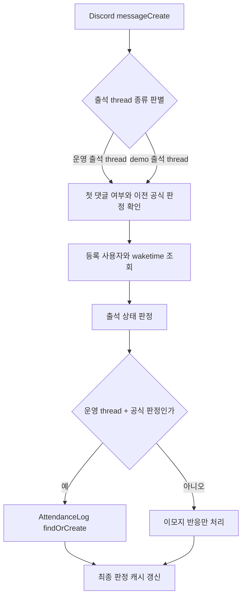

# ISSUE #100 구현 계획

## 목표

- 운영 `#wake-up` 채널의 `YYYY-MM-DD 출석` thread 댓글도 `messageCreate` 출석 판정 경로에 포함한다.
- 운영 출석 thread의 첫 공식 판정(`✅`, `🟡`, `❌`)을 `AttendanceLog`에 즉시 저장해 13:00 집계와 일치시킨다.
- 기존 테스트 채널 demo thread의 출석 반응 및 중복 방지 동작은 그대로 유지한다.
- 운영자가 `dist` artifact만 있는 서버에서도 누락된 출석 댓글을 1회성 backfill 할 수 있는 helper를 제공한다.

## 배경

- 2026-03-30 운영 `#wake-up` 채널의 `2026-03-30 출석` thread에 등록 회원 2명이 댓글을 남겼지만 봇 반응 이모지가 달리지 않았다.
- 현재 구현은 `src/events/messageCreate.ts`에서 테스트 채널의 `출석-demo` thread만 처리하고 있어, 운영 `출석` thread 댓글은 공식 출석 판정 경로를 타지 못한다.
- 그 결과 운영 thread 댓글은 `AttendanceLog`에도 저장되지 않아 같은 날 13:00 출석표에서 결석으로 오집계될 수 있다.
- 이 문제는 운영 출석 입력 경로와 문서(`docs/PROJECT.md`, `docs/USER_STORIES.md`)의 설명이 어긋난 상태이기도 하다.
- 추가로 production 서버는 source 없이 `dist` artifact만 유지하므로, 과거 누락 건 보정도 build 없는 직접 실행 경로가 필요하다.

## 범위

포함:

- 운영 `#wake-up` 출석 thread를 `messageCreate` 판정 대상으로 추가
- 운영 출석 thread 첫 공식 판정 시 `AttendanceLog` 저장 연결
- 기존 demo thread 중복 댓글 방지, 임시 반응(`⏰`, `❓`) 이후 재시도 허용, 이전 공식 판정 탐색 로직 회귀 방지
- 배포된 `dist` artifact에서 직접 실행 가능한 1회성 출석 backfill helper 추가
- 관련 문서와 운영 검증 절차 업데이트

제외:

- 2026-03-30 댓글 2건 외의 일반화된 대량 데이터 backfill 자동화
- 일반화된 과거 출석 로그 재계산 또는 재동기화 기능
- 출석 정책 자체 변경

## 문서 영향 분석

- `docs/PROJECT.md`
  - `messageCreate.ts` 설명을 "demo 전용"에서 "운영/데모 출석 thread 공용 처리"로 정정해야 한다.
  - 운영 출석 thread의 첫 공식 판정이 `AttendanceLog`로 저장된다는 구현 메모를 추가해야 한다.
- `docs/PRODUCTION_RUNBOOK.md`
  - 배포 후 수동 검증 절차에 운영 출석 thread 반응 및 `AttendanceLog` 기록 확인을 포함해야 한다.
  - `dist` artifact만 있는 서버에서 1회성 backfill helper를 직접 실행하는 절차를 추가해야 한다.
- `docs/USER_STORIES.md`
  - 공식 기상 출석 입력과 `AttendanceLog` 저장 시점을 실제 구현과 맞게 반영해야 한다.
- `README.md`
  - 이번 변경은 사용자 명령 사용법이나 정책 변경이 아니므로 업데이트 불필요

## 완료조건

- 운영 `#wake-up`의 `YYYY-MM-DD 출석` thread 첫 댓글에 대해 봇이 기존 규칙대로 `✅`, `🟡`, `❌`, `⏰`, `❓`를 반응한다.
- 운영 출석 thread에서 첫 공식 판정(`✅`, `🟡`, `❌`)을 받은 댓글은 `AttendanceLog`에 1건만 저장된다.
- 같은 사용자의 두 번째 댓글은 기존과 같이 공식 출석을 덮어쓰지 않는다.
- demo thread 동작은 유지된다.
- 배포된 `dist` artifact에서 build 없이 1회성 backfill helper를 실행할 수 있다.
- 관련 문서가 실제 동작과 일치한다.

## 검증항목

- `npm run lint`
- `npx prettier --check src`
- `npm run build`
- `npm test`
- `npx prettier --check docs`
- `node dist/backfill-attendance.js --help`

## 회귀 테스트 계획

- 구현 전에 운영 `출석` thread 댓글이 반응되지 않고 `AttendanceLog`도 저장되지 않는 failing test를 추가한다.
- failing test는 운영 thread(`parentId=checkChannelId`, 이름 suffix=`출석`)의 첫 댓글에서 `react`와 `AttendanceLog` 저장이 모두 호출되어야 한다는 조건으로 실패해야 한다.
- 구현 후 해당 테스트와 기존 demo thread 테스트가 모두 green 이어야 한다.
- 추가로 같은 사용자의 두 번째 댓글 무시, 임시 반응(`⏰`, `❓`) 이후 재시도 가능 여부가 유지되는지 확인한다.
- backfill helper는 build 산출물에서 `--help` 실행이 가능해야 하고, 서버 build를 전제하지 않아야 한다.

## 상위 계층 구현 계획

- `messageCreate`의 출석 판정 대상을 `demo 출석 thread`와 `운영 출석 thread` 두 scope로 분리하되, 첫 댓글/중복 방지/이전 공식 판정 탐색 로직은 공용으로 유지한다.
- 운영 thread에서만 첫 공식 판정 시 `AttendanceLog`를 `findOrCreate`로 기록해, 실시간 반응과 13:00 집계의 진실 원본을 일치시킨다.
- 임시 반응(`⏰`, `❓`)은 공식 기록으로 고정하지 않고 이후 댓글의 공식 판정을 계속 허용한다.
- 1회성 backfill helper는 배포된 `dist`에서 직접 실행되도록 별도 엔트리포인트로 두고, Discord message fetch -> 상태 계산 -> `AttendanceLog` -> 봇 반응 순으로 처리한다.
- 문서는 이벤트 책임, 공식 출석 입력, 운영 검증 절차를 현재 구현과 동기화한다.

## 하위 계층 구현 계획

- `src/events/messageCreate.ts`
  - 운영/데모 thread를 함께 판별하도록 scope 분기 추가
  - 운영 thread에서만 `AttendanceLog` 저장 연결
  - 기존 첫 공식 판정 캐시와 대기 중 댓글 재처리 로직 유지
- `src/test/US-12-daily-message-demo.test.ts`
  - 운영 출석 thread의 첫 댓글 반응 및 `AttendanceLog` 저장 failing test 추가
  - 기존 demo 회귀 시나리오가 유지되는지 확인
- `src/backfill-attendance.ts`
  - 배포된 `dist`에서 직접 실행 가능한 운영용 backfill helper 추가
  - 입력 JSON 기반으로 Discord 메시지 조회, 상태 계산, `AttendanceLog`, 봇 반응을 순차 실행
- `docs/PROJECT.md`, `docs/USER_STORIES.md`, `docs/PRODUCTION_RUNBOOK.md`
  - 실제 출석 입력/기록 흐름과 운영 검증 절차를 동기화

## 구현 순서

1. 운영 출석 thread 댓글 누락을 재현하는 failing test를 추가한다.
2. `messageCreate`를 운영/데모 공용 출석 처리로 확장한다.
3. 운영 thread 첫 공식 판정에 `AttendanceLog` 저장을 연결한다.
4. `dist`에서 직접 실행 가능한 1회성 backfill helper를 추가한다.
5. 관련 문서를 현재 구현과 맞게 수정한다.
6. lint, build, test, docs formatting, helper `--help` 검증을 실행한다.

## 리스크 및 확인 포인트

- 오늘 이전에 이미 작성된 운영 댓글은 코드 수정만으로 소급 보정되지 않는다.
- 운영 thread에서 `AttendanceLog` 저장만 하고 반응이 실패하면 사용자 체감과 집계 결과가 어긋날 수 있으므로, 반응/저장 둘 다 검증해야 한다.
- 반대로 반응만 성공하고 DB 저장이 실패하면 13:00 집계가 틀어질 수 있어 운영 수동 검증이 필요하다.
- production 서버는 source가 없고 `dist` artifact만 있으므로 helper도 build 없는 직접 실행을 전제로 설계해야 한다.

## 현재 상태 메모

- 현재 로컬 워크트리의 수정안은 이 계획 범위와 일치한다.
- 다만 실제 작업 순서는 `구현 -> 이슈 생성 -> 계획 문서 작성` 순서였으므로, 이후 커밋/PR 단계에서는 이 계획 문서와 이슈 #100 기준으로 범위를 다시 고정한다.
