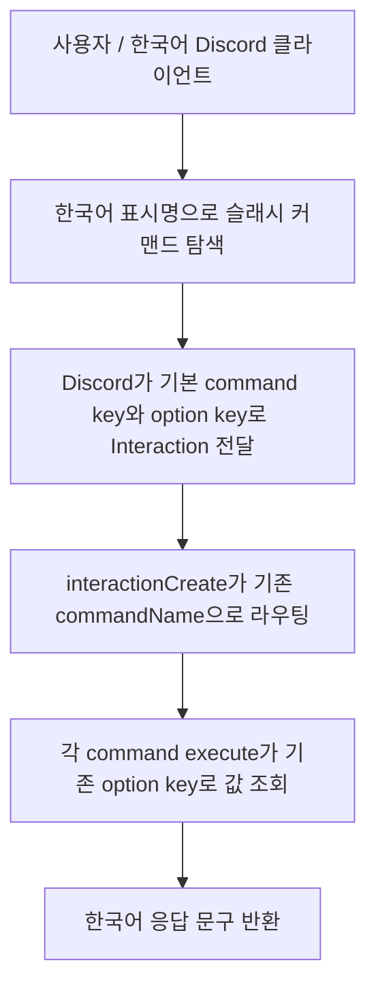

# ISSUE #52 구현 계획

## 목표

- 한국어 Discord 사용자 기준으로 모든 활성 슬래시 커맨드를 한글로 탐색하고 이해할 수 있게 만든다.
- 현재 런타임의 내부 명령 키와 옵션 키는 최대한 유지해 실행 흐름 회귀를 줄인다.
- 커맨드 코드, 테스트, 사용자 문서를 같은 언어 정책으로 동기화한다.

## 배경

- 현재 슬래시 커맨드 이름, 설명, 옵션 설명이 영어 중심이라 한국어 사용자 입장에서 진입 장벽이 있다.
- 현재 런타임은 `interaction.commandName`과 option key를 내부 식별자로 사용하고 있으므로, 사용자 노출 언어와 내부 식별자를 분리하는 방식이 안전하다.
- Discord 애플리케이션 커맨드는 locale 기반 localization을 지원하므로, 기본 키를 유지한 채 한국어 표시명을 추가할 수 있다.

## 범위

포함:

- 모든 활성 슬래시 커맨드의 이름/설명 한국어 localization 적용
- 커맨드 옵션 이름/설명과 선택지 라벨의 한국어 localization 적용 가능 범위 검토 및 반영
- 사용자에게 직접 노출되는 주요 응답 문구의 한국어 정비
- 커맨드 정의/등록/테스트 코드 정비
- `docs/PROJECT.md`, `docs/USER_STORIES.md` 동기화

제외:

- DB 스키마 변경
- daily message/thread 정책 변경
- 출석 집계 로직 변경
- 일반 메시지 이벤트 문구 전면 개편

## 문서 영향 분석

- `docs/PROJECT.md`
  - 활성 커맨드 목록, 파라미터 표, 커맨드 노출 언어 정책을 갱신해야 한다.
- `docs/USER_STORIES.md`
  - 사용자 입력 예시와 성공/실패 응답을 한국어 명령 UX 기준으로 정리해야 한다.
- `docs/HOLIDAY_POLICY.md`
  - 공휴일 정책과 무관하므로 변경 불필요하다.
- DB/운영 스케줄 관련 문서
  - 이번 작업은 구조와 스케줄 정책을 바꾸지 않으므로 변경 불필요하다.

## 명령어 한글화 초안

기본 원칙:

- 내부 기본 command key와 option key는 그대로 유지한다.
- Discord 한국어 locale에서만 한글 표시명과 설명을 노출한다.
- 한글 표시명은 짧고 검색 가능해야 하므로 공백 없이 명사형으로 맞춘다.
- 관리자 전용 명령은 목적이 드러나도록 일반 사용자 명령과 구분되는 이름을 사용한다.
- 관리자 전용 명령은 Discord 명령 목록에서 한눈에 모이도록 `admin-` 접두어를 통일 적용한다.
- 데모 전용 관리자 명령은 일반 관리자 명령과 구분되도록 `admin-demo-` 접두어를 사용한다.

### 커맨드 이름 매핑

| 내부 key             | 현재 노출             | 한국어 표시명 초안     | 비고                                       |
| -------------------- | --------------------- | ---------------------- | ------------------------------------------ |
| `register`           | `/register`           | `/기상등록`            | 사용자가 자신의 기상시간 등록/수정         |
| `apply-vacation`     | `/apply-vacation`     | `/휴가신청`            | 사용자가 자신의 특정 날짜 휴가 신청        |
| `add-vacances`       | `/add-vacances`       | `/admin-휴가추가`      | 관리자가 월별 휴가일수 지급                |
| `delete`             | `/delete`             | `/admin-챌린저삭제`    | 관리자용 기상 챌린지 사용자 삭제           |
| `register-cam`       | `/register-cam`       | `/admin-캠스터디등록`  | 관리자용 캠스터디 참가자 등록              |
| `delete-cam`         | `/delete-cam`         | `/admin-캠스터디삭제`  | 관리자용 캠스터디 참가자 삭제              |
| `demo-daily-message` | `/demo-daily-message` | `/admin-demo-출석생성` | 테스트 채널 daily message/demo thread 생성 |
| `ping`               | `/ping`               | `/admin-상태확인`      | 관리자용 봇 헬스체크                       |

### 옵션 이름 매핑

| 내부 key    | 한국어 표시명 초안 | 적용 대상                                              |
| ----------- | ------------------ | ------------------------------------------------------ |
| `waketime`  | `기상시간`         | `register`                                             |
| `date`      | `날짜`             | `apply-vacation`                                       |
| `userid`    | `사용자id`         | `add-vacances`, `delete`, `register-cam`, `delete-cam` |
| `yearmonth` | `년월`             | `add-vacances`, `delete`                               |
| `count`     | `추가일수`         | `add-vacances`                                         |
| `username`  | `이름`             | `register-cam`                                         |

### 설명 문구 초안

| 대상                 | 한국어 설명 초안                                                     |
| -------------------- | -------------------------------------------------------------------- |
| `register`           | 자신의 기상시간을 등록하거나 수정합니다                              |
| `apply-vacation`     | 특정 날짜에 사용할 휴가를 신청합니다                                 |
| `add-vacances`       | 관리자가 대상 사용자의 월별 휴가일수를 추가합니다                    |
| `delete`             | 관리자가 기상 챌린지 사용자를 삭제합니다                             |
| `register-cam`       | 관리자가 캠스터디 참가자를 등록합니다                                |
| `delete-cam`         | 관리자가 캠스터디 참가자를 삭제합니다                                |
| `demo-daily-message` | 관리자가 테스트 채널에 데일리 출석 메시지와 데모 쓰레드를 생성합니다 |
| `ping`               | 관리자가 봇 응답 상태를 확인합니다                                   |

## 완료조건

- 활성 슬래시 커맨드 전부에 한국어 이름/설명 노출 방식이 일관되게 적용된다.
- 내부 기본 명령 키와 옵션 키는 기존 로직과 호환되도록 유지되거나, 변경 시 런타임/테스트/문서가 함께 갱신된다.
- 한국어 Discord locale 환경에서 주요 커맨드와 옵션이 한글로 표시된다.
- 관리자 전용 명령은 `admin-` 접두어 규칙으로 일관되게 정렬된다.
- 데모 전용 관리자 명령은 `admin-demo-` 접두어 규칙으로 구분된다.
- 주요 성공/실패 응답 문구가 한국어 기준으로 정리된다.
- `docs/PROJECT.md`, `docs/USER_STORIES.md`가 실제 구현과 일치한다.

## 검증항목

- `npm run lint`
- `npx prettier --check src docs`
- `npm test`
- 커맨드 빌더 JSON 또는 등록 payload에서 `name_localizations`, `description_localizations` 값이 예상대로 생성되는지 확인
- 관리자 전용 명령이 Discord 한국어 locale 명령 목록에서 `admin-...` 패턴으로 함께 정렬되는지 수동 확인
- 데모 전용 명령이 `admin-demo-...` 패턴으로 일반 관리자 명령과 구분되는지 수동 확인
- 한국어 locale Discord 클라이언트에서 대표 커맨드(`/register`, `/add-vacances`, `/register-cam`, `/ping`) 노출 수동 확인

## 회귀 테스트 계획

- 구현 전에 대표 커맨드 빌더 테스트를 추가해 현재는 한국어 localization 메타데이터가 없어 실패하도록 만든다.
- 구현 후 커맨드 기본 키는 유지되고 한국어 localization만 추가되었는지 테스트로 고정한다.
- 관리자 전용 명령은 한국어 localization 값이 모두 `admin-` 접두어를 쓰는지 테스트로 고정한다.
- 데모 전용 관리자 명령은 `admin-demo-` 접두어를 쓰는지 테스트로 고정한다.
- 옵션 키 조회(`interaction.options.getString('userid')` 등)가 기존 이름 기준으로 계속 동작한다는 점을 테스트 또는 타입 단위 검증으로 확인한다.
- locale별 실제 렌더링은 Discord 클라이언트 동작이므로 자동 테스트 외에 수동 검증 절차를 병행한다.

## 상위 계층 구현 계획

- 사용자에게 보이는 명령 UX와 내부 식별자를 분리한다.
- 기본 `setName(...)`과 옵션 키는 기존 영어 식별자를 유지하고, Discord localization API로 한국어 표시명과 설명을 추가한다.
- 관리자 전용 명령은 `admin-` 접두어 규칙으로 묶어 Discord 명령 검색과 목록 식별성을 높인다.
- 데모 전용 관리자 명령은 `admin-demo-` 접두어로 한 단계 더 분리한다.
- 커맨드 정의가 파일별로 흩어져 있으므로 공통 한글화 기준을 먼저 정한 뒤 각 커맨드 파일에 동일 패턴으로 반영한다.
- 구현 후 등록 payload와 문서 예시를 함께 갱신해 코드와 운영 문서의 불일치를 없앤다.

## 하위 계층 구현 계획

- `src/commands/haruharu/*.ts`
  - 각 `SlashCommandBuilder`에 `setNameLocalizations`, `setDescriptionLocalizations` 적용
  - 관리자 전용 명령은 localization 이름을 `admin-...` 형식으로 통일
  - 데모 전용 관리자 명령은 `admin-demo-...` 형식으로 분리
  - 각 option builder에도 한국어 localization 적용 가능 범위를 반영
  - 주요 reply 문구를 한국어 기준으로 정리
- `src/index.ts`, `src/events/interactionCreate.ts`
  - 기본 command key 유지 가정을 재확인하고, 이름 변경이 필요한 경우 라우팅 영향 범위를 점검
- `src/test/**`
  - 대표 커맨드부터 localization 메타데이터와 기존 내부 키 호환성을 검증하는 테스트 추가
  - 관리자 명령 접두어 규칙 assertion 추가
  - 데모 명령 전용 접두어 assertion 추가
  - 필요 시 공통 assertion helper 도입
- `docs/PROJECT.md`, `docs/USER_STORIES.md`
  - 커맨드 표기와 사용자 흐름 예시를 한국어 노출 기준으로 수정

## 구현 순서

1. 활성 커맨드 목록과 한글 표기 기준을 확정한다.
2. 커맨드/옵션 한글 표시명과 설명 초안을 이슈와 문서에 고정한다.
3. 대표 커맨드 테스트를 먼저 추가해 localization 부재를 실패로 고정한다.
4. 각 커맨드 builder에 한국어 localization을 적용한다.
5. 주요 사용자 응답 문구를 한국어 기준으로 정리한다.
6. 문서와 테스트를 실제 구현에 맞춰 동기화한다.
7. 로컬 검증과 Discord 수동 검증을 수행한다.
