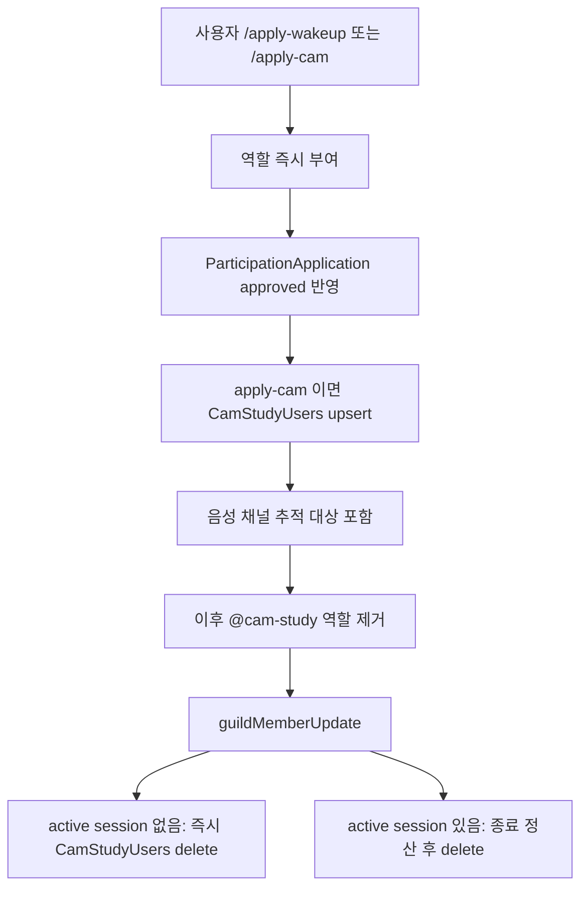

# ISSUE 53: 캠스터디 self-service 등록 및 역할 부여 기반 자동 등록

## 목표

- `/apply-wakeup`, `/apply-cam`을 운영자 승인 대기 없이 즉시 활성화한다.
- `@cam-study` 역할 상태와 `CamStudyUsers`를 자동으로 동기화한다.
- deprecated 운영 명령은 삭제하지 않고 안내 전용 legacy 명령으로 유지한다.

## 범위

포함:

- `/apply-wakeup` 실행 시 `ParticipationApplication.status=approved`와 `@wake-up` 역할 즉시 반영
- `/apply-cam` 실행 시 `ParticipationApplication.status=approved`, `@cam-study` 역할, `CamStudyUsers` upsert 즉시 반영
- `guildMemberUpdate` 기반 `@cam-study` 역할 부여/회수 동기화
- 진행 중 active session 이 있을 때 역할 회수 삭제 defer
- `CamStudyUsers` concurrent upsert 직렬화와 중복 row 정리
- `/approve-application`, `/reject-application`, `/register-cam`, `/delete-cam` deprecated 안내 전환
- 관련 테스트와 문서 갱신

제외:

- 캠스터디 집계 규칙 자체 변경
- 음성 채널 추적 규칙 변경
- 실제 Discord 서버 수동 검증

## 구현 계획

하위 변경 포인트:

- `src/services/participationApplication.ts`
  - 즉시 승인, 역할 부여, cam-study upsert, 실패 시 필요한 범위만 rollback
- `src/services/camStudyRoleSync.ts`
  - `@cam-study` 역할 부여/회수 동기화와 defer 상태 관리
- `src/events/guildMemberUpdate.ts`
  - 역할 변경 이벤트를 동기화 서비스에 연결
- `src/repository/camStudyRepository.ts`
  - serialized `upsertCamStudyUser()`와 중복 row 정리
- `src/services/camStudy.ts`
  - deferred revoke 사용자의 세션 종료 후 `CamStudyUsers` 자동 정리
- deprecated 명령 4종
  - 안내 전용 응답과 legacy description 반영

## 검증 전략

완료조건과 회귀 테스트 매핑:

- 즉시 활성화:
  - `src/test/US-14-role-based-application-flow.test.ts`
- 역할 기반 자동 등록/해제:
  - `src/test/US-16-cam-study-role-sync.test.ts`
- concurrent upsert / 중복 row 정리:
  - `src/test/repository.test.ts`
- 기존 캠스터디 세션 추적 유지:
  - `src/test/US-08-cam-study.test.ts`
  - `src/test/US-09-10-cam-study-report.test.ts`
  - `src/test/US-15-cam-study-recovery.test.ts`
- deprecated 커맨드 메타데이터 유지:
  - `src/test/command-localization.test.ts`
  - `src/test/integration/discord.integration.test.ts`
  - `src/test/US-14-bot-boot-smoke.test.ts`

로컬 검증:

- `npx -y -p node@22 node /opt/homebrew/bin/npm run local:ci`
- `npx prettier --check --parser markdown AGENTS.md README.md docs/PROJECT.md docs/USER_STORIES.md docs/plan/ISSUE_53_feat_cam_study_self_service_role_sync.md`
- `npx -y -p node@22 node /opt/homebrew/bin/npm run test:smoke`

수동 검증:

- 실제 Discord 서버에서 `/apply-wakeup`, `/apply-cam` 실행 결과 확인
- `@cam-study` 역할 제거 후 추적 대상 해제 확인
- 자동 등록 뒤 음성 채널 입장/카메라 또는 화면공유 시작 시 기존 로그 적립 확인
