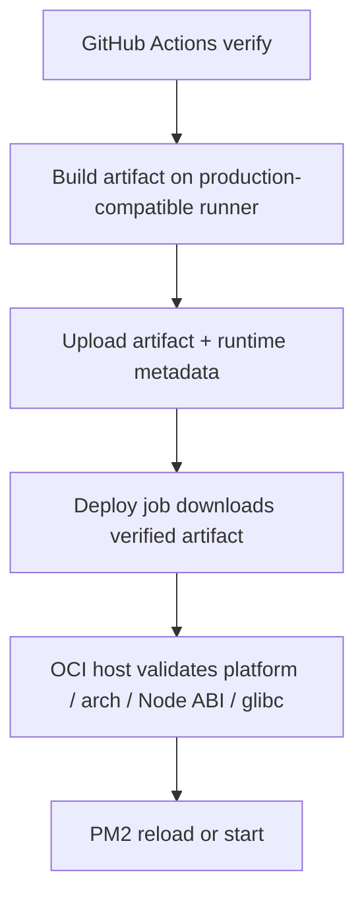

# ISSUE 61: production deploy runtime compatibility mismatch

## 배경

- `Deploy Production` workflow가 GitHub-hosted runner에서 production artifact를 빌드하고 OCI 서버에 그대로 배포한다.
- 실제 배포에서 아래 호환성 검사가 실패했다.
  - `nodeModuleVersion: build=115 runtime=137`
  - `glibcVersionRuntime: build=2.39 runtime=2.35`
- 즉 artifact를 만든 runner의 Node ABI와 glibc가 production 서버보다 새로워 native module이 포함된 bundle을 그대로 반영할 수 없다.

## 목표

- production deploy artifact를 production 서버와 호환되는 runner / Node 조합에서 생성한다.
- PR 단계 CI도 같은 런타임 계열로 맞춰 배포 직전에야 드러나는 drift를 줄인다.
- 테스트와 문서를 현재 artifact 기반 배포 흐름에 맞게 동기화한다.

## 범위

포함:

- `.github/workflows/deploy-production.yml`의 runner / Node 버전 고정
- `.github/workflows/ci.yml`의 runner / Node 버전 고정
- US-15 정적 회귀 테스트 보강
- 배포 관련 문서 동기화

제외:

- OCI 서버 OS 업그레이드
- PM2 구조 변경
- deploy script의 artifact 검증 로직 재설계

## 문서 영향

- `AGENTS.md`: 배포 기준 런타임 명시
- `docs/PROJECT.md`: CI/CD 런타임 및 artifact 배포 흐름 갱신
- `docs/USER_STORIES.md`: US-15 인수 조건과 sequence diagram 갱신
- `docs/PRODUCTION_RUNBOOK.md`: verify 환경과 호환성 실패 대응 추가

## 완료조건

- `Deploy Production` verify job이 production 서버와 호환되는 runner / Node 조합에서 artifact를 생성한다.
- `CI` workflow가 같은 runner / Node 조합으로 고정된다.
- `src/test/US-15-production-delivery-workflow.test.ts`가 고정값을 회귀로 검증한다.
- 배포 관련 문서가 현재 artifact 기반 배포 흐름과 호환성 체크를 설명한다.

## 검증항목

- `npm run lint`
- `npx prettier --check src`
- `npm run build`
- `npm test -- src/test/US-15-production-delivery-workflow.test.ts`
- 가능하면 GitHub Actions `Deploy Production` 재실행으로 verify/deploy 확인

## 회귀 테스트 계획

- 배포 workflow의 runner / Node 고정값을 검증하는 failing test를 먼저 추가한다.
- CI workflow의 runner / Node 고정값을 검증하는 failing test를 추가한다.
- 구현 후 US-15 workflow 테스트가 green 이어야 한다.
- production 재검증은 secrets와 원격 runtime이 필요하므로 로컬에서는 정적 테스트와 build를 우선 확인한다.

## 구현 계획

### 상위 계층

- artifact를 production 서버보다 더 새로운 libc / 다른 Node ABI에서 만들지 않도록 verify 환경을 고정한다.
- PR 단계 CI도 같은 계열로 맞춰 production 전 drift를 조기 탐지한다.
- 문서와 테스트를 실제 artifact deploy 흐름 기준으로 함께 갱신한다.

### 하위 계층

- `.github/workflows/deploy-production.yml`
  - `verify`, `deploy` runner를 `ubuntu-22.04`로 고정한다.
  - `actions/setup-node` 버전을 production 서버 ABI와 맞는 Node 24로 고정한다.
- `.github/workflows/ci.yml`
  - lint/test/smoke/integration job의 runner와 Node 버전을 동일하게 고정한다.
- `src/test/US-15-production-delivery-workflow.test.ts`
  - deploy workflow와 CI workflow의 runner / Node 버전 고정값을 정적으로 검증한다.
- `AGENTS.md`, `docs/PROJECT.md`, `docs/USER_STORIES.md`, `docs/PRODUCTION_RUNBOOK.md`
  - 배포 런타임, artifact 흐름, 호환성 체크 실패 대응을 코드와 맞춘다.
