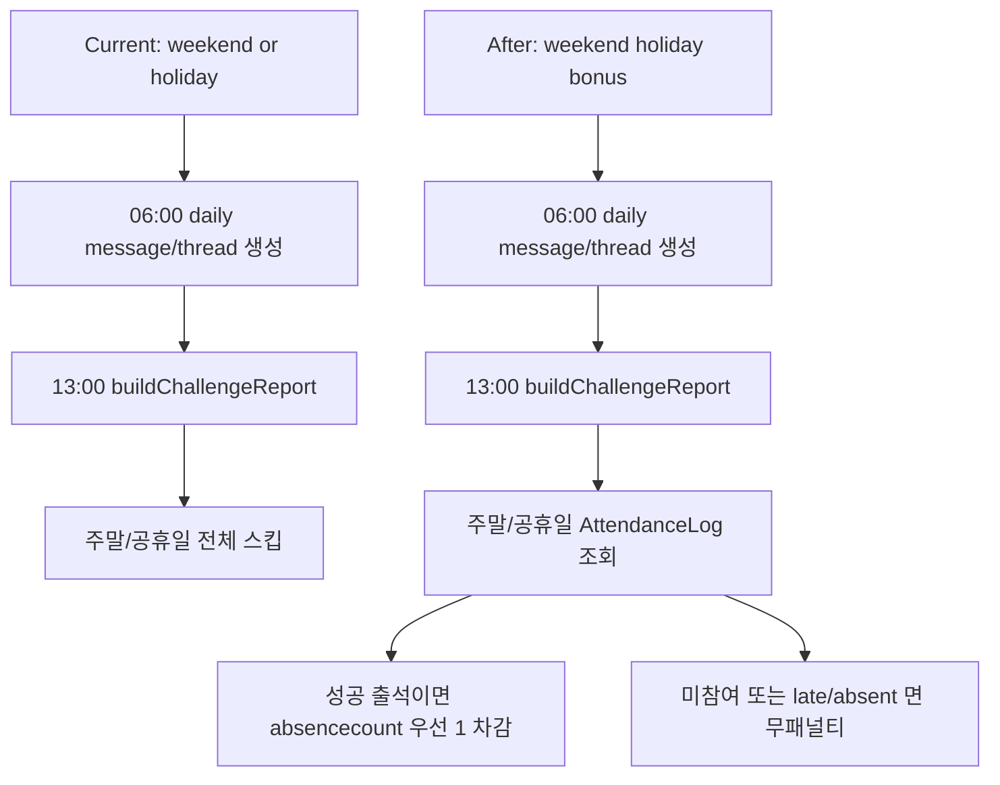

# ISSUE #65 구현 계획

## 목표

- 주말(토/일)과 공휴일 기상 thread를 선택적 보너스 기회로 정의한다.
- 주말 또는 공휴일에 출석 기준으로 성공한 사용자는 월 누적 `absencecount` 또는 `latecount`를 1회 차감받을 수 있게 한다.
- 주말 또는 공휴일에 출석하지 않거나 늦게 댓글을 남겨도 새로운 지각/결석 패널티는 추가하지 않는다.
- 채널별 고정/반복 안내 메시지 중 `#wake-up` daily message/thread 안내가 어디에 문서화되는지 명확히 정리한다.

## 배경

- 현재 `README.md`, `docs/HOLIDAY_POLICY.md`, `docs/USER_STORIES.md`는 주말/공휴일에 출석 집계를 하지 않고 결과도 공지하지 않는다고 설명한다.
- 현재 구현도 `src/services/reporting.ts`에서 주말과 공휴일을 같은 규칙으로 취급해 집계를 통째로 건너뛴다.
- 반면 운영 daily message/thread 생성은 `src/daily-attendance.ts`와 `ready.ts` 기준으로 평일/주말 구분 없이 매일 생성된다.
- 채널별 고정 메시지 문서화는 `#start-here`, `#apply` 온보딩 안내 정도만 `docs/USER_STORIES.md`에 있고, `#wake-up` 채널의 daily message/thread 안내와 정책 문구 위치는 문서상 분산돼 있다.
- 이번 정책은 "주말/공휴일은 패널티 없는 선택적 보너스"로 바뀌므로, 정책 문서와 채널 안내 문서를 함께 정리해야 한다.

## 정책 가정

- 이번 이슈의 `주말`은 토요일/일요일만 의미한다.
- 법정 공휴일과 대체공휴일도 주말과 동일한 보너스 규칙을 적용한다.
- 주말 또는 공휴일 출석 성공 보너스는 하루 최대 1회다.
- 차감 우선순위는 `absencecount` 1회 차감 후, 차감할 결석이 없을 때 `latecount` 1회 차감으로 가정한다.
- `absencecount`와 `latecount`가 모두 0이면 주말/공휴일 출석 성공은 기록만 남기고 추가 차감은 없다.

## 범위

포함:

- 주말/공휴일 보너스 정책을 `reporting.ts` 기준 집계 규칙에 반영
- 주말/공휴일 성공, 미참여, 늦은 댓글, 기존 누적치 0건 시나리오 테스트 추가
- `#wake-up` daily message/thread 안내 문구에 주말/공휴일 보너스 정책 반영
- `docs/PROJECT.md`, `docs/USER_STORIES.md`, `docs/HOLIDAY_POLICY.md`, `README.md`, `AGENTS.md` 문서 영향 반영
- 채널별 고정/반복 메시지 문서 위치를 `docs/PROJECT.md` 중심으로 정리

제외:

- 기존 월 누적 데이터 일괄 재계산 또는 백필
- DB 스키마 변경
- 새로운 슬래시 커맨드 추가

## 문서 영향 분석

- `docs/PROJECT.md`
  - `#wake-up` 채널의 daily message/thread와 주말/공휴일 보너스 규칙을 채널 운영 설명에 추가해야 한다.
  - 채널별 고정 메시지와 반복 생성 메시지의 책임 위치를 표로 정리해야 한다.
- `docs/USER_STORIES.md`
  - `US-13`에 주말/공휴일에도 daily message/thread가 운영되며, 성공 출석이 보너스로 집계된다는 흐름을 반영해야 한다.
  - 일일 출석 리포트 사용자 스토리에는 "주말/공휴일 무참여 무패널티, 성공 시 누적 차감" 규칙을 추가해야 한다.
- `docs/HOLIDAY_POLICY.md`
  - 기존 "주말/공휴일 모두 출석 체크를 하지 않음" 문구를 "주말/공휴일 보너스 정책 적용"으로 바꿔야 한다.
- `README.md`
  - 기상 챌린지 정책 요약을 현재 구현/문서와 일치하도록 수정해야 한다.
- `AGENTS.md`
  - 정책/운영 규칙 변경 시 어떤 문서를 갱신해야 하는지 이번 사례에 맞춰 유지해야 한다.

## 완료조건

- 토요일, 일요일 또는 공휴일 13:00 집계에서 출석 로그가 없는 사용자는 `latecount`, `absencecount`가 증가하지 않는다.
- 토요일, 일요일 또는 공휴일에 `AttendanceLog.status='attended'` 인 사용자는 월 누적 `absencecount`가 1 이상이면 1 감소하고, 없으면 `latecount`가 1 이상일 때 1 감소한다.
- 토요일, 일요일 또는 공휴일에 `AttendanceLog.status='late'` 또는 `AttendanceLog.status='absent'` 여도 새로운 패널티는 추가되지 않는다.
- 운영 `#wake-up` daily message/thread 안내 문구와 정책 문서가 실제 주말/공휴일 보너스 정책과 일치한다.
- 채널별 고정/반복 안내 메시지 설명이 최소 `docs/PROJECT.md`에 정리된다.

## 검증항목

- `npm run lint`
- `npx prettier --check src docs README.md AGENTS.md`
- `npm test`
- `src/test/reporting.test.ts`에 주말/공휴일 보너스 시나리오가 추가되고 green 인지 확인
- 주말과 공휴일이 동일한 보너스 정책으로 처리되는지 테스트 결과로 확인

## 회귀 테스트 계획

- 구현 전에 `src/test/reporting.test.ts`에 주말/공휴일 출석 성공 시 누적 카운트가 차감되는 failing test를 추가한다.
- 구현 전에 주말/공휴일 무댓글 사용자가 더 이상 결석으로 증가하지 않아야 한다는 failing test를 추가한다.
- 구현 전에 주말/공휴일 `late` 또는 `absent` 로그가 있어도 추가 패널티가 붙지 않아야 한다는 failing test를 추가한다.
- 구현 후 평일 패널티 규칙이 기존 기대값을 유지하는지 확인한다.
- 안내 문구 변경은 자동 테스트 범위가 제한적이므로, 관련 문자열 assertion 또는 수동 확인 절차를 병행한다.

## 상위 계층 구현 계획

- 집계 규칙을 `평일`과 `주말/공휴일 보너스일` 두 가지로 분리한다.
- `AttendanceLog` 입력 경로는 유지하고, 주말/공휴일에는 로그를 "패널티 판정" 대신 "보너스 차감 후보"로 해석한다.
- 누적 차감 우선순위를 한 곳에서 계산하도록 만들어, 주말/공휴일 정책이 리포트 문자열과 사용자 카운트 갱신에서 일관되게 적용되게 한다.
- `#wake-up` 채널 문서화는 정책 의미와 채널 안내 메시지 책임을 분리한다.
  - 정책 의미: `docs/HOLIDAY_POLICY.md`, `README.md`
  - 운영 채널 메시지 구조: `docs/PROJECT.md`, `docs/USER_STORIES.md`

## 하위 계층 구현 계획

- `src/services/reporting.ts`
  - 평일과 주말/공휴일 보너스일 분기 로직을 분리한다.
  - 주말/공휴일 보너스 적용 함수를 추가해 누적 차감과 결과 문자열 생성을 한 흐름으로 묶는다.
  - 보너스일 결과 메시지를 보낼지, 아니면 카운트만 조정할지 정책을 코드와 문서에서 일치시킨다.
- `src/daily-attendance.ts`
  - thread 안내 문구에 주말/공휴일 보너스 정책을 드러내는 문구를 추가하거나, 날짜 유형별 가이드 전략을 도입한다.
- `src/test/reporting.test.ts`
  - 주말 출석 성공, 공휴일 출석 성공, 보너스일 무참여, 보너스일 late/absent 케이스를 추가한다.
- `docs/PROJECT.md`
  - 채널별 고정 메시지/반복 메시지 설명 테이블을 추가한다.
  - `#wake-up` daily message/thread와 주말/공휴일 보너스 관계를 정리한다.
- `docs/USER_STORIES.md`
  - `US-13`, 일일 출석 리포트 스토리, 관련 시퀀스 다이어그램을 정책에 맞게 수정한다.
- `docs/HOLIDAY_POLICY.md`, `README.md`
  - 주말/공휴일 보너스 정책을 현재 구현 기준으로 설명한다.
- `AGENTS.md`
  - 주말/공휴일 보너스 정책 변경 시 어떤 문서를 함께 갱신해야 하는지 체크리스트를 맞춘다.

## 구현 순서

1. 주말/공휴일 보너스 정책 가정과 차감 우선순위를 이슈 본문과 계획 문서에 고정한다.
2. `src/test/reporting.test.ts`에 보너스일 관련 failing test를 먼저 추가한다.
3. `src/services/reporting.ts`에 평일/보너스일 분기 분리를 구현한다.
4. 필요하면 `src/daily-attendance.ts` 안내 문구를 정책에 맞게 수정한다.
5. `docs/PROJECT.md`, `docs/USER_STORIES.md`, `docs/HOLIDAY_POLICY.md`, `README.md`, `AGENTS.md`를 동기화한다.
6. 로컬 lint, prettier, test를 실행해 green 을 확인한다.

## 리스크 및 확인 포인트

- 현재 운영용 `AttendanceLog` 생성 경로와 주말 보너스 반영 시점이 분리돼 있으면, 집계 정책만 바꿔도 실제 사용자 체감이 부족할 수 있다.
- 주말/공휴일 보너스 결과를 별도 메시지로 공지하지 않으면 사용자가 차감 적용 여부를 즉시 알기 어렵다.
- 결석 우선 차감 정책이 운영 의도와 다르면, 구현 전에 이슈 본문에서 확정하거나 구현 중 PR 본문에 재명시해야 한다.
